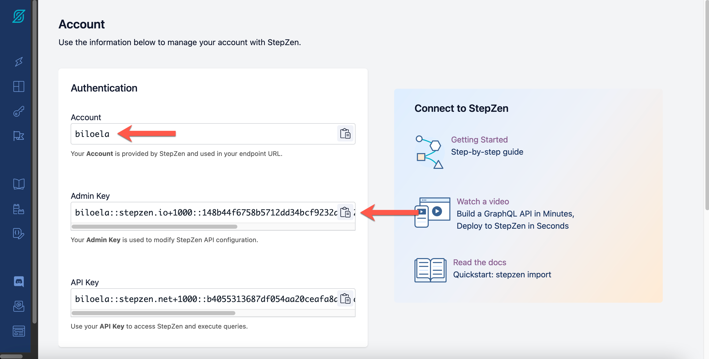
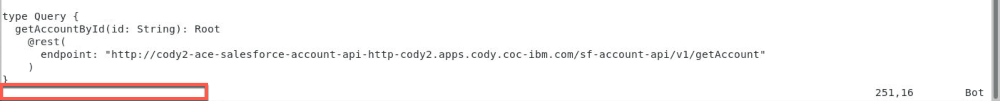
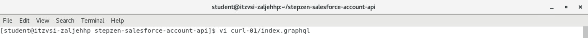
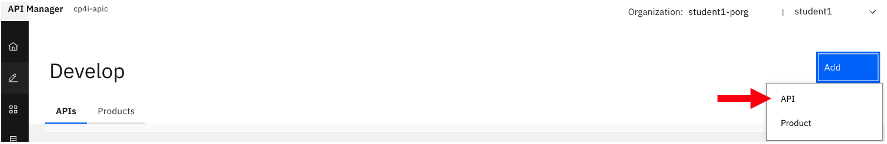

# IBM API Connect

## Creating a StepZen GraphQL Proxy for a Salesforce Account REST API 

[Return to main APIC lab page](../ReadMe.md)

---

# Table of Contents 
- [1. Introduction](#introduction)

- [2. App Connect Dashboard](#dashboard)
	* [2a. Deploy a Toolkit API](#toolkit_api)
	* [2b. Test the API](#test_api)
	* [2c. Capture the REST API Endpoints] (#capture_endpoints)

- [3. StepZen](#stepzen)
	* [3a. StepZen CLI](#stepzen_cli)
	* [3b. Import the Salesforce Account API Operations into the StepZen Configuration](#stepzen_import)
	* [3c. Modify index.graphql Files](#modify)

- [4. Deploy to the StepZen Server](#deploy)

- [5. Working with the StepZen Dashboard](#stepzen_dashboard)
	* [5a. StepZen GraphQL Query Testing](#stepzen_testing)
	* [5b. Capturing the salesforce-account-api GraphQL Server URL](#capture)

- [6. Creating the GraphQL API in API Connect](#graphql_apic)
	* [6a. Testing the GraphQL API from the API Connect Manager](#testing_apim)

- [7. Summary](#summary)
    
---

# 1. Introduction <a name="introduction"></a>

In this lab, we will leverage an existing REST API to create StepZen GraphQL Proxy and then expose the GraphQL Proxy through IBM API Connect. For the lab, we will be leveraging a Salesforce Account REST API deployed onto IBM App Connect. A Salesforce Account Object has 100+ fields. By using GraphQL, one can Query for fields that they are interested in thus reducing the response payload and network traffic.


-	Deploy an App Connect Toolkit built bar file into Cloud Pak for Integration
-	Capture REST API Endpoints for getAccounts, getAccount methods
-	Create StepZen Configurations for both methods
-	Deploy to StepZen GraphQL Server
-	Test the GraphQL Queries in StepZen Portal
-	Extract StepZen GraphQL URL from StepZen Portal
-	Expose GraphQL URL into IBM API Connect
-	Test GraphQL API from API Connect

# 2. App Connect Dashboard <a name="dashboard"></a>

In this section, you will deploy a pre-built App Connect Toolkit Rest API that retrieves Account records from Salesforce.

## 2a. Deploy a Toolkit API <a name"toolkit_api></a>

1\. If you are not already logged into the Platform Navigator, enter the URL for the Platform Navigator that was provided by your instructor.  To navigate to the main page of the Platform Navigator, click on **IBM Cloud Pak** in the upper left.


2\. Navigate to the App Connect instance.


3\. For this lab, we already have the REST service built and available as a **bar** file. You can download the **SF&#95;ACCOUNT&#95;API.bar** file for the service [here](./resources/SF_ACCOUNT_API.bar).

4\. Click on **Deploy integrations**.  

**Note:** The number of Integrations and Runtimes that you see in your environment may differ from the screenshot below.


5\. Click **Small integration** and click **Next**.


6\. Drag and drop the BAR file that you just downloaded or click to upload.  Once you have dragged and dropped or uploaded, you will see the bar file listed under **to be imported**.  Click **Next**.


7\. Click **Create Configuration**.


8\. Populate the following values:

- **Type:**: Select **setdbparms.txt** from the drop-down menu
- **Name:** Enter **\<username\>-setdbparms-salesforce-conf**. Replace **\<username\>** with the username that you logged in the Cloud Pak with.  In the screenshot below, the username is cody2
- **Description:** Enter **Salesforce credentials**
- **setdbparms.txt:** Enter **mqsisetdbparms -w /home/aceuser/ace-server -n salesforce::SF1 -u \<salesforce-userid\> -p \<password-and-token\> -c \<clientid\> -s \<secret\>**.  **Note**: Your instructor will provide you with the salesforce-userid, password-and-token, clientid, and secret.

Click **Next**.


9\. Confirm that the newly created configuration is selected and click **Next**.


9\. Give the Integration Server a **Name** (e.g., username-ace-salesforce-account-api) and click **Create**.  **Note:** In the screenshot below, the username is cody2.


10\. This will take you back to the Runtimes Dashboard where you will see your new server. It will likely be showing Pending while it is starting up the pod.


11\. Note: It may take a several minutes to start up. You can refresh the page. Once it is up and running it will show the following:


## 2b. Test the API <a name="test_api"></a>

1\. From the App Connect Dashboard, click on the newly created Runtime.


2\. Click on the **sf&#95;account&#95;api** API.


3\. Click on the **GET /getAccounts** tab.


4\. Click **Try it**.


5\. Click **Send**.


6\. The Response Body should return several accounts.  **Note:**. The accounts that you see may differ from the accounts listed in the screenshot below.


7\. Copy and past into a text editor one of the **Id** values from the output (e.g., 0014100000D0bbQAAR).  **Note:** You will want to make sure that you capture an Id that has the BillingStreet, BillingCity, BillingState, BillingPostalCode, and BillingCountry populated with a value other than null.  You will use this Id to test getAccount operation.


8\. Click on the **GET /getAccount** tab.


9\. Click **Try it**.


10\. In the **id** field, enter the value that you previously captured and click **Send**.


11\. The Response Body will return the account for the specified id.  **Note:**. The account detail that you see may differ from the account detail listed in the screenshot below.


## 2c. Capture the REST API Endpoints <a name="capture_endpoints"></a>

In the next steps, you will capture the Salesforce Account REST API endpoints and save them to a text editor.

1\. From the **Try it** tab of the **GET /getAccount** tab, you should still have the response of the getAccount operation that you just tested.  Copy the URL in the **Request** and save it to a text editor.


2\. Click on the **GET /getAccounts** tab.


3\. Click **Try it**.


4\. Copy the URL in the **Request** and save it to a text editor.


# 3. StepZen <a name="stepzen"></a>

## 3a. StepZen CLI <a name="stepzen_cli"></a>

1\. If you have been using a browser outside of the VDI, navigate to the browser tab where the Cloud Pak for Integration VDI is running.


2\. From within the VDI, launch **Firefox**.


3\. Navigate to stepzen.com and click **Log In**.


4\. Enter the **Username** and **Password** provided by your instructor and click **LOG IN**.


5\. Navigate to the **Account** tab.


6\. Copy and paste the **Account** and **Admin Key** into a text editor.



7\. From within the VDI, launch **Terminal**.


8\. In the terminal, log in with the Account that you copied in the step above.

```
stepzen login -a <account>
```
Make sure you replace **\<account\>** with the **Account** you copied in the previous step.


9\. When prompted, enter the **admin key** that you copied in the previous step.


## 3b. Import the Salesforce Account API Operations into the StepZen Configuration <a name="stepzen_import"></a>

Next, you will be importing the getAccount and getAccounts operations into StepZen.

1\. Using the terminal, create a directory called **stepzen-salesforce-account-api**.

```
mkdir stepzen-salesforce-account-api
```


2\. Change into the **stepzen-salesforce-account-api** directory.

```
cd stepzen-salesforce-account-api
```


3\. Copy the below 5 lines as-is, and paste in the command line. This will create config.yaml.

```
echo "access:
  policies:
    - type: Query
      policyDefault:
        condition: true" > config.yaml
```


4\. Next you will import the Get Salesforce Account by ID operation.  In the terminal, enter:

```
stepzen import curl "<REPLACE-WITH-GETACCOUNT-URL>"
```
Replace **\<REPLACE-WITH-GETACCOUNT-URL\>** with the URL that you copied in Section 2c Step #1.


5\. Enter **api/salesforce-account-api** when prompted for what you want your endpoint to be called.


6\. Next you will import the Get Salesforce Accounts operation.  In the terminal, enter:

```
stepzen import curl "<REPLACE-WITH-GETACCOUNTS-URL>"
```
Replace **\<REPLACE-WITH-GETACCOUNTS-URL\>** with the URL that you copied in Section 2c Step #4.


ge


## 3c. Modify index.graphql Files <a name="modify"></a>

Next, you will modify the index.graphql files.

1\. From the **Terminal** in the VDI, enter:

```
vi curl/index.graphql
```


2\. You will likely be at the first line of the file.  Enter **SHIFT + G** to jump to the last line of the file.


3\.  Replace **myQuery** with **getAccountById**.  If you are not familiar with vi, follow the steps below.  If you are familiar with vi, skip to Step #4 once you have replaced myQuery.


If you are not familiar with vi, using your cursor, navigate to the **m** in **myQuery**.


Press the **x** key to delete each letter of **myQuery**.


Press the **i** key.  You should see the word **INSERT** at the bottom of the screen.


With the cursor at the **(**, enter **getAccountById**.


4\. Make sure that you are out of **INSERT** mode, by pressing the **ESC** key.  Save and quit by entering **:wq**.




5\. From the **Terminal** in the VDI, enter:

```
vi curl-01/index.graphql
```



6\. You will likely be at the first line of the file.  Enter **SHIFT + G** to jump to the last line of the file.


7\.  Replace **myQuery** with **getAccounts**.  If you are not familiar with vi, follow the steps below.  If you are familiar with vi, skip to Step #8 once you have replaced myQuery.


If you are not familiar with vi, using your cursor, navigate to the **m** in **myQuery**.


Press the **x** key to delete each letter of **myQuery**.


Press the **i** key.  You should see the word **INSERT** at the bottom of the screen.


With the cursor at the **:**, enter **getAccounts**.


8\. Make sure that you are out of **INSERT** mode, by pressing the **ESC** key.  


9\. Next, we need to remove the **Attributes** and **BillingAddress** types as they are duplicate segments under curl and curl-01. If you are not familiar with vi, follow the steps below.  If you are familiar with vi, skip to Step #10 once you have removed the Attributes and BillingAddress types.


 
If you are not familiar with vi, enter **gg** to jump to the first line of the file. 


To delete a line, position your cursor at the beginning of the line and enter **dd**.  Do this for each line of the **Attributes** type and the **BillingAddress** type.

**Attributes**:

```
type Attributes {
  type: String
  url: String
}
```

**BillingAddress**:

```
type BillingAddress {
  city: String
  country: String
  """
  Field "geocodeAccuracy" is defined as JSON since its value was always 'null'
  """
  geocodeAccuracy: JSON
  """
  Field "latitude" is defined as JSON since its value was always 'null'
  """
  latitude: JSON
  """
  Field "longitude" is defined as JSON since its value was always 'null'
  """
  longitude: JSON
  postalCode: String
  state: String
  street: String
}
```

The file should now begin with **RootEntry**.


10\. Save and quit by entering **:wq**.


# 4. Deploy to the StepZen Server <a name="deploy"></a>

In this section, you will deploy the salesforce-account-api to the StepZen server.

1\. In the terminal, make sure that you are in the **stepzen-salesforce-account-api** directory and enter **stepzen start**.


This will deploy the GraphQL Queries into the StepZen account.


# 5. Working with the StepZen Dashboard <a name="stepzen_dashboard"></a>

1\. Copy the URL (https://dashboard.stepzen.com/explorer?endpoint=api%2Fsalesforce-account-api) found under **Or explore it with GraphiQL at** and paste it into a new browser window.


## 5a. StepZen GraphQL Query Testing <a name="stepzen_testing"></a>

From the StepZen Dashboard, you will be testing both the queries.

1\. You will first run the getAccounts query will all of the fields.  You should see the getAccounts query already reflected in the Explorer.


If you do not, you can cut and paste the query below.

```
 query getAccounts {
  getAccounts {
    AccountNumber
        AccountSource
        Active__c
        AnnualRevenue
        BillingAddress{
            city
            country
            geocodeAccuracy
            latitude
            longitude
            postalCode
            state
            street
        }
        BillingCity
        BillingCountry
        BillingGeocodeAccuracy
        BillingLatitude
        BillingLongitude
        BillingPostalCode
        BillingState
        BillingStreet
        CleanStatus
        CreatedById
        CreatedDate
        CustomerPriority__c
        DandbCompanyId
        Description
        DunsNumber
        Fax
        Id
        Industry
        IsDeleted
        Jigsaw
        JigsawCompanyId
        LastActivityDate
        LastModifiedById
        LastModifiedDate
        LastReferencedDate
        LastViewedDate
        MasterRecordId
        NaicsCode
        NaicsDesc
        Name
        NumberOfEmployees
        NumberofLocations__c
        OwnerId
        Ownership
        ParentId
        Phone
        PhotoUrl
        Rating
        SLAExpirationDate__c
        SLASerialNumber__c
        SLA__c
        ShippingAddress {
          city
          country
          geocodeAccuracy
          latitude
          longitude
          postalCode
          state
          street
        }
        ShippingCity
        ShippingCountry
        ShippingGeocodeAccuracy
        ShippingLatitude
        ShippingLongitude
        ShippingPostalCode
        ShippingState
        ShippingStreet
        Sic
        SicDesc
        Site
        SystemModstamp
        TickerSymbol
        Tradestyle
        Type
        UpsellOpportunity__c
        Website
        YearStarted
        attributes{
            type
            url
        }
        nextPageToken
  }
}

```

2\. To execute the query, click on the **Execute query** button.


Results (**Note:**  The data in your results may be different):


3\. Next, you will run getAccounts with a smaller set of fields.  In the Explorer, click on **Clear**.


4\. Copy and paste the query below into the Explorer and click **Execute query**.

```
query getAccounts {
  getAccounts {
    Id
    AccountNumber
    Name
    AnnualRevenue
    BillingAddress {
      city
      country
      postalCode
      state
      street
    }
  }
}
```


Results:


5\. Capture one of the **Id** values from the output (e.g., 0014100000D0bbQAAR).  You will use this Id to test getAccountById query.


6\. Next, you will run getAccountById with all of the fields.  In the Explorer, click on **Clear**.


7\. Copy and paste the query below into the Explorer.  Make sure that you change the **id** to the **Id** that you copied in Step #5 and click **Execute query**.

```
{
    getAccountById(id: "0014T0000048SQHQA2"){
        AccountNumber
        AccountSource
        Active__c
        AnnualRevenue
        BillingAddress{
            city
            country
            geocodeAccuracy
            latitude
            longitude
            postalCode
            state
            street
        }
        BillingCity
        BillingCountry
        BillingGeocodeAccuracy
        BillingLatitude
        BillingLongitude
        BillingPostalCode
        BillingState
        BillingStreet
        CleanStatus
        CreatedById
        CreatedDate
        CustomerPriority__c
        DandbCompanyId
        Description
        DunsNumber
        Fax
        Id
        Industry
        IsDeleted
        Jigsaw
        JigsawCompanyId
        LastActivityDate
        LastModifiedById
        LastModifiedDate
        LastReferencedDate
        LastViewedDate
        MasterRecordId
        NaicsCode
        NaicsDesc
        Name
        NumberOfEmployees
        NumberofLocations__c
        OwnerId
        Ownership
        ParentId
        Phone
        PhotoUrl
        Rating
        SLAExpirationDate__c
        SLASerialNumber__c
        SLA__c
        ShippingAddress
        ShippingCity
        ShippingCountry
        ShippingGeocodeAccuracy
        ShippingLatitude
        ShippingLongitude
        ShippingPostalCode
        ShippingState
        ShippingStreet
        Sic
        SicDesc
        Site
        SystemModstamp
        TickerSymbol
        Tradestyle
        Type
        UpsellOpportunity__c
        Website
        YearStarted
        attributes{
            type
            url
        }
        nextPageToken
    }
}
```


Result:


8\. Next, you will run getAccounts with a smaller set of fields.  In the Explorer, click on **Clear**.


9\. Copy and paste the query below into the Explorer.  Make sure that you change the **id** to the **Id** that you copied in Step #5 and click **Execute query**.

```
{
  getAccountById(id: "0014T0000048SQHQA2") {
    Id
    AccountNumber
    Name
    AnnualRevenue
    BillingAddress {
      city
      country
      postalCode
      state
      street
    }
  }
}
```

.

Result:


10\.  Lastly, you will run multiple queries together. In the Explorer, click on **Clear**.


11\. Copy and paste the query below into the Explorer.  Make sure that you change the **id** to the **Id** that you copied in Step #5 and click **Execute query**.  

```
query MyQuery {
  getAccountById(id: "0014T0000048SQHQA2") {
    Id
    AccountNumber
    Name
    AnnualRevenue
    BillingAddress {
      city
      country
      postalCode
      state
      street
    }
  }
  getAccounts {
    Id
    AccountNumber
    Name
    AnnualRevenue
    BillingAddress {
      city
      country
      postalCode
      state
      street
    }
  }
}
```


Result:


## 5b. Capturing the salesforce-account-api GraphQL Server URL <a name="capture"></a>

1\. Copy the StepZen GraphQL Server URL and save it to a text editor.


# 6. Creating the GraphQL API in API Connect <a name="graphql_apic"></a>


1\. If you are not already logged into the Platform Navigator, enter the URL for the Platform Navigator that was provided by your instructor.  To navigate to the main page of the Platform Navigator, click on **IBM Cloud Pak** in the upper left.


2\. Navigate to the API Connect instance.


3\. If you are asked to log in, click **Common Services User Registry**.


4\. Once logged in, confirm that you are in the organization for your user and click **Develop APIs and products**.


5\. With the **APIs** tab selected, click **Add** and then select **API (from REST, GraphQL or SOAP)**.



6\. Select **From existing GraphQL service (GraphQL proxy)** and click **Next**.


7\. For the **Title**, enter **stepzen-graphql-salesforce-account-api** and for the **GraphQL Server URL** paste the URL that you copied in the previous section.


8\. Accept the defaults and click **Next**.


9\. Make sure that **Activate API** is not selected and click **Next**.


10\. Upon reviewing the Summary, click **Edit API**.


11\. Navigate to the **Gateway** tab.


12\. Select the **graphql-invoke** action (middle of the flow) which can be found under **GraphQL execute** (under **Otherwise**).


13\. Deselect the **Compression** flag.


14\. Click **Save**.


15\. Once saved, you will see an indicator window appear that shows that **Your API has been updated**. Click on the **X** to close the window.


## 6a. Testing the GraphQL API from the API Connect Manager <a name="testing_apim"></a>

In the API Designer, you have the ability to test the API.

1\. Switch the toggle from Offline to Online. This step automatically publishes the API.


2\. You will see an indicator window appear that shows that **Your API has been updated**. Click on the **X** to close the window. You should see that the API is now Online.


3\. Click on the Test tab.


4\. From the drop down menu, select the **POST** operation that ends with **stepzen-graphql-salesforce-account-api/graphql**.


5\. In **GraphiQL**, put you cursor in the request area and enter (**CTRL+A**) and hit the **delete** key.


6\. Copy and paste the **getAccounts** query below into **GraphiQL** and click **Execute Query**.

```
query getAccounts {
  getAccounts {
    Id
    AccountNumber
    Name
    AnnualRevenue
    BillingAddress {
      city
      country
      postalCode
      state
      street
    }
  }
}
```


Result:


7\. Capture one of the **Id** values from the output (e.g., 0014100000D0bbQAAR).  You will use this Id to test getAccountById query. 

8\. In **GraphiQL**, put you cursor in the request area and enter (**CTRL+A**) and hit the **delete** key.

9\. Copy and paste the **getAccounts** query below into **GraphiQL**.  Make sure that you change the **id** to the **Id** that you copied in Step #7 and click **Execute Query**.

```
{
  getAccountById(id: "0014T0000048SQHQA2") {
    Id
    AccountNumber
    Name
    AnnualRevenue
    BillingAddress {
      city
      country
      postalCode
      state
      street
    }
  }
}

```


Result:


10\. In **GraphiQL**, put you cursor in the request area and enter (**CTRL+A**) and hit the **delete** key.

11\. Copy and paste the query below into the Explorer.  Make sure that you change the **id** to the **Id** that you copied in Step #7 and click **Execute Query**. 

```
query MyQuery {
  getAccountById(id: "0014T0000048SQHQA2") {
    Id
    AccountNumber
    Name
    AnnualRevenue
    BillingAddress {
      city
      country
      postalCode
      state
      street
    }
  }
  getAccounts {
    Id
    AccountNumber
    Name
    AnnualRevenue
    BillingAddress {
      city
      country
      postalCode
      state
      street
    }
  }
}
```


Result:


# 7. Summary <a name="summary"></a>
Congratulations, you have completed the **Creating a StepZen GraphQL Proxy for a Salesforce Account REST API** lab.  Throughout the lab, you learned how to:

-	Deploy an App Connect Toolkit built bar file into Cloud Pak for Integration
-	Capture REST API Endpoints for getAccounts, getAccount methods
-	Create StepZen Configurations for both methods
-	Deploy to StepZen GraphQL Server
-	Test the GraphQL Queries in StepZen Portal
-	Extract StepZen GraphQL URL from StepZen Portal
-	Expose GraphQL URL into IBM API Connect
-	Test GraphQL API from API Connect

[Return to main APIC lab page](../ReadMe.md)