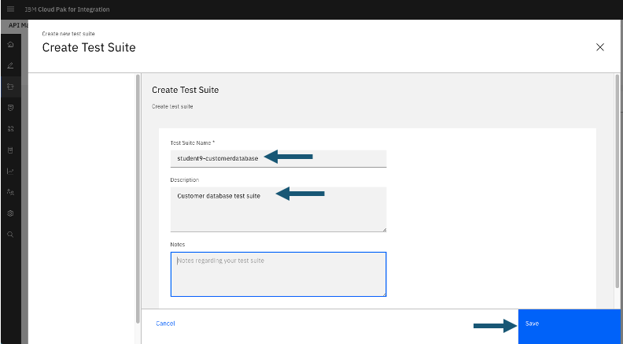
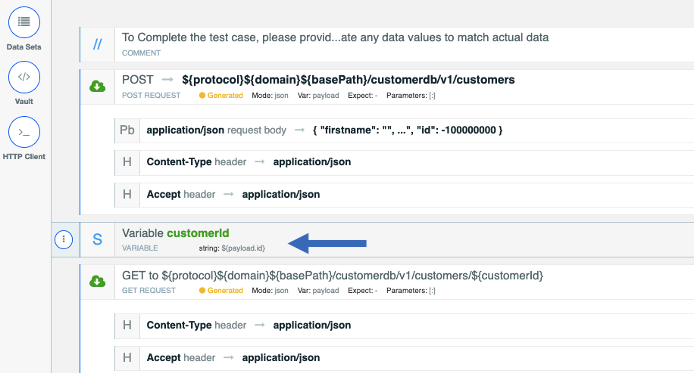
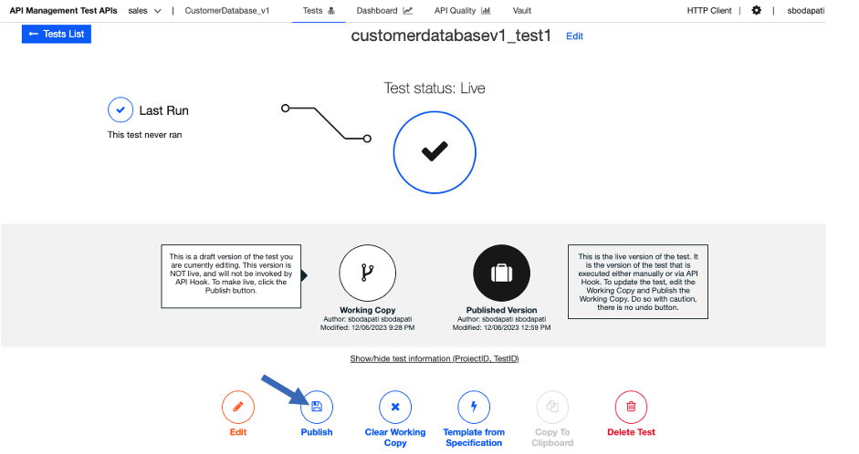

# API Connect Test APIs - Generate Tests using SmartGenerator

# 1. Overview

In this lab, you will explore "Test APIs" feature of IBM API Connect that generates API tests automatically. By using IBM Api Connect TestAPIs capability you can deliver high quality APIs consistently and improve developer productivity with automation and AI powered testing capabilities.
<br>
Reference: https://www.ibm.com/products/api-connect/api-testing

You will be using Customer Database Rest API deployed in Lab1 to App Connect Dashboard. <br>
<br> 

# 2. App Connect - Download Swagger document

From the Cloud Pak for Integration Platform Navigator, open App Connect Dashboard (student(n)-db). <br>

Click on the Runtimes.<br>
Select customerdatabase Integration Runtime, and click on the API, then "Download the OpenAPI Document" (yaml) as below.<br>


<br>
Lets adjust the OpenAPI document to conform to the specification that API Connect Test APIs feature is expecting!  <br>

Edit the downloaded yaml file. <br>

a) Append the below section above the schema: segement. Make sure it's aligned propertly.<br>
```
consumes:
  - application/json
produces:
  - application/json
```


b) Make sure the /customers/post: operation is defined before the "get" operation. if not move the "post" operation segment before the "get" segment as below. <br>


# 3. Api Connect - Test APIs

From the Cloud Pak for Integration Platform Navigator, open API Connect Manager (apim-demo). <br>

Click on the "Test APIs" tile. <br>


Click **"Create Test Suite"**. <br>



Test Suite name: student(n)-customerdatabase <br>
Description: student(n) customer database test suite.<br>

Click correct tick mark (on top right).<br>


Click on "Tests" Option.<br>


<br>
Click on **\<Add\>** to create a test. <br>


<br>
Enter customerdatabasev1_test1 and hit **continue**.<br>


Click \<Template from Specifications\> in the bottom middle option.<br>


Select "Swagger 2.0 YAML", and click on "drag a file here or click to upload", select downloaded yaml file (as below). <br>


Click **Save**. <br>

Click on the dropdown, and select /customerdb/v1/customers/{customerId} operation.<br>


Select "Smart Generator" circle as below, and click on the Tick mark on right of the window.<br>


That should generate a POST, GET, and DELETE operations as below.<br>


Now, add a variable "customerId" in between POST, and GET as below.<br>

Click on the (i) circle on the GET opeartion, and select "add component before".<br>


Click on "Set variable" circle.<br>


Set the variable name as customerId, and value as ${payload.id}. <br>

Confirm changes by clicking the Tick mark on top right of the Variable window.<br>



Modify the DELETE operation. Set Authorization default secret <br>

Click Edit of Authorization header field, and enter value "secr3t" as below and click the Correct symbol to save.<br>


Click \<Save\> button on the top, and then click \<Run Test\>. <br>


Take the defaults, and hit \<Run Test\>, and that should generate a report as below.<br>


Review and Close the Report.<br>

Click on \<Save and Exit\> button on the top.<br>


NOW CLICK \<Publish\> button as below.<br>


Click on the Tests option on the top.<br>


Click on the 3 dots on the test CustomerDatabasev1_test1 as below, and click Run. You can hit Run few times.<br>


Click on the Dashboard on the top.<br>


Here you can see the tests that were ran, and results with Graphs.<br>


### Congratulations !!!

