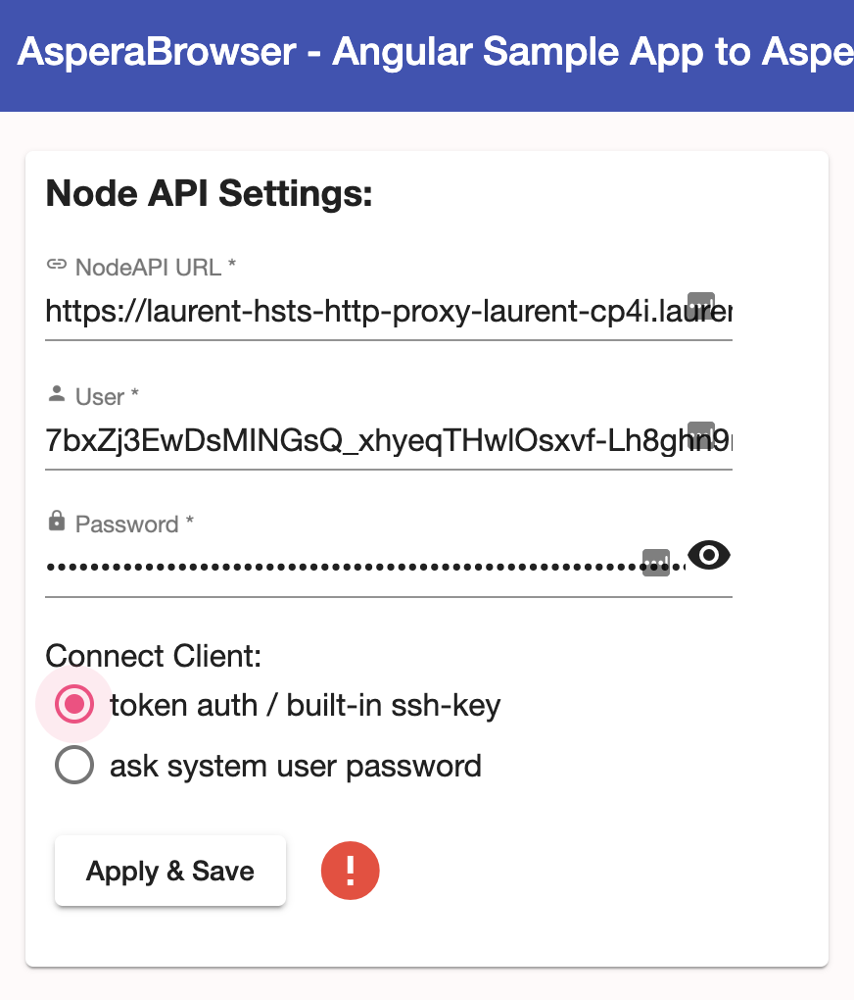
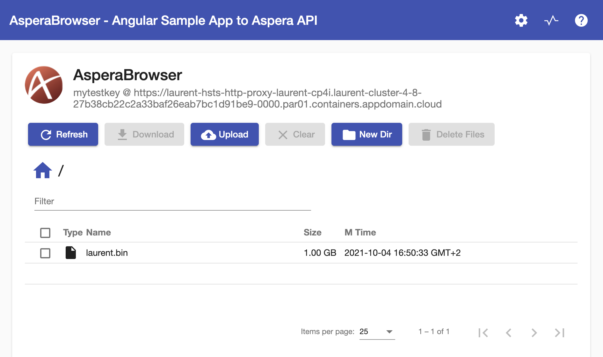
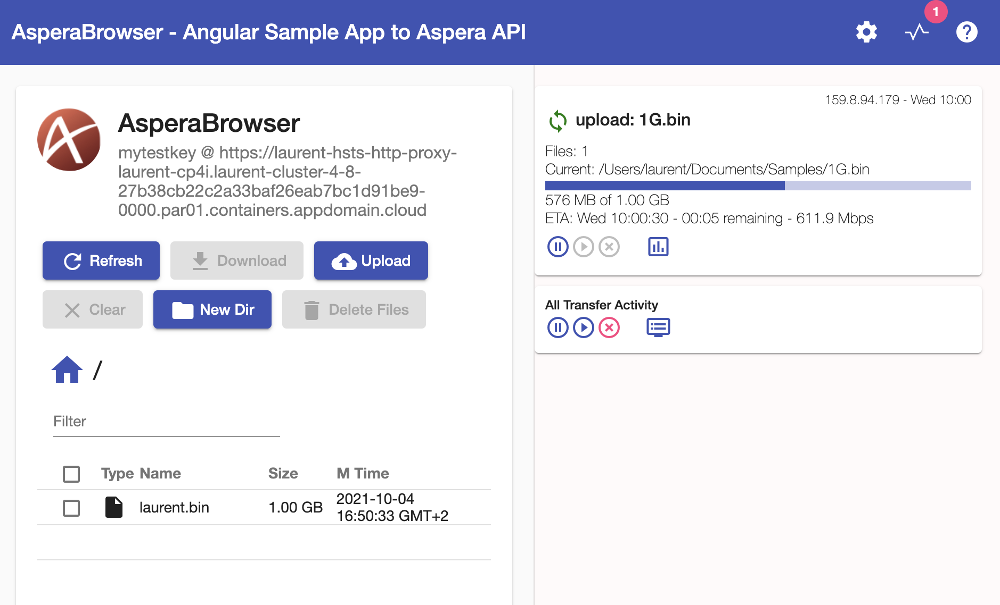
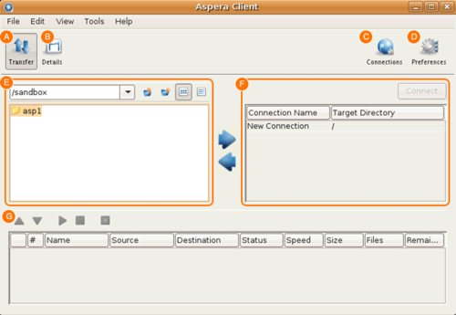
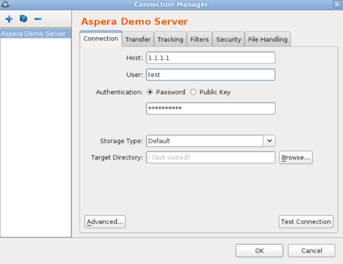
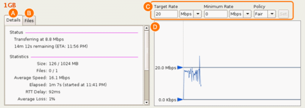

# LAB2 : Aspera setup and transfer using GUI

In this lab, the user will initiate a transfer using GUI between a client and the Aspera High Speed Transfer Server (HSTS) on CP4I.

Reference in documentation: [[CP4IDOC]](README.md#CP4IDOC) &rarr; Initiating transfers with Aspera High Speed Transfer Server

# 0- Prerequisites

* An Aspera HSTS instance installed in Cloud Pak, refer to [GUI setup](README.setup_gui.md)
* A text editor that will be used to take note of values (names, passwords, urls) identified by a `name` for later copy/paste
* Name of Aspera instance created: `my_cp_hsts_instance_name`

# 1- Retrieve Aspera HSTS Node API URL and credentials

In the OpenShift web console:

### Retrieve Node API Credentials:

1. Navigate to  &rarr; Workloads &rarr; Secrets
* Make sure that your project is selected on the top of the page
* Search: *asperanoded-admin*
* Select the secret
* Click on: **Reveal values**
* Note those as `my_node_username` and `my_node_password`

### Retrieve the Node API URL:

1. Navigate to  &rarr; Networking &rarr; Routes
* Make sure that your project is selected on the top of the page
* Look for the route named `<my_cp_hsts_instance_name>-http-proxy`
* Note the URL as `my_node_url`

### Test the credentials and API:

1. Copy/paste `my_node_url` in the address bar of a web browser (or click on the URL in last step)
* When asked for credentials, copy/paste `my_node_username` and `my_node_password`
* This will display some JSON result (endpoints)
* Add `/info` at the end of the URL, e.g. `https://my.cluster.fqdn/info`, then enter
* This will call an API and display a JSON result (general server information)

# 2- Create an Aspera access key using `curl`

Before performing a transfer, it is required to create an Access Key / Secret on the Aspera Server, but the app *Aspera Browser* does not provide access key manipulation. Using `my_node_username`, `my_node_password` and `my_node_url` from step 2-, execute the following in a terminal:

```
curl -k -u my_node_username:my_node_password my_node_url/access_keys -d '{"storage":{"type":"local","path":"/data"}}'
```

The output will display a JSON Result with several fields. Take a note of result fields:

* `id` &rarr; `my_node_access_key`
* `secret` &rarr; `my_node_secret`

# 3- Upload files using open source web app "Aspera Browser"

This part shows a typical Aspera-based integration in a web interface. The web application used here is a sample application whose source code is available at [https://github.com/m67hoff/aspera-browser](https://github.com/m67hoff/aspera-browser).

This uses the [IBM Aspera Connect SDK](https://developer.ibm.com/apis/catalog?search=%22aspera%20connect%22)

### Connect to the web app

1. Navigate to: [https://asperabrowser.mybluemix.net/](https://asperabrowser.mybluemix.net/)
* Click on cogwheel on top right: 
* Copy/paste the values of `my_node_url`, `my_node_access_key` and `my_node_secret`
* Select the radio button: *token auth / built-in ssh key*
<p align="center"><br/>Fig. 1 Aspera Browser Login</p>
* If you did not install the IBM Aspera Connect Client, the installation of both the browser extension and lightweight client will be proposed by the browser.

### Use the web app

1. The main windows allows: browse, create a folder or delete files and folders, and upload, download with Connect Client .
<p align="center"><br/>Fig. 2 Aspera Browser Main Page</p>
* Click on **Upload** &rarr; **File**, then select a local file and start the upload
* Transfers can be monitored both in the browser (Click on the graph icon on top right)
<p align="center"><br/>Fig. 3 Aspera Browser Transfer Status</p>
* Transfers can be monitored in the Aspera Connect Client: Right click on the icon  located in the desktop docking area (usually close to the clock), and select **Activity**.

Note: If you configured `ascli` earlier with the access key, you can open the browser with the credenials executing: `ascli -Pmy_cp4i_ak node asperabrowser`

# 4- Upload files using IBM Aspera Desktop Client

This part shows a transfer executed using a native application, typically any application can integrate transfer using Aspera using the [Aspera Transfer SDK](https://developer.ibm.com/apis/catalog?search=%22aspera%20transfer%20sdk%22)

1. Start the Aspera Desktop Client.<br/>If not yet installed: [https://www.ibm.com/aspera/downloads/](https://www.ibm.com/aspera/downloads/).<br/>User Manual: [https://www.ibm.com/docs/en/asdc](https://www.ibm.com/docs/en/asdc)
<p align="center"><br/>Fig. 4 Aspera Desktop Client Connection Manager</p>
* In the main window, on the upper right corner, click on **Connections**.
<p align="center"><br/>Fig. 5 Aspera Desktop Client Main Window</p>
* In the Connection Manager window, click the `+` icon in the upper left to create a new connection.
* In the Connection tab, enter the following information, leaving the other options with their default values or blank:
    * **Host**: the value of `my_node_url`<br/>e.g. `https://blahblah.par01.containers.appdomain.cloud`<br/>It shall be an URL starting with `https://`, this makes the **Public Key** option disappear from **Authentication**.<br/>It is recommended to end the URL with `:443` (This removes a warning)
    * **User**: the value of `my_node_access_key`
    * **Authentication**: Only the **Password** option remains: enter the value of `my_node_secret`
* If you want to give your connection a more useful name, click on the name displayed below Connection Manager, and change it in the Rename Connection dialog.
* Click **Test Connection**: A dialog indicates if it was successful. Close it.
* Click **OK** to validate the connection parameters.
* In the main window, in the panel on the right, select your connection name, and then click the **Connect** button above it. (or double click on the connection name).
* In the left panel, browse to select a file or directory from your local system to upload to the server.
* Click the right-arrow icon between the panels to upload the file. (or drag and drop the file from left to right).
* Select the upload status line displayed in the panel at the bottom of the UI and click on button **Details** on top left of main window. (or double click on the upload status line).
<p align="center"><br/>Fig. 6 Aspera Desktop Client Transfer Details</p>
* Observe the evolution of bandwidth on right hand side panel, and technical parameters on left hand side panel.
* Change the "target rate" on right hand side by acting on the arrow on diagram, or using the fields on top (and click *Set*).
* Go back to File selection by clicking on button *Transfer* on top left.

