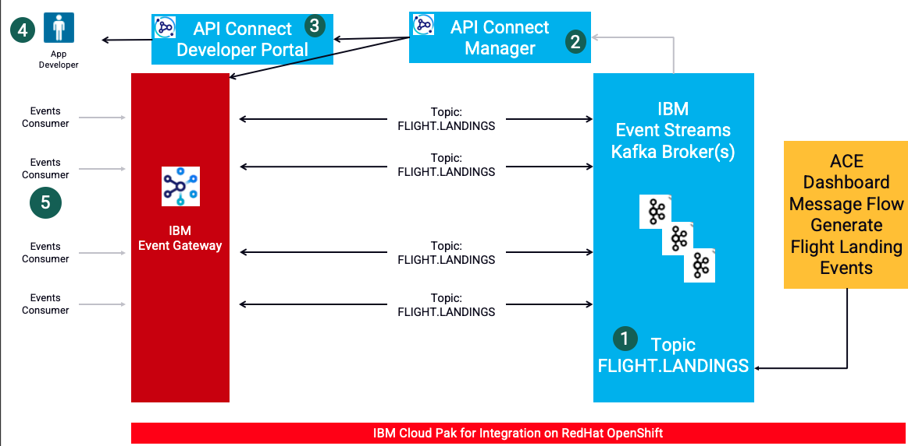

## Multi-Style Integration with IBM Cloud Pak for Integration Event Endpoint Experience
Get hands on building API and Event driven flows in this day in the life experience integrating with Async APIs

[Return to lab section page](../index.md#lab-sections)

# IBM Cloud Pak for Integration - IBM API Connect AsyncAPI Labs

AsyncApi's helps you to socialize the Kafka sources (Topics) as API's through IBM Event Gateway. The labs will enable Cloud Pak for Integration developers on how to create an Async API in IBM API Connect Manager, Produce events to IBM Event Streams using IBM App Connect Toolkit Flow, and finally Consume the events using open-source kafka client kafka-console-consumer.sh as well as consuming from a Java Client Application  

Architecture Diagram below  

 

 
## Lab Abstracts

|  Subject                            | Description                                            |                                                               
|-------------------------|------------------------------------------------------------------------------------------------------------|
| [Lab 1](lab1/ReadMe.md)       |In this lab you will,  a) Create Kafka Topic in IBM Event Streams b) Create a AsyncAPI in IBM API Connect Management Portal  c) Create a Product in IBM API Connect Management Portal d) Publish the Product & AsyncApi to API Connect Developer Portal and IBM Event Gateway.  e) Subscribe to the AsyncApi from API Connect Developer Portal. 
|-------------------------|------------------------------------------------------------------------------------------------------------|
| [Lab 2](lab2/ReadMe.md)       |In this lab you will,  a) Use IBM App Connect Toolkit and import Flight Landing Simulator Project Interchange  b) Review the Flight landing simulator flow, and modify Topic name, kafka policy's, and bootstrap url  c) ReBuild the bar file and deploy the bar file to IBM App Connect Dashboard.
|-------------------------|------------------------------------------------------------------------------------------------------------|
| [Lab 3](lab3/ReadMe.md)       |In this lab you will run kafka clients to consume the Flight landing events being produced in lab2.

[Return to lab section page](../index.md#lab-sections)