# IBM Cloud Pak for Integration - Creating AsyncAPI

In this lab, students will go through steps on how to create a Topic in Event Streams, and build an AsyncApi and publish it the IBM API Connect Developer Portal and IBM Event Gateway.

[Return to main EEM lab page](../index.md#lab-abstracts)

# 1. IBM Event Streams

## Create Topic 

From the Cloud Pak for Integration Platform Navigator, open the IBM Event Streams Console. <br>
If you need to review logging in to the Platform Navigator review the steps in the [Return to main lab page](../../index.md#lab-sections)

# 2.1 Create the Kafka topic<a name="Setup_kafka"></a>

1\. Now go to the tab for **es-demo** or you can click on the link from the home page and this will take you to the IBM Event Streams home page.   

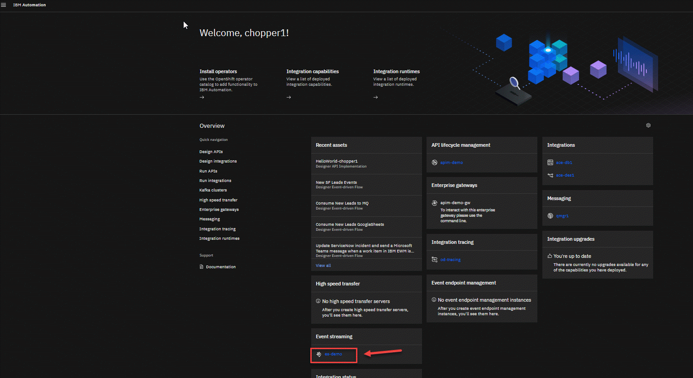

2\. Now we will create our topic. Click on the **Create a topic** tile. 


3\. Now enter the name of your topic.  Since this is a shared Kafka broker, use your userid as part of the topic name.  In this example, we are logged in as palpatine4 so the topic name is **STUDENT04.FLIGHT.LANDINGS**.  Click **Next**.

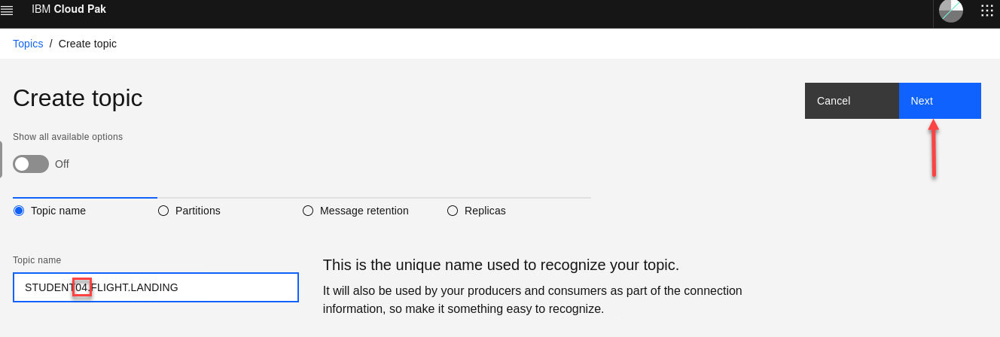

4\. Leave the partitions at 1 and click **Next**.


5\. Since this is for a lab, change the Message retention to **A day** and click **Next**.
**Note:** If we wanted to retain message longer we could change this to meet those needs.


6\. For the Replicas, we will change the **Minimum in-sync replicas** to **1** and select **Replication factor:1**.  Note:  Make sure that the radial button next to Replication factor:1 is selected before clicking **Create topic**.


7\. Now you will be back on the Topics screen.  You may see other users topics in the list but make sure you see your topic you just created.  
Created topic STUDENT04.FLIGHT.LANDINGS. <br>


Download es-cert.pem, es-cert.p12 certificates to Downloads folder. <br>

### Important
Save es-cert password into Notepad.
<br>

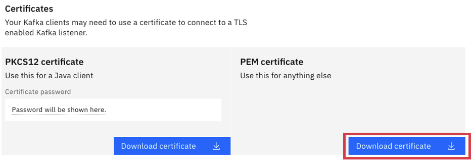

The Scram Credentials, and the es-cert.pem certificate will be used during AsyncApi configuration in IBM Api Connect. <br>

We will need to create JKS file based on es-cert.p12. App Connect KafkaConnector's needs JKS format. <br>
Go to the **Downloads** directory where you have the es-certs
and run the following command.  You will then see a es-cert.jks file.

**Note** for the srcstorepass and the deststorepass use the PKCS12 password you saved when you download the cert.

```
cd ~/Downloads 
/bin/keytool -importkeystore -srckeystore es-cert.p12 \
        -srcstoretype PKCS12 \
        -destkeystore es-cert.jks \
        -deststoretype JKS \
	-srcstorepass xxxxxxx  \
	-deststorepass xxxxxx \
	-noprompt
```

After running this command you will now have the es-cert.jks
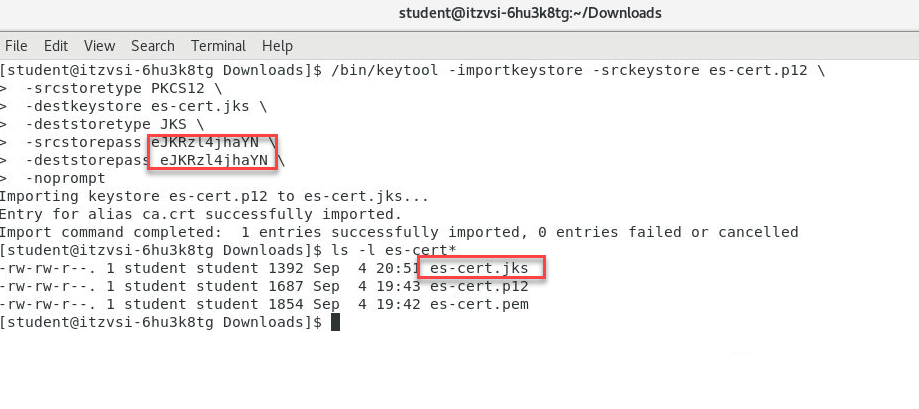


The Scram Credentials, and the es-cert.jks certificate will be used in IBM App Connect Toolkit Flow to simulate flight landing events. <br>

### Important
By now you should have saved the below in Notepad, <br>
a) bootstrap address of your Event Streams Cluster, <br>
b) student00-scram-credentials / and the password <br>
c) es-cert.p12 <br>
d) es-cert.jks<br>


# 2. Api Connect - Manager

## Create AsyncAPI

From the IBM Cloud Pak for Integration Platform Navigator, open the Api Management Console. <br>

From the Home page select "Develop APIs and products" tile.<br>

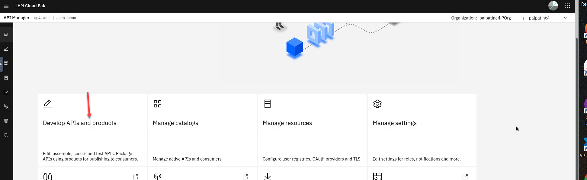

Click on Add and select AsyncAPI! <br>


<br>
Title: student00-asyncapi-flight-landings<br>
Summary: Events emitted when a flight lands<br>
Bootstrap Servers: Copy/Paste the bootstrap address you saved from the kafka pre-lab steps<br>
Topic Name: STUDENT00.FLIGHT.LANDINGS (change the 00 to the number of your topic<br>
Security Protocol: SASL_SSL<br>
SASL mechanism: SCRAM-SHA-512<br>
SASL Username: palpatine04 (scram-credentials you saved from the kafka pre-lab steps)<br>
SASL Password: Copy/Paste the Scram Password you saved from the kafka pre-lab steps<br>
Transport CA Certificate: Drag/Drop the es-cert.pem from the Downloads folder
<br>

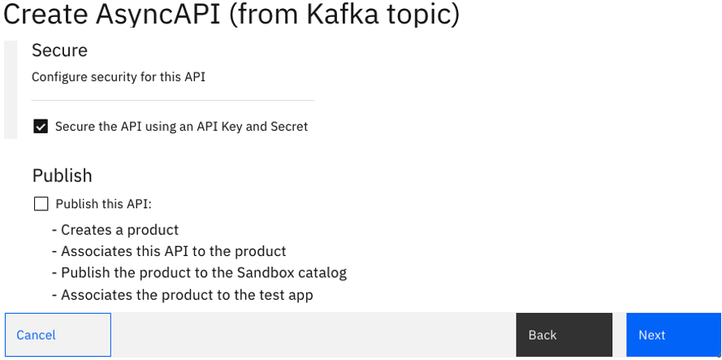
<br><br>
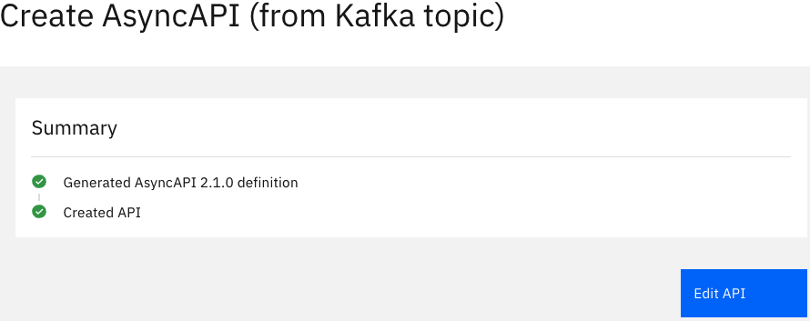
<br><br>


## Edit the API

Edit the API to add the Flight Landing Event Schema.<br><br>
Click on the Source Icon as below,
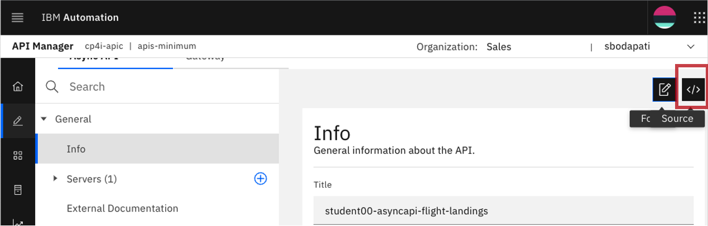

Replace "message: {}" line as below <br>
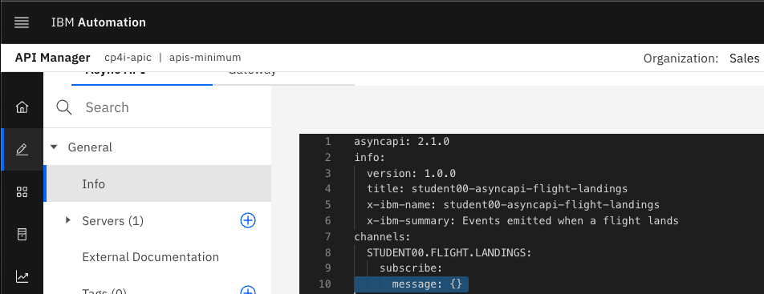 <br>
Double click "message: {}" to select/highlight the entire line. Now, copy and paste the below Avro schema.<br>

```
      message:
        name: landingEvent
        title: Flight landing event
        summary: Flight landing information
        description: >-
          This API provides a stream of events based on the landing of planes at
          Bodapati Airport
        schemaFormat: application/vnd.aai.asyncapi;version=2.0.0
        contentType: application/json
        payload:
          type: object
          required:
            - flight
            - terminal
            - passengers
          properties:
            flight:
              description: ID for the flight that has landed
              type: string
            terminal:
              description: Which terminal the flight has landed at
              type: string
            passengers:
              description: Number of passengers on the flight
              type: string
            additionalProperties: false
        examples:
          - payload: |
              { "flight" : "AI100",  "terminal" : "2", "passengers": "100"}
```
Save the API.<br><br>


## Create Product & Add API


Make sure to change the number in your new product to match you userid and topic.  

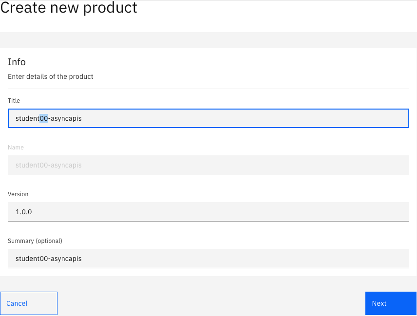


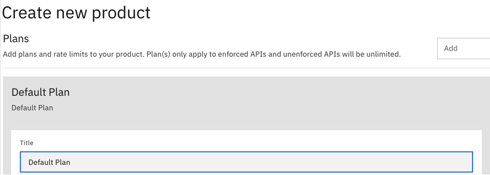

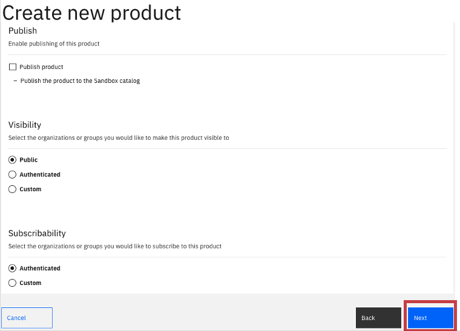


When done you will see the Summary page.   Click Done to complete. 

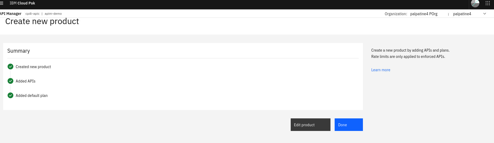
<br>

## Publish the Product
Now, publish the AsyncApi's product to the IBM Api Connect Developer Portal, and to the IBM Event Gateway.


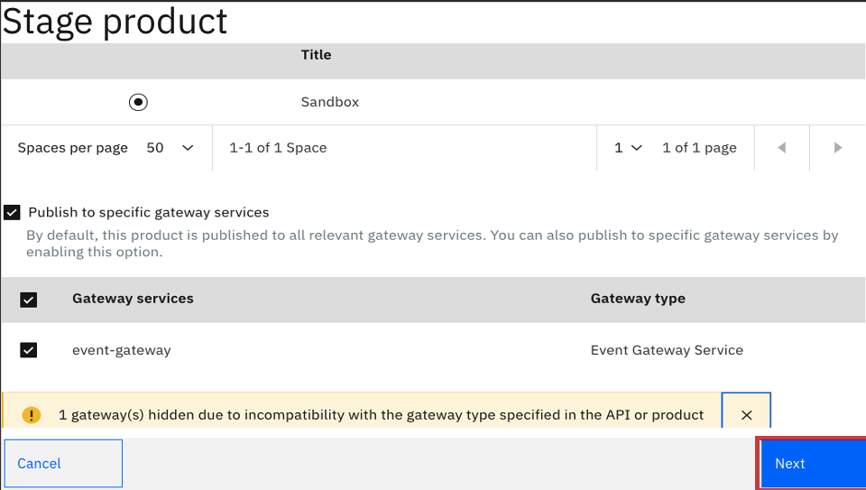

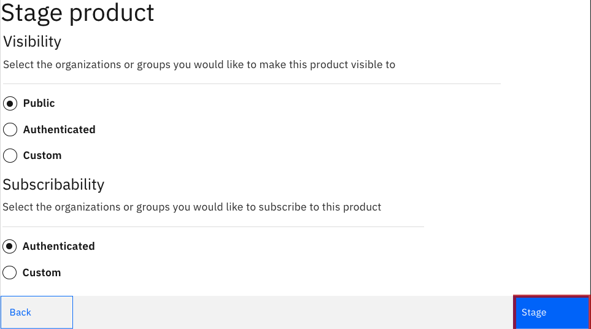

Navigate to API Manager Home (Home Icon on top left) --> Manage Catalogs, select Sandbox Catalog.

Publish the Product to APIC Developer Portal, and Event Gateway.


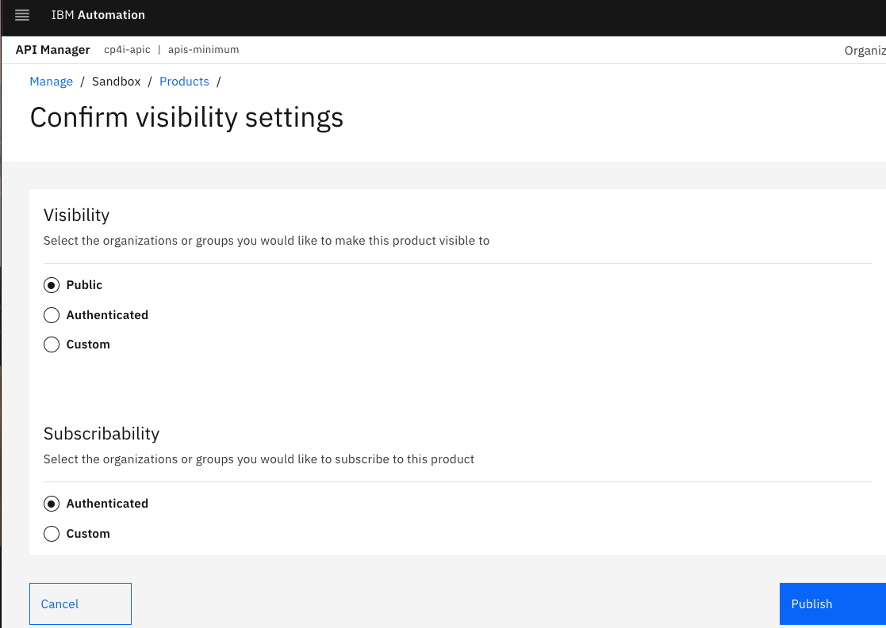

<br><br>

# 3. API Connect Developer Portal

Locate the developer portal Url, by navigating to API Manager Home (Home Icon on top left) --> Manage Catalogs, select Sandbox Catalog.

Click on "Catalog Settings" tab.


Click on Portal tab on left panel, and copy the Portal URL.


Signon to API Connect Developer Portal


## Subscribe to AsyncAPI

Select student00-asyncapis Product


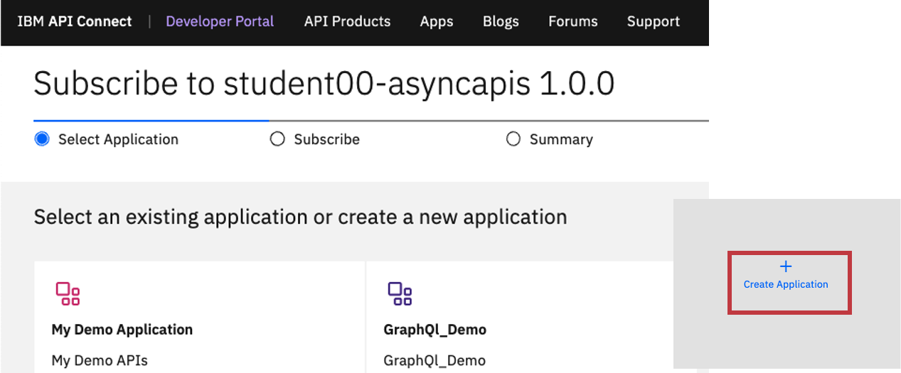

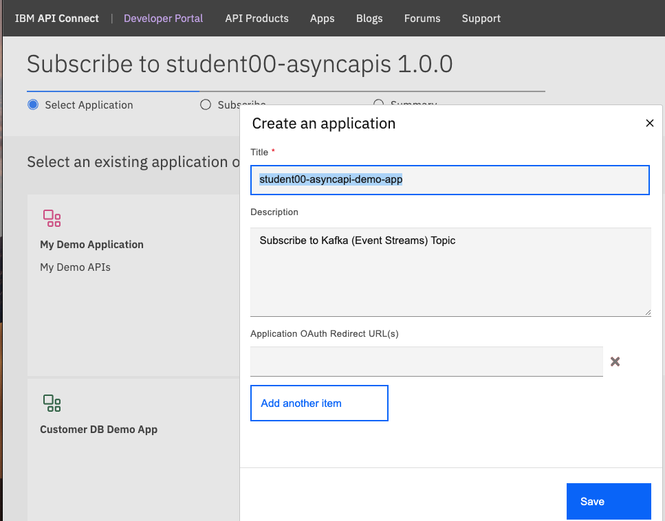

Important: 
Copy and Save the Key (ClientId), and the Secret into Notepad. These will be used by the Async Client java application.


Select the new application that you just created.
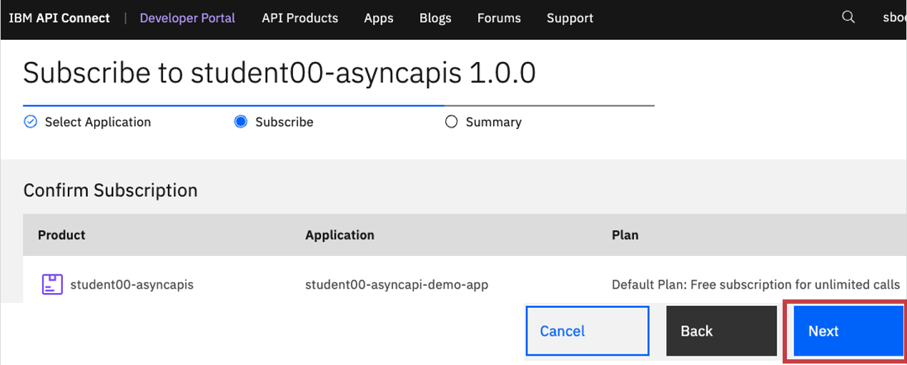

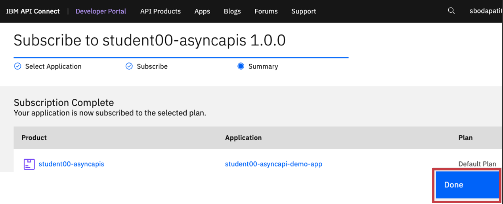

<br><br>

# 4. Event Gateway Bootstrap certificate

We will now need to obtain Event Gateway bootstrap certificate, to be used by the Kafka Consumer programs. <br>

First we will need to get the ocp login for our account.  Sign in to the OCP cluster provide by instructor and use the credentials you were assigned.   Here we are using palpatine4.

First from the OCP console in the upper right click the the drop down and select Copy Login.

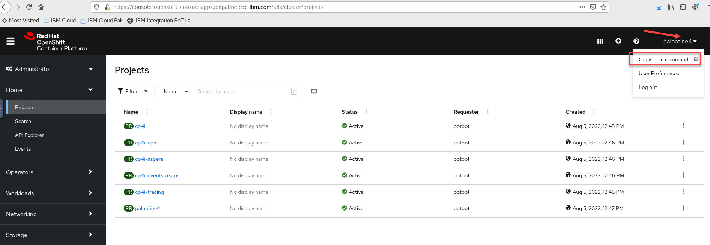

You will see a new tab select display Token
Copy the token.

**Example** oc login --token=sha256~xxxx --server=https://xxxx-coc-cluster:32167

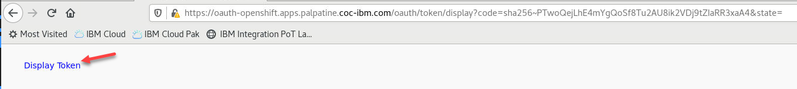


From the command line, copy and paste the url to logon to OpenShift CLI. <br>


```
cd ~/Downloads

EVENT_GW_ROUTE_NAME=`oc get route -n cp4i-apic | grep event-gw-client | awk '{print$1}'`
BOOTSTRAP_HOST=`oc get route $EVENT_GW_ROUTE_NAME -n cp4i-apic  -o jsonpath="{.spec.host}"`

echo -n | openssl s_client -connect $BOOTSTRAP_HOST:443 -servername $BOOTSTRAP_HOST -showcerts | openssl x509 > bootstrap.crt

/bin/keytool -import -noprompt \
        -alias bootstrapca \
        -file bootstrap.crt \
        -keystore bootstrap.p12 -storepass passw0rd
/bin/keytool -importkeystore -srckeystore bootstrap.p12 \
        -srcstoretype PKCS12 \
        -destkeystore bootstrap.jks \
        -deststoretype JKS \
	      -srcstorepass passw0rd  \
	      -deststorepass passw0rd \
	      -noprompt
```
<br>

Important: <br>
The path, and bootstrap.p12 will be used in kafka-sonsole-sonsumer.sh program. <br>
The path, and bootstrap.jks will be used in java client application. <br>
<br>


<br>
<br>
[Return to main EEM lab page](../index.md#lab-abstracts)
