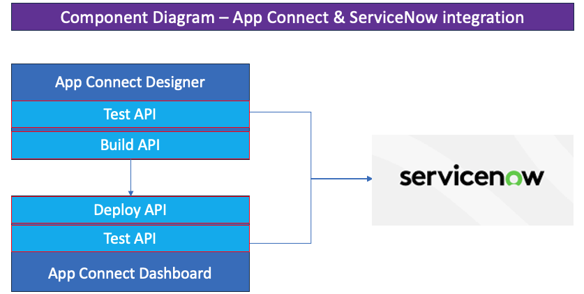

# IBM App Connect Enterprise

## App Connect Designer ServiceNow

[Return to main lab page](../index.md)

---

# Table of Contents 
- [1. Introduction](#introduction)
  * [Pre-Lab: Gathering your ServiceNow Credentials](#pre_lab)
- [2. Create a Designer Flow in CP4I to Call ServiceNow](#create_a_designer_flow_in_cp4i_to_call_servicenow)
  * [2a Testing the API flow](#testing_the_API_flow)
  * [2b Add an Additional Operation for our ServiceNow API](#add_an_additional_operation_for_our_servicenow_API)
  * [2c Testing the New API Operation](#testing_the_new_API)
- [3. Deploying Your Designer Flow to App Connect Dashboard](#deploying_your_designer_flow_to_app_connect_dashboard)
    
---

# 1. Introduction 
The purpose of this LAB is to show how to retrieve ServiceNow Records using IBM App Connect Designer on IBM Cloud Pak for Integration.

If you need to review logging in to the Platform Navigator review the steps in the [Return to main lab page](../../../index.md#lab-sections)   

**Gathering your own ServiceNow Credentials**
- For this lab, you will be provided with shared credentials.  If you would like to use your own account you can follow these steps to collect your ServiceNow account details: Username, Password, Client Secret, and Client ID. You can learn how to obtain these values [here](../SNow-Pre-Lab/SNow-Pre-Lab.md) 

# 2. Create a Designer Flow in CP4I to Call ServiceNow  

In this section, we use App Connect Designer to create a flow that will be exposed as an API to connect and call ServiceNow records.

3\. You will now be on your home page and it the upper left it will show your login name.   Under Integrations, click on the App Connect Designer link to take you to the designer dashboard.

![alt text][pic2]

4\. In the upper left, always make sure you are in the correct namespace.  

Select the tile for **Create flows for an API** 

![alt text][pic3]

6\. First thing we will do is create the model for this.  We will call the model **ServiceNowRetrieve**.  Also in the upper left, we will change the Name from Untitled to **SNowRetrieveIncidents**.  

Click **Create model**. 

![alt text][pic8]

8\. We will now add the following properties which are all data type String.

Use the *Add property +* to add more fields to your model. 

You can also set the data type to Number for properties containing numerical integer values if it is needed.   For this they will all be strings.  

When you have defined the properties in our API model definition, we can implement a flow by clicking on the **Operations tab**. The Operations tab is located next to the Properties tab.

1.	IncidentNumber
2.	OpenDate
3.	Descripton
4.	State
5.  Priority
6.  Category

![alt text][pic9]

9\. 
From the Operations drop-down menu **"Select an operation to add"**, select **Add a Custom Operation**. Here we will customize the operation that we want our API to perform. 

10\. Customize the details of your API operation. 
* **Note**: You can optionally set a description for your individual API operation. 
    * Display Name: **Retrieve Incidents**
    * HTTP Verb: **GET** 
    * Operation Name: **incidents**
        * Note: The operation name will be a part of your API Endpoint URL and is therefore consumer-facing.
    * Response body: **SNowIncidents**

11\. After customizing your API operation, the details should match the image below.

Click the **Implement flow**

This will take us to the App Connect Designer flow. This is where we can insert Smart Connectors to communicate with a variety of external applications as well as implement conditional logic and callable flows. 

![alt text][pic11]

12\. After clicking the blue plus icon on our flow designer interface, we will be able to see the variety of Smart Connectors offered by IBM App Connect Designer. 
* For our lab, we will be using the ServiceNow smart connector, Since there is already a connection define (student) you will use that. 
* Select the **incident** and select **Retrieve incidents** 

![alt text][pic62]

15\. The next screen we will have the ServiceNow node added.  

In our example, we will retrieve the first 4 ServiceNow Incidents records.  In order to do this, we can set the Maximum number of items to retrieve field to 2.  And then select, **Process 2 item from the collection** in the radio button options. As you can see there is also some error handling options provided by App Connect Designer below.

A helpful feature offered by the Smart Connectors is the **“Try this action”** . Clicking this button will allow you to test your ServiceNow connection. If your credentials and operations are configured correctly you should be able to pull records from ServiceNow. 

![alt text][pic14]

16\. You can now click on the **View details** to see the results.   This is done even before your API is complete and allows you to see info that is returned from ServiceNow to be mapped. 

![alt text][pic15]

17\. This shows the Test Results details.

![alt text][pic16]

18\. Now we can configure our API Response body to populate a successful response message with the data fields we are interested in returning to our consumer. Go ahead and click the **Response** node on the integration flow (outlined in the red box below).

![alt text][pic17]

19\. Now we can map our API Response keys to the respective values we want our consumer to obtain from ServiceNow. For this one we will only be doing the **Incidents Number**.

* Click on the IncidentNumber field and you will get a list of Available mappings.
* For this lab, we will just start typing.   Select the number to map to this field. 

![alt text][pic18]

20\. After populating all the fields your mapping should match the image attached below. Click **Done** this will take you back to the main page for this API.

![alt text][pic20]

[pic0]: images/0.png
[pic1]: images/1.png
[pic2]: images/2.png
[pic3]: images/3.png
[pic3a]: images/3a.png
[pic4]: images/4.png
[pic5]: images/5.png
[pic6]: images/6.png
[pic7]: images/7.png
[pic8]: images/8.png
[pic8a]: images/8a.png
[pic9]: images/9.png
[pic10]: images/10.png
[pic11]: images/11.png
[pic12]: images/12.png
[pic13]: images/13.png
[pic13a]: images/13a.png
[pic13b]: images/13b.png
[pic13c]: images/13c.png
[pic14]: images/14.png
[pic15]: images/15.png
[pic16]: images/16.png
[pic17]: images/17.png
[pic18]: images/18.png
[pic18a]: images/18a.png
[pic18b]: images/18b.png
[pic19]: images/19.png
[pic20]: images/20.png
[pic53]: images/53.png
[pic54]: images/54.png
[pic55]: images/55.png
[pic56]: images/56.png
[pic57]: images/57.png
[pic58]: images/58.png
[pic59]: images/59.png
[pic60]: images/60.png
[pic61]: images/61.png
[pic62]: images/62.png

# 2a. Testing the API flow 

We will now start the API and this will make the Test button visible on the menu bar.

1\. Click in the upper right corner on the Stopped switch and it will turn green and show started.

![alt text][pic21]

2\. We will now test the API, first Click on the **Test**  button. 
Then click on the **Get operation** on the left side under Overview. This will take you to the Details page for this operation. Scroll down and review the info. 

![alt text][pic22]

3\. When ready to Test the API click on the **Try it** you will see the GET Url for our API and the Security key. Since we are not passing anything into the API we can just go ahead and Click on **Send**

![alt text][pic23]

4\. The API will run and you will see the Request details sent in as well as the Response from the API.

![alt text][pic24]

[pic21]: images/21.png
[pic22]: images/22.png
[pic22a]: images/22a.png
[pic23]: images/23.png
[pic24]: images/24.png

# 2b. Add an Additional Operation for our ServiceNow API 

1\. In this section, we will add an additional operation to get a Incident by Number. First, we will stop the API. Click on the green Started switch in the upper right corner. This will take you to the designer page. 

![alt text][pic25]

2\. Click on the **Operations** item.

Now select to add another operation for our API.  Select the Retrieve ServiceNowRetrieve by ID.

![alt text][pic26]

3\. Select “Implement flow” for the new operation and that will get us to the flow editor where we will select the “+” sign and scroll down to ServiceNow connector and select **Retrieve Incidents**.

![alt text][pic27]
![alt text][pic27a]

4\. We will now add a condition to our API call so that we just get an Incident that we pass in.  Click on the **Add condition +**

![alt text][pic28]

5\.  Now set the Where clause to **Number** 

* You can scroll thru the list or just start typing in the field *Number* 
* Next we will leave the *equals* and for the mapping use the *IncidentNumber* we pass to the operation.   

![alt text][pic29]
![alt text][pic29a]

6\. Now we will map our API Response fields to the respective values we want our consumer to obtain from ServiceNow. 

* You can use the Preview Suggestions for mapping most fields.
* You can also map each field but clicking on the mapping icon and selecting the fields returned from ServiceNow that best matches you response mapping.  

![alt text][pic30]

7\. After populating all the fields, your mapping should match the image attached below. 

Click **Done** this will take you back to the main page for this API.

![alt text][pic31]

[pic24]: images/24.png
[pic25]: images/25.png
[pic26]: images/26.png
[pic27]: images/27.png
[pic27a]: images/27a.png
[pic28]: images/28.png
[pic29]: images/29.png
[pic29a]: images/29a.png
[pic30]: images/30.png
[pic31]: images/31.png

# 2c. Testing the New API Operation 
Make sure your API is running by checking the upper pane of your Designer instance. Since App Connect Designer has a built-in REST API testing utility. 

1\. Click in the upper right corner on the Stopped switch and it will turn green and show started. Click on the Test menu on top.

![alt text][pic32a]

2\. As you can see, we have two operations now.  One that will get us the first four Incidents and the other will get an Incident by number.   
So let’s first run the GET first to get a list of Incidents.  Now click on the **Try it** button. 

![alt text][pic32b]

3\. Scroll down and click on the Send button. This will trigger an API call to your Designer flow and in turn populate a Request and Response pane below the Send button.
**Note:** If you get an error the first time you click Send, click Send again

Now you will get a response with the first four incident numbers.  Save one of the Incident numbers for the next step

![alt text][pic32c]

4\. Now select the GET operation (by number) on the left menu and click **Try it** and review the information on this new operation we just created.  

You will see a required field for this API called **IncidentNumber**.  Enter one of the Incident Numbers  from the last step.  

Click **Send**.

![alt text][pic33]

5\. You will see the response for the Incident Number that you entered for the API call. 
* **Note:** If you get an error the first time you click Send, click Send again

![alt text][pic34]

[pic32a]: images/32a.png
[pic32b]: images/32b.png
[pic32c]: images/32c.png
[pic33]: images/33.png
[pic34]: images/34.png

# 3. Deploying Your Designer Flow to App Connect Dashboard 

Now we can export our Designer flow to deploy to App Connect Dashboard on Cloud Pak for Integration. 

1\. Navigate to your App Connect Designer Dashboard so we can export our flow as a BAR file. The Dashboard for App Connect Designer is on the left-hand pane. After navigating to the Dashboard, click on the triple-dot icon on your Designer flow. Select **Export** and then select **Runtime Flow Asset (BAR).** This will allow you to download the BAR file to your local directory. 

![alt text][pic38]
![alt text][pic38a]

* This will save the SNowRetrieveIncidents bar file locally on your machine and will use that to deploy to the AppConnect runtime. 

2\. Now we will go back to the Automation home page. Click on the IBM Automation on the top 
menu.

* Make sure you put your student id in the filter to make sure you use the correct instances.
* Then select the **studentX-db**

**Note:** This is showing we are logged in as student1 which is your user id that you used to sign in with.

![alt text][pic39]

3\. Now on the App Connect Dashboard click on the Dashboard instance.  You may see any integrations you have already deployed. 

Click on **Deploy integrations**

![alt text][pic40]

5\. We will now select the Designer Integration that we will deploy then click next.

![alt text][pic41]

6\. Now we will either drag and drop the BAR file we just exported or we can click to upload it.  Then click next.

![alt text][pic42]

You will see your bar file here and it will be saved for later use if needed. 

Click **Next**

![alt text][pic43]

7\. The next section is for configuration you can look at all the options that are available.   We will just be using the Designer Accounts which will include your ServiceNow credentials.
* **Note:** This takes a little time to populate.

![alt text][pic44]

8\. The final section is the server details.   We will give it a name **is-snow-designer** and change the Designer flows mode to local.

 Go ahead and click **Create**.

![alt text][pic45]

9\. This will take you back to the Dashboard where you will see your new integration.   It will be showing Pending while it is starting up the pods for it. 

![alt text][pic46]

10\. You can refresh the page to see if the status has changed.  It may take a couple minutes to start up all the needed pods depending on the workload of the cluster.
Once it is up and running it will show the following:

![alt text][pic47]

11\. We can also quickly test the API call running in the Integration server.  Click on the tile and you will see your API.  Click on the tile again and you will see the API test screen.
Select the Get accounts and then select the GET url and paste in a browser window.

![alt text][pic48]

12\. You will see the following results.
![alt text][pic50]

13\. One last step is to download the OpenAPI spec for this service for the next SN Experience lab.  Click on the Overview and below you will see where you can download the API yaml

![alt text][pic51]

[Return to main lab page](../index.md)

[pic38]: images/38.png
[pic38a]: images/38a.png
[pic39]: images/39.png
[pic40]: images/40.png
[pic41]: images/41.png
[pic42]: images/42.png
[pic43]: images/43.png
[pic44]: images/44.png
[pic45]: images/45.png
[pic46]: images/46.png
[pic47]: images/47.png
[pic48]: images/48.png
[pic49]: images/49.png
[pic50]: images/50.png
[pic51]: images/51.png
[pic52]: images/52.png
