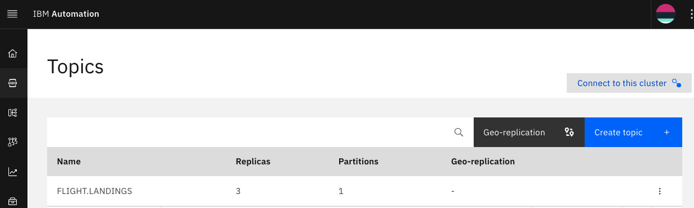
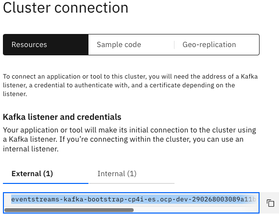
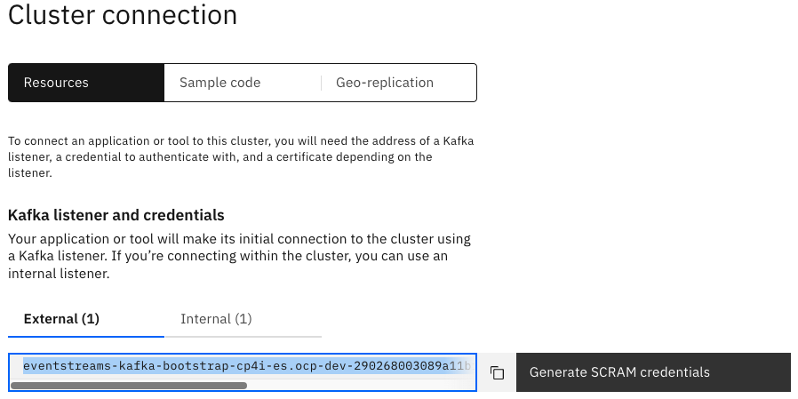
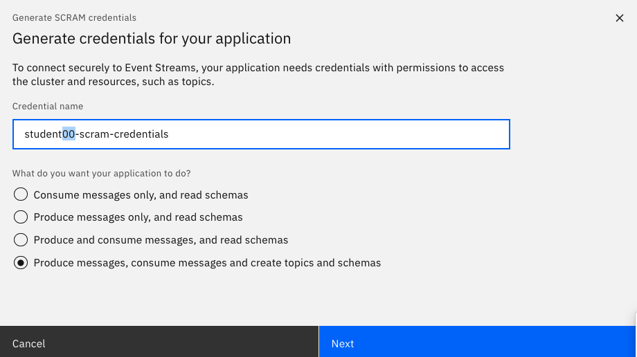
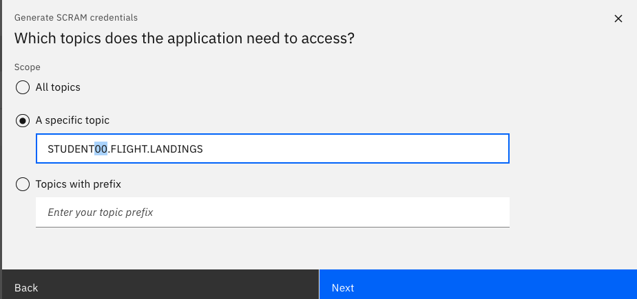
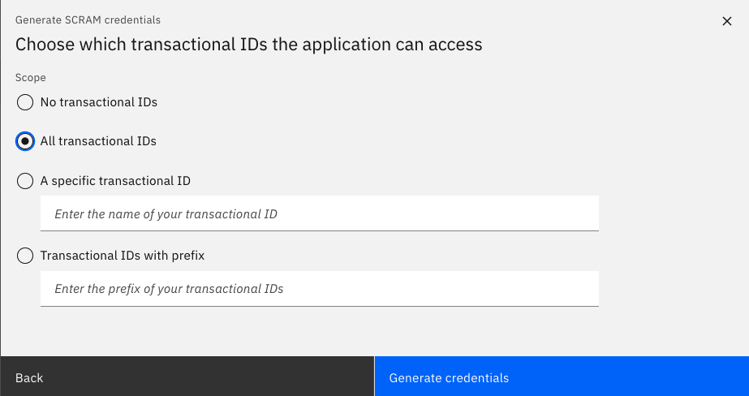
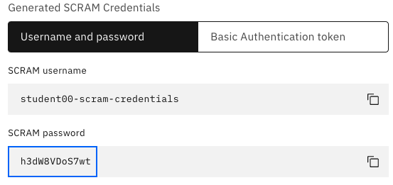

# Create Kafka Topic & capture SCRAM credentials

In this lab, students will go through steps on how to create a Topic in Event Streams, and build an AsyncApi and publish to IBM API Connect Developer Portal and IBM Event Gateway.

<br>

# 1. IBM Event Streams

## 1.1 Create Topic 

From the Cloud Pak for Integration Platform Navigator, open the IBM Event Streams Console. <br>

Create a topic STUDENTxx.FLIGHT.LANDINGS, where STUDENTxx can be \<yourcluster-and-id\><br>

Use default settings, and create the Topic. <br>

## 1.2 Generate SCRAM Credentials

From the Event Streams console, navigate to "connect to this cluster" from either the main page, or from the Topics view as below.<br>


*** IMPORTANT ***  <br>
Save Bootstrap server address into a Notepad <br>



Generate Scram Credentials <br>







<br>

*** IMPORTANT ***  <br>
Save the SCRAM username, and password into the Notepad. <br><br>



DOWNLOAD es-cert.pem, es-cert.p12 certificates to Downloads folder. <br>

*** IMPORTANT ***  <br>
SAVE es-cert password into the Notepad.
<br>


The Scram Credentials, es-cert.pem, es-cert.p12, and es-cert password will be used during AsyncApi configuration in IBM Api Connect. <br>

<br>

## 1.3 Create JKS file

Create JKS file based on es-cert.p12. App Connect KafkaConnector's needs JKS format. <br>

```
cd ~/Downloads 
/usr/bin/keytool -importkeystore -srckeystore es-cert.p12 \
        -srcstoretype PKCS12 \
        -destkeystore es-cert.jks \
        -deststoretype JKS \
	-srcstorepass <password-of-pkcs12-certificate>  \
	-deststorepass passw0rd \
	-noprompt
```

The Scram Credentials, and the es-cert.jks certificate will be used in IBM App Connect Toolkit Flow to simulate flight landing events. <br>

<br>

### Important
By now you should have saved the below in Notepad, <br>
a) bootstrap address of your Event Streams Cluster, <br>
b) studentxx-scram-credentials / and the password <br>
c) es-cert's password <br>
d) es-cert.jks, and the password (i.e passw0rd) <br><br>


#### CONGRATULATIONS !!!