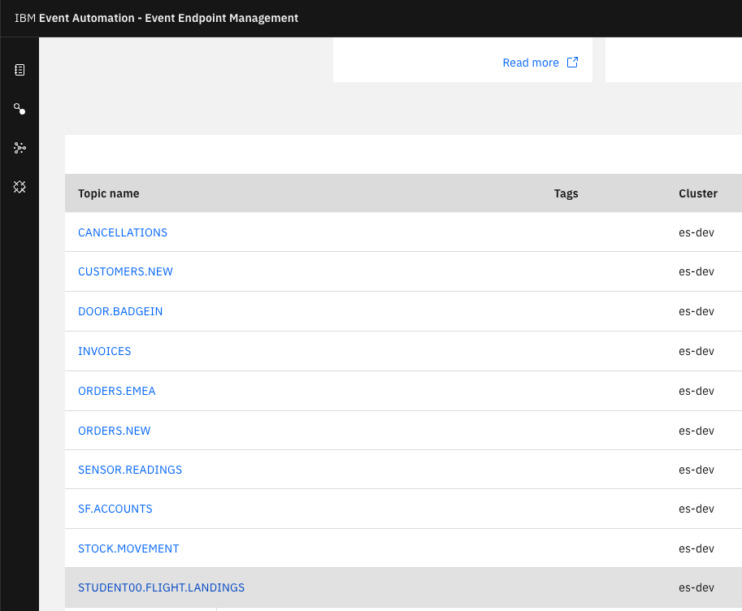
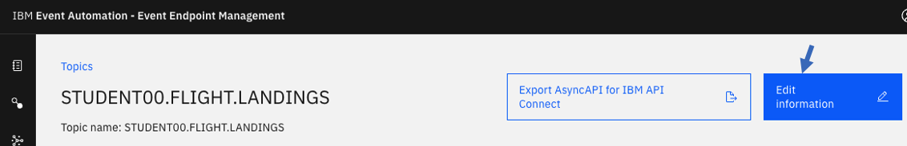
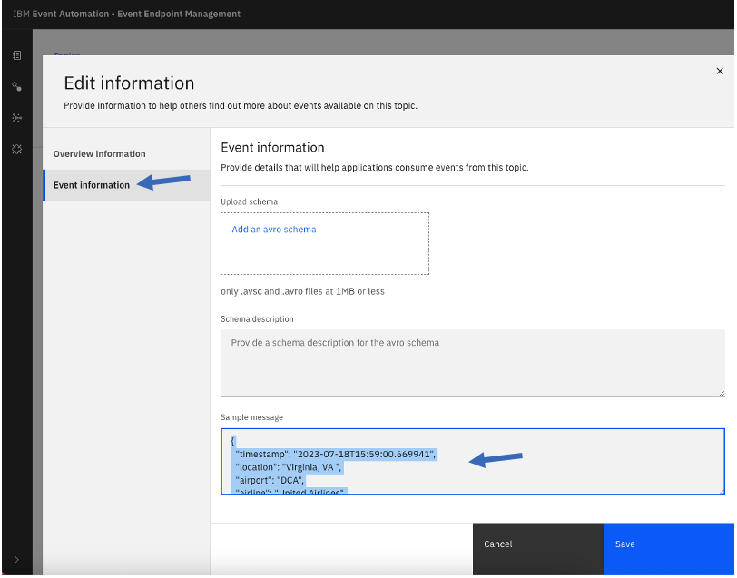
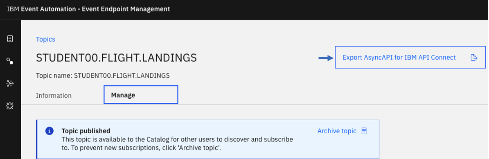

# IBM Cloud Pak for Integration - Creating AsyncAPI

In this lab you will, <br>
<t> 1) Add STUDENTXX.FLIGHT.LANDINGS topic to Event EndPoint Management (EEM).<br>
2) Create Catalog from the Topic.
<br>
<br>


# 1. Event Endpoint Manager

Logon to the IBM Event Endpoint Mangement Console.<br>


## 1.1 Expose Topic

In this section you will expose the STUDENTxx.FLIGHT.LANDINGS topic from Event Streams to Event Endpoint Management.<br>

Click on Topics Icon on the left panel, this will open Topics page.<br>

Click on "Add topic" button.<br>

The EventStreams Cluster should already be configured for you, so just select the existing cluster, and hit \<Next\> button.<br>

Select STUDENTxx.FLIGHT.LANDINGS Topic that you have created in the previous lab section, and hit \<Add topic\> button <br>




Add Sample Message so that Schema will be generated for the AsyncApi.

Select STUDENTxx.FLIGHT.LANDINGS topic, and click on "Edit information".




Copy & paste the below json payload into the "Sample message" box.<br>
```
{
  "timestamp": "2023-07-18T15:59:00.669941",
  "location": "Virginia, VA ",
  "airport": "DCA",
  "airline": "United Airlines",
  "flight": "UA775",
  "terminal": "C",
  "gate": 3,
  "passengers": 167
}
```

Click Save. <br><br>


## 1.2 Expose Topic as Catalog 

In this section you will expose the STUDENTxx.FLIGHT.LANDINGS topic in Event Endpoint Management into the EEM Catalog.<br>


Under the Manage Tab, hit \<Publich topic\>. This will publish the Topic to the EEM Catalog.<br>


## 1.3 Export AsyncAPI for IBM Api Connect

In this section you will expose AsyncAPI definition of STUDENTxx.FLIGHT.LANDINGS Topic in Event Endpoint Management.<br>

Open the Topics view.<br>



Click on "Export AsyncAPI for IBM API Connect", this should download the AsyncAPI definition of your Topic. The file will be downloaded to your Downloads folder.<br>

You will be importing the downloaded AsyncAPI definition file into Api Connect Manager. <br>


<br>

# 2. Event Gateway Bootstrap certificate

Obtain Event Gateway bootstrap certificate, to be used by the Kafka Consumer clients. <br>

From the command line, logon to OpenShift CLI. <br>

```
oc login --token=sha256~xxxx --server=https://xxxx-coc-cluster:32167
```

```
cd ~/Downloads
oc project event-automation

EGW_INSTANCE=my-egw
export EGW_BOOTSTRAP=`oc get routes | grep ${EGW_INSTANCE}-ibm-egw.rt | awk '{print$2}'`

echo $EGW_BOOTSTRAP

echo -n | openssl s_client -connect $EGW_BOOTSTRAP:443 -servername $EGW_BOOTSTRAP -showcerts | openssl x509 > egw-cert.pem

openssl x509 -outform der -in egw-cert.pem -out egw-cert.der

keytool -import -noprompt -alias ca -file egw-cert.der -keystore egw-cert.p12 -storepass passw0rd

keytool -importkeystore -srckeystore egw-cert.p12 \
	-srcstoretype PKCS12 \
        -destkeystore egw-cert.jks \
        -deststoretype JKS \
        -srcstorepass passw0rd \
        -deststorepass passw0rd \
        -noprompt
```
<br>

Important: <br>
echo $EGW_BOOTSTRAP <br>

(Save EGW_BOOTSTRAP into Notepad) <br>

The EGW_BOOTSTRAP, egw-cert.p12, and password will be used in kafka-sonsole-sonsumer.sh program. <br>

The EGW_BOOTSTRAP, egw-cert.jks, and password will be used in java client application. <br>
<br>


*** CONGRATULATIONS *** 