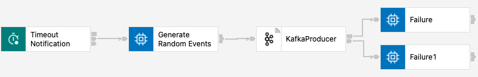
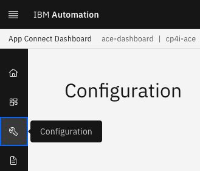

# IBM Cloud Pak for Integration - Flight Landing Events Simulator

In this lab, you will deploy App Connect Toolkit flow to simulate flight landing events.  

 

# 1. App Connect Toolkit

## Flight landing event generator Message Flow

This is a simple App Connect Toolkit Flow to generate Flight Landing events. 

Download the **AsyncApi_Toolkit_PIF.zip**  
    Click here and save the zip file - [AsyncApi_Toolkit_PIF_3.zip](./source/project-interchange/AsyncApi_Toolkit_PIF_3.zip)

 
Open IBM App Connect Toolkit.   

Import Project Interchange AsyncApi_Toolkit_PIF.zip into App Connect Toolkit File > Import > Project Interchange > Select AsyncApi_Toolkit_PIF.zip from the Downloads folder.
 

#### Modify TOPIC name with yours Topic name. 

 

<b>BUILD THE BAR FILE ACE_Flight_Landing_Event_Simulator_Application.</b>

#### Kafka Policy

 
Update bootstrap url with yours saved in  Notepad.
  
Save the policy   

#### Export the policy as a zip file, save to Downloads folder.

  

# 2. App Connect Enterprise Dashboard

From Cloud Pak for Integration Platform Navigator, open App Connect Dashboard.  

Navigate to Configuration Icon on the left panel, and click Configuration. 

Click "Create Configuration" 

#### Event Streams Policy Project configuration

#### Truststore configuration

#### setdbparms.txt configuration

 
kafka::myKafkaSecId studentxx-scram-credentials studentxx-scram-password
 
truststore::truststorePass dummy passw0rd

 

## Deploying the BAR (Broker Archive) file
Navigate to "Create Server" from the "Servers" Icon on the left panel.  
Select "Small Integration" tile.  

Drag and drop the bar file from Toolkit to ACE Dashboard "Create Server" wizard as below. 

 
Next
 

Search for "es-" configurations.  
Select all es-policy, es-setdbparms, es-cert.jks configurations, and Hit Next  

 
Wait for few minutes for the Integration Server to be ready. 
 
 
 

# 3. Event Streams Console - Verify Flight Events

From the Cloud Pak for Integration Platform Navigator, open Event Streams Console. 

Open STUDENT00.FLIGHT.LANDINGS, and verify if the Flight Landing Evennts are being generated as below.   

 
 
 

<b> END OF LAB </b>
