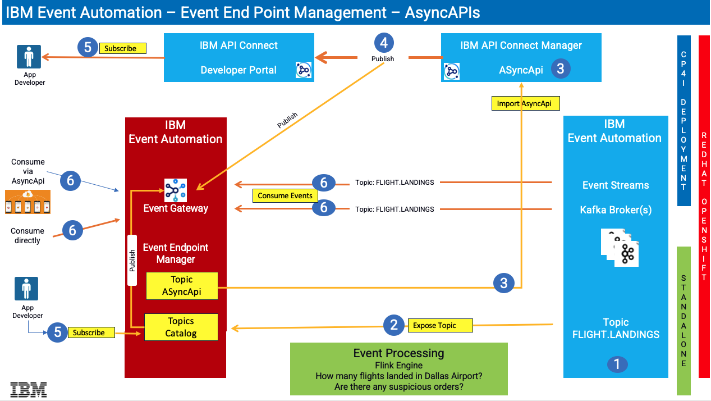

# IBM Event Automation - Consuming Flight landing events through AsyncApi

AsyncApi's helps you to socialize the Kafka sources (Topics) as API's through IBM Event Gateway. These labs enables you an end-2-end event automation experience through the IBM Cloud Pak for Integration & IBM Event Automation products.

Architecture Diagram below  

### Lab1: Work with IBM EventStreams
in this lab you will create Kafka Topic in IBM Event Streams, and capture Kafka Credentials. 

### Lab2: Work with IBM Event End Point Management (EEM)
In this lab you will, 
a) Link STUDENTxx.FLIGHT.LANDINGS topic from Event Streams into Event Endpoint Management.  
b) Export AsyncApi definition of STUDENTxx.FLIGHT.LANDINGS Topic.  
c) Extract Event Gateway Certificates to be used for Testing (lab5). 

### Lab3: Work with IBM Api Connect
In this lab you will, 
a) Create AsyncAPI, and a Product in IBM API Connect Manager.   
b) Publish the Product & AsyncApi to API Connect Developer Portal. 
c) Subscribe to the AsyncApi from API Connect Developer Portal.  
 

### Lab4: Work with IBM App Connect
in this lab you will,  
a) Use IBM App Connect Toolkit and import Flight Landing Simulator Project. 
b) Review the Flight landing simulator flow, and modify Topic name  
c) Modify kafka policy's bootstrap url  
d) ReBuild the bar file  
e) Deploy the bar file to IBM App Connect Dashboard.  
 

### lab5: Consuming flight landing events
in this lab you will run kafka clients to consume the Flight landing events being produced in lab4.  

 

!!! CONGRATULATIONS !!!