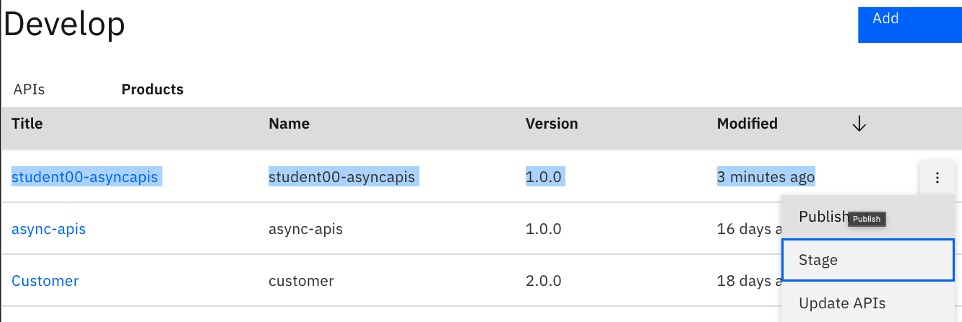
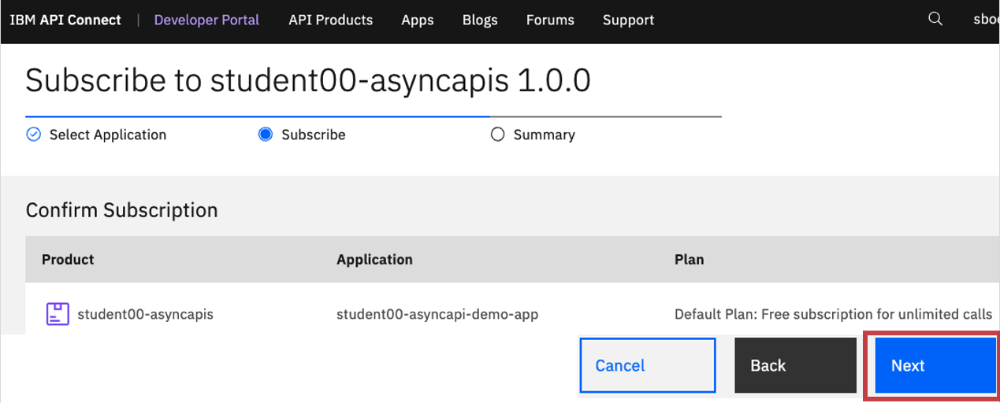

# IBM Cloud Pak for Integration - Creating AsyncAPI

In this lab you will import the AsyncApi definition of STUDENTxx.FLIGHT.LANDINGS that you exported in the previous lab. After importing, you will create a Product and Publish. 

 

# 1. Api Connect Manager

From the IBM Cloud Pak for Integration Platform Navigator, open IBM Api Management Console.  

## 1.1 Import AsyncApi definition

From the Home page select "Develop APIs and products" > \<Add\> button > API option. 

Click \<Next\>  \<Next\> \<Next\> 

You have successfully imported AsyncApi into IBM Api Connect.  

## 1.2 Create Product

Click \<Next\>  \<Next\> \<Next\> \<Done\>, that should publish the AsyncApi into the IBM Api Connect Developer Portal. 

## 1.3 Publish Product

Now, publish the AsyncApi's product to the IBM Api Connect Developer Portal, and to the IBM Event Gateway.

Navigate to API Manager Home (Home Icon on top left) --> Manage Catalogs, select Sandbox Catalog.

Publish the Product to APIC Developer Portal, and Event Gateway.

 

# 2. Api Connect Developer Portal

Locate the developer portal Url, by navigating to API Manager Home (Home Icon on top left) --> Manage Catalogs, select Sandbox Catalog.

Click on "Catalog Settings" tab.

Click on Portal tab on left panel, and copy the Portal URL.

Signon to API Connect Developer Portal

## 2.1 Subscribe to AsyncAPI

Select student00-asyncapis Product

*** IMPORTANT ***  
Copy and Save the Key (ClientId), and the Secret into Notepad. These will be used by the Async Client java application.

Select the new application that you just created.

  

   

<b> CONGRAGULATIONS !!! </b>
