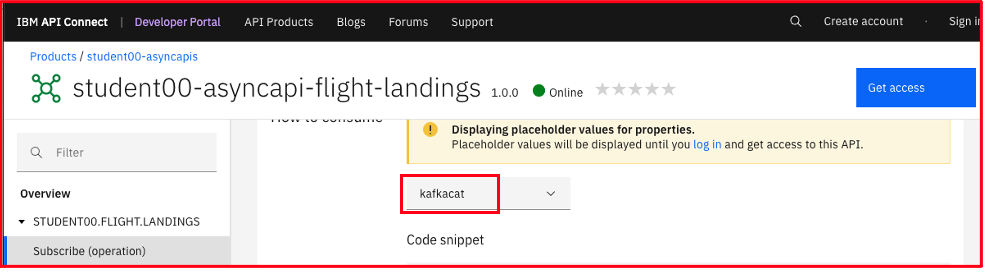

# IBM Cloud Pak for Integration - AsyncApi - Consuming Flight Landing Events

In this lab, you will consume the flight landing events using Kafka Clients kafka-console-consumer.sh, kafkacat, and Java program.
<br><br><br>


# 1. Consuming Flight Landing Events

## 1.1 kafka-console-consumer.sh

Receive flight landing events using open-source kafka-console-consumer.sh <br>

From API Connect Developer Portal, navigate to your Async API & the Subscribe Operation.<br> 


Copy the code snippet by clicking "Copy to Clipboard" icon on right (sample command below) and update the credentials.<br>

```
kafka-console-consumer.sh --bootstrap-server "my-egw-ibm-egw-rt-event-automation.ocp-dev-e8d7fad266f3d495445c089746d902f0-0000.us-east.containers.appdomain.cloud:443" \
  --group "1" \
  --consumer-property "client.id=1d58133f-d731-46d6-a944-5bfdfc623b0f" \
  --key-deserializer "org.apache.kafka.common.serialization.StringDeserializer" \
  --value-deserializer "org.apache.kafka.common.serialization.StringDeserializer" \
  --consumer-property "security.protocol=SASL_SSL" \
  --consumer-property "sasl.mechanism=PLAIN" \
  --consumer-property "sasl.jaas.config=org.apache.kafka.common.security.plain.PlainLoginModule required username=\"62f9a33d1917ffeb271220e1f4aebbbe\" password=\"<APIConnect-application-Password>\";" \
  --consumer-property "ssl.truststore.location=./egw-cert.p12" \
  --consumer-property "ssl.truststore.password=passw0rd" \
  --consumer-property "ssl.truststore.type=PKCS12" \
  --topic "STUDENT00.FLIGHT.LANDINGS"
```
Modify the command, and update username, password, ssl.truststore.location, ssl.truststore.password, ssl.truststore.type fields.<br>

<br>
<b>username:</b> client id/key of APIC developer portal/application <br>
<b>password:</b> secret of the APIC developer portal application <br>
<b>ssl.truststore.location:</b> ./egw-cert.p12 <br>
<b>ssl.truststore.password:</b> passw0rd <br>
<b>ssl.truststore.type:</b> PKCS12 <br>
<br>

## Run kafka-console-consumer.sh

If the configurations are correct, then you should receive the flight landing events (at 10 seconds interval) being generated by the Flight landing Event Simulator App Connect Message Flow.<br>
```
{"timestamp":"2023-07-18T23:42:10.709400","location":"San Francisco, CA","airport":"SFO","airline":"American Airlines","flight":"AA911","terminal":"B","gate":35,"passengers":45}
{"timestamp":"2023-07-18T23:42:20.721948","location":"San Francisco, CA","airport":"SFO","airline":"Russian Airlines","flight":"RA451","terminal":"G","gate":99,"passengers":34}
```
<br>


## 1.2 kafkacat (kcat)
kcat (formerly kafkacat) is a command-line utility that you can use to test and debug Apache Kafka® deployments. You can use kcat to produce, consume, and list topic and partition information for Kafka.<br><br>

From the API Connect Developer Portal, select the AsyncApi, and the subscribe operation. Under "How to consume" select kafkacat. <br>
Copy the kafkacat command. <br>



<br>

```
kcat -J -G "1" \
  -b "my-egw-ibm-egw-rt-event-automation.ocp-dev-e8d7fad266f3d495445c089746d902f0-0000.us-east.containers.appdomain.cloud:443" \
  -X client.id="40ae1649-1049-41c5-a71d-8814e38a5bfe" \
  -X security.protocol="SASL_SSL" \
  -X ssl.ca.location="<path to cluster ca>" \
  -X sasl.mechanisms="PLAIN" \
  -X sasl.username="62f9a33d1917ffeb271220e1f4aebbbe" \
  -X sasl.password="<SASL_password>" \
  "STUDENT00.FLIGHT.LANDINGS"
  ```
Replace <br>
<b>ssl.ca.location=<b>./egw-cert.p12<br>
<b>sasl.password=</b> secret of the APIC developer portal application <br>
If the command ran successfully, you should receive Flight Landing Events from your Event Streams Topic through the AsyncApi that you have created! <br>
```
{"topic":"STUDENT00.FLIGHT.LANDINGS","partition":0,"offset":765876,"tstype":"create","ts":1689870850941,"broker":2,"key":null,"payload":"{\"timestamp\":\"2023-07-20T16:34:10.941322\",\"location\":\"San Francisco, CA\",\"airport\":\"SFO\",\"airline\":\"American Airlines\",\"flight\":\"AA660\",\"terminal\":\"B\",\"gate\":10,\"passengers\":135}"}
```

<br>


## 1.3 Java Application

Use the Java Client application and receive the flight landing events thru the IBM Event Gateway --> Api Connect Async Api --> Event Streams, using a java client<br>

From API Connect Developer Portal, navigate to your Async API & the Subscribe Operation.<br> 


Open App Connect Enterprise Toolkit. <br>


Project: AsyncApi_Consume_Flight_Landing_Events_Java_Project_EEM<br>
Class Name: AsyncApi_Consume_Flight_Landing_Events_EEM.java<br>
Config File: config.properties<br>

Update config.properties
```
bootstrap.servers=<eventgateway-bootstrap-server:443>
group.id=2
client.id=<from api connect developer portal>
username=<api connect dev portal - apikey>
password=<api connect dev portal - secret>
SslConfigs.SSL_TRUSTSTORE_LOCATION_CONFIG=<path of /egw-cert.jks>
SslConfigs.SSL_TRUSTSTORE_PASSWORD_CONFIG=passw0rd
SslConfigs.SSL_TRUSTSTORE_TYPE_CONFIG=JKS
FLIGHT.LANDING.TOPIC=STUDENT00.FLIGHT.LANDINGS
```

You need the below jar files to resolve the compilation errors. <br>
They are included in the AsyncApi-Flight-Landings-Java Project under jars folder. Please make sure the Project Build Path is setup right.<br>
jackson-annotations-2.10.5.jar <br>
jackson-core-2.11.4.jar <br>
jackson-databind-2.10.5.1.jar <br>
kafka-clients-2.8.0.jar <br>
slf4j-api-1.7.30.jar <br>

<br>
Make sure that you have set the parameters accurately: <br>

<br>

If no compilation errors, run the AsyncApi_Consume_Flight_Landing_Events_EEM Java Program and watch the Flight Landing Events being received every 10 seconds.<br>
```
DEBUG: A FLIGHT HAS LANDED!
           time landed: 2023-09-02T22:03:18.094274
              location: Orlando, FL
               airport: MCO
               airline: Russian Airlines
         flight number: RA413
              terminal: G
                  gate: 79
  number of passengers: 41
  ```
<br>
<br>

# Troubleshooting

### kafka-console-consumer.sh is not consuming events - event gateway pod log: ERROR com.ibm.eem.core.Request - [abortAndCloseConnection:225] Unable to set hostname or port on request for api key: JOIN_GROUP and correlationId: 985366

Fix: it's an issue with the SCRAM Credentials. Regenerated SCRAM credentials and updated the ASYNCAPI definition and republished.
<br><br>

### kafka-console-consumer.sh is not consuming events - event gateway pod log: ERROR com.ibm.eem.core.Request - [abortAndCloseConnection:225] Error creating verticle for Server es-demo-kafka-bootstrap-cp4i-eventstreams.apps.melch.coc-ibm.com:443 Error received from Kafka during SASL exchange : 1
Fix: Make sure you have selected SCRAM-SHA-512 in the ASYNCAPI definition.
<br>

### kafka-console-consumer.sh failure
[2023-07-27 20:40:13,506] ERROR [Consumer clientId=40ae1649-1049-41c5-a71d-8814e38a5bfe, groupId=1] Connection to node -1 (my-egw-ibm-egw-rt-event-automation.ocp-dev-e8d7fad266f3d495445c089746d902f0-0000.us-east.containers.appdomain.cloud/169.63.130.26:443) failed authentication due to:  (org.apache.kafka.clients.NetworkClient)
[2023-07-27 20:40:13,506] WARN [Consumer clientId=40ae1649-1049-41c5-a71d-8814e38a5bfe, groupId=1] Bootstrap broker my-egw-ibm-egw-rt-event-automation.ocp-dev-e8d7fad266f3d495445c089746d902f0-0000.us-east.containers.appdomain.cloud:443 (id: -1 rack: null) disconnected (org.apache.kafka.clients.NetworkClient)
[2023-07-27 20:40:13,508] ERROR Error processing message, terminating consumer process:  (kafka.tools.ConsoleConsumer$)
org.apache.kafka.common.errors.SaslAuthenticationException:

Fix: Make sure the API is subscribed in the APIC Dev Portal.

<b> END OF LAB </b>
