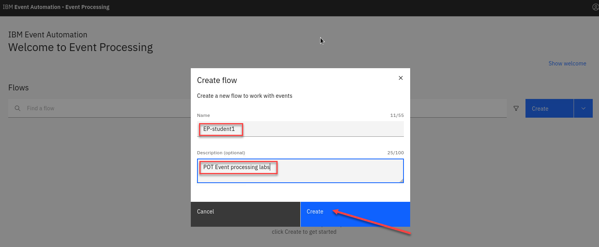
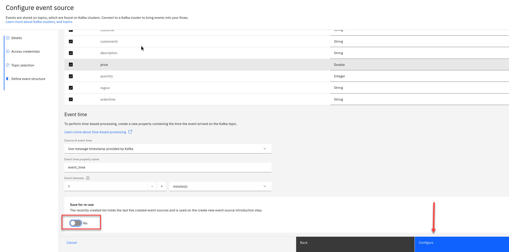

# Discover the topic to use and filter events based on particular properties

For this scenario, you need a source of order events. A good place to discover sources of event streams to process is the catalog in Event Endpoint Management.
When processing events, we can use filter operations to select a subset
that we want to use. Filtering works on individual events in the stream.

# 1.1 Discover the topic to use

In these labs the instructor will act as the Event Endpoint Management administrator to expose the topics that students will need to complete the labs.   

**Event Endpoint Management** provides the capability to describe and catalog your Kafka topics as event sources, and to share the details of the topics with application developers within the organization. Application developers can discover the event source and configure their applications to subscribe to the stream of events, providing self-service access to the message content from the event stream.

Access to the event sources are managed by the Event Gateway. The Event Gateway handles the incoming requests from applications to consume from a topic’s stream of events. The Event Gateway is independent of your Kafka clusters, making access control to topics possible without requiring any changes to your Kafka cluster configuration.

1. A quick review of Event Endpoint Management home page.  The EEM administrator will manage the **Topics, Clusters, and Event gateways**
Also will published the topics that will be visible to developers 

    

1. Login to the EEM home page as **eem-user**

    

1. Go to the **Event Endpoint Management** catalog home page and find the **ORDERS.NEW** topic.

    

1. Click into the topic to review the information about the events that are available here.
Look at the schema to see the properties in the order events. You can see the sample message to get an idea of what to expect from events on this topic.

    You will also see the Servers available this will be used in the Event Processing.

    

    **NOTE**: Keep this page open. It is helpful to have the catalog available while you work on your event processing flows, as it allows you to refer to the documentation about the events as you work. Do the following steps in a separate browser window or tab.
# 1.2 Event Automation Processing

1. Go to the **Event Automation Processing** home page.
The next step is to start processing this stream of events, to create a custom subset that contains the events that you are interested in.

    

1. Create a flow, and give it a name and description to explain that you will use it to identify orders made in the EMEA region.

    Name your Flow "EP-<Student Name>" for example **EP-melch1**

     And add a Description (ex: POT Event processing lab)

     Click **Create**

    

    The next step is to bring the stream of events you discovered in the catalog into Event Processing.

1. You will know be on the canvas. Create an event source node by dragging one onto the canvas. You can find this in the "Events" section of the left panel.
To configure the event source node hover over the node and select the **pen icon**.

    

1. Configure the new event source. Make sure to use the **Add event source**.  You may see others that were recently created. 

    

1. Give the node a name that describes this stream of events: **Order_source_cody1**
We need to get the server address from Event Endpoint Management

    **NOTE:** You will not need to **Generate access credentials** those will be provided for you.  

    

1. Now go back to the Event Endpoint Management home page (should be open in another tab).
Here we will copy the Server that we need to complete the Source Connector. 

    

1. Now return to the **Event Processing** to finish configuring the event source for our flow.
Paste the url in the server and click **Next**

    

1. Now we will accept the certificates.  
Click the **Accept certificate** box and click **Next**

    

    **NOTE:**: If the credentials are not accepted immediately, wait for
    thirty seconds, and then click "Next" again.

1. Now we will add the username and password provided to you for the **ORDERS.NEW** topic.  

    Click **Next**

    

1. Now select the Topic we will use. **ORDERS.NEW**
    
 
1. Get the schema for order events from Event Endpoint Management.

    Click the Copy button in the Schema tab to copy the schema to the clipboard.
You need to give Event Processing a description of the events
available from the topic. The information in the schema will enable
Event Processing to give guidance for creating event processing nodes.

    

1.  Click the Yes button and turn it to No for this Lab because we
have already saved this source topic for you
Click **Configure** to finalize the event source.
    
### Recap

You created your first event processing flow.
You have seen how to discover and request access to a topic in the
catalog, and register it as a source of events for processing.

# 2.0 Filter events based on particular properties

When processing events, we can use filter operations to select a subset
that we want to use. Filtering works on individual events in the stream.

## Scenario : Identify orders from a specific region                                       

The EMEA operations team wants to move away from reviewing quarterly sales reports and be able to review orders in their region as they occur.                                       Identifying large orders as they occur will help the team identify changes that are needed in sales forecasts much earlier. These results can also be fed back into their manufacturing cycle so they can better respond to demand.                                      

## Define the filter

The next step is to start processing this stream of events, by creating the filter that will select the custom subset with the events that you are interested in.

1. Go to the **Event Processing** home page, search for **Student Name** and click on the "Edit flow" link on the tile for your flow.  
For example "EP-melch1".                                       
  

1. Create a **Filter** node and link it to your event source.
Create a filter node by dragging one
 onto the canvas. You can find this in the "Processors" section of the
 left panel.  Click and drag from the small gray dot on the event source to the
matching dot on the filter node.
Hover over the node and select the pen icon to edit the flow. 

   

    **Note:** You can add a node onto the canvas and automatically
  connect it to the last node added by  double-clicking it in the
  palette. 
 
1. Give the filter node a name that    describes the events it
should identify: EMEA orders

    Click **Next**

      

1. Use the assistant to define a filter that matches events with:

    *region = EMEA* 

    Use the drop down for the property and conditon and type in EMEA.  
    
    Click "Add to expression".

      

## Testing the flow

 The final step is to run your event processing flow and view the results.

1. Use the "Run" menu, and select **Include historical** to run your
filter on the history of order events available on this Kafka topic.

   
 
    **NOTE:** "Include historical" is useful while you are developing your flows, as it means that you don't need to wait for new events to be produced to the Kafka topic. You can use all of the events already on the topic to check that your flow is working the way that you want.

1. Click the EMEA orders node to see a live view of results from your filter. It is updated as new events are emitted onto the orders topic.
**Note:** You may see the message "Waiting for receiving the events"

   

    You will see only messages from Region EMEA.

   

1. When you have finished reviewing the results, you can stop this flow.

   
## Recap

 You used a filter node to specify a subset of events on the topic that you are interested in.
 
[Return to main Event processing lab page](../index.md)