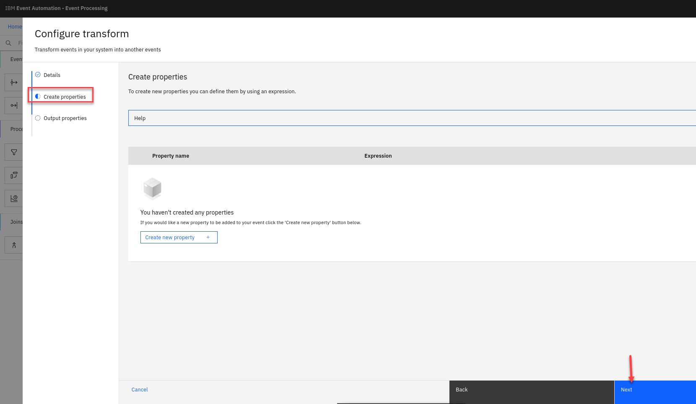
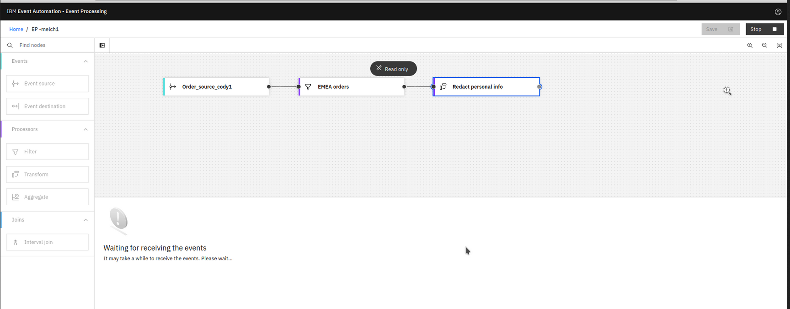
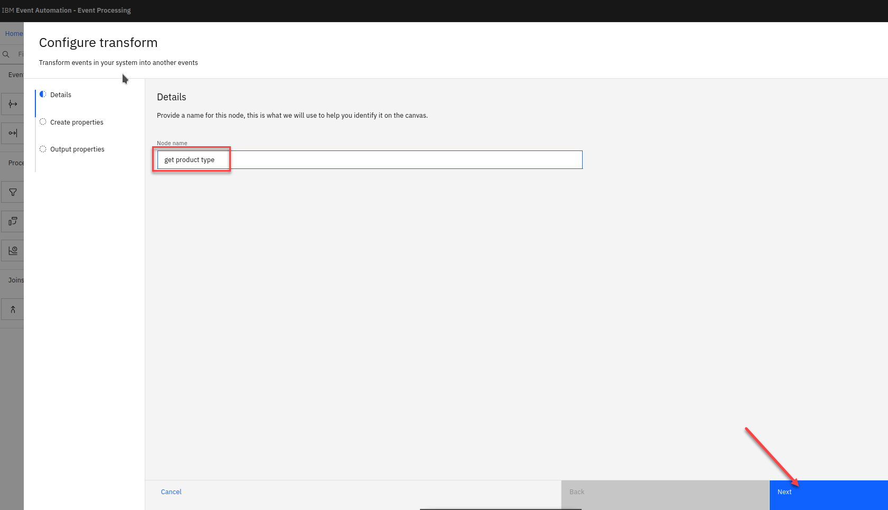

# Lab 2 - Transform events by removing event properties adding new custom properties.
 

When processing events we can modify events to remove some properties
from the events. Transforms work on individual events in the stream.

When processing events we can modify events to create additional properties, which are derived from the event. Transforms work on individual events in the stream.

## Scenario: Redact personal information from order events

The operations team wants to enable another team to analyse order
events, however this other team is not permitted access to
personally-identifiable information (PII) about customers. They need
to be able to process order events without customer PII.


# 1.0 Transform events by removing event

 For this scenario, we will use the flow from lab 1.

1. Go to the **Event Processing** home page, search for your User Name and click on the **Edit flow**

    For example "melch1".
 
     

1. The next step is to define the transformation that will remove the customer personal information from events.

    Add a **Transform** node and link it to your event source.

    Click on the **Pen icon** on the transform node to edit it. 


    
  
    **NOTE:** You can add a node onto the canvas and automatically connect it to the last node added by double-clicking it in the palette.

1. You are now in the Configure Transform screen.  First thing is give the transform node a name that describes what it will do.   (ex: redact personal info)

    Click **Next**  
  
 

1. As you aren't creating any new properties, 

    Click **Next**

    **Note:** You can learn about creating custom properties in the next section.

    

1. Now we will update the output properties and remove the *customer* and *customerid* properties from the events. 

    Clicking the remove property icon next to their names.

    When done click on Configure to complete the transform node.
  


## Testing the flow

The final step is to run your event processing flow and view the results.

1. Use the "Run" menu, and select **Include historical** to run your transform on the history of order events available on this Kafka topic.
  
    

    **NOTE:** "Include historical" is useful while you are developing your flows, as it means that you don't need to wait for new events to be produced to the Kafka topic. You can use all of the events already on the topic to check that your flow is working the way that you want.

1. Click the redact transform node to see a live view of results from your transform. It is updated as new events are emitted onto the orders topic.
**Note:** You may see the message "Waiting for receiving the events" while the process is running.

    

    You will now see the results and will not have "customer" or "customerid" in the output. 

    When you have finished reviewing the results, you can stop this flow

   

## Recap

You used a transform node to redact sensitive data from order events.

# 2.0 Transform events by adding new custom properties

When processing events we can modify events to create additional properties, which are derived from the event. Transforms work on individual events in the stream.

## Scenario : Create new properties needed for the next lab
In this scenario, we will create properties that are needed in a future lab. We need more data to identify the product that has sold the most units in each hourly window. This could be used to drive a constantly updating event streams view of "Trending Products".

## Extract product type from events
The product description value in the events includes several attributes of the jeans that are sold - the size, material, and style.  We would like to aggregate the data based on this information. This data in the description is combined as a single string in a consistent way. This means we can extract them using regular expressions.

For this scenario, we will use the flow from the last section.

1. If you closed it go to the **Event Processing** home page, search for your User Name and click on the **Edit flow**

    For example "melch1".
 
     


    In the next step, we extract product type into a separate property so that we can use them to filter and aggregate events later in the flow.

1. Add a **Transform** node and link it in your current flow.

    Hover over the node and select the pen icon to edit the node. 
  
    

1. Give the transform node a name that describes what it will do: "get product type"

    Click **Next**
  
    

1. Click the **Create new property** button.

                            |
 
1. Give the property a name "product type" and then select the "Assistant" drop down link.

    


1. Use the assistant to choose the REGEXP_EXTRACT function from the list.

    You can scroll down the list until you find REGEXP_EXTRACT or you can type "regex" in the field and it will reduce the size of the pull down.

    Click the "REGEXP_EXTRACT"

    
    
   
    

1. Define the regular expression that extracts the product type from the description.

    Product descriptions are all made up of four words.
  
    Some examples:
    
   * XXS Navy Cargo Jeans
   * M Stonewashed Capri Jeans
   * XL White Bootcut Jeans
   * S Acid-washed Jogger Jeans

    Each word contains similar information in each description:
    * word 1 : Size. This is made up of one-or-more uppercase letters.
    * word 2 : Material or color, made up of a mixed-case word, optionally with a hyphen.
    * word 3 : The type of jeans, made up of a mixed-case word, optionally with a hyphen.
    * word 4 : The text "Jeans".

    Create a regular expression that extracts the third word from the description text, by filling in the assistant form with the following values:

      ``` 
      **text** :  description

      This identifies which property in the order events that contains the
      text that you want to apply the regular expression to.

      **regex** :  ([A-Z]+)([A-Za-z\-]+)([A-Za-z\-]+) Jeans

      This can be used to match the description as shown above - describing
      the four words that every description contains.

      **index** : 3
      ```
      Click **Insert into expression** to complete the assistant.

      

1.  You should now see your expression.   Click **Next**

      

1. As you aren't modifying Output properties, then click **Configure** to finalize the transform.

     
## Testing the flow

 The final step is to test your event processing flow and view the results.

1.  Use the "Run" menu, and select **Include historical** to run your transform on the product type of order events available on this Kafka topic.

      

    **NOTE:** It is good to regularly test as you develop your event processing flow to confirm that the last node you have added is doing what you expected. Note the new property for product type is populated with the data extracted from the description property.

1. Click the "get product type" node to see a live view of results from your transform. It is updated as new events are emitted onto the orders topic.
**Note:** You may see the message "Waiting for receiving the events" while the process is running.

      

    You will now see the results and will see the new proporty for **productType** in the output. 

    When you have finished reviewing the results, you can stop this flow

      


## Recap

You used a transform node to dynamically extract a property from the description within the order events.

[Return to main Event processing lab page](../index.md)