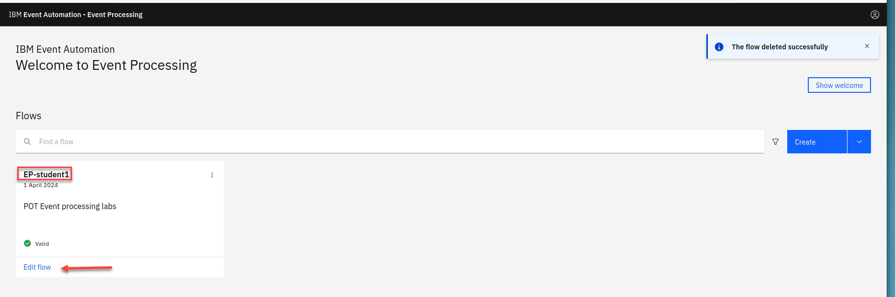
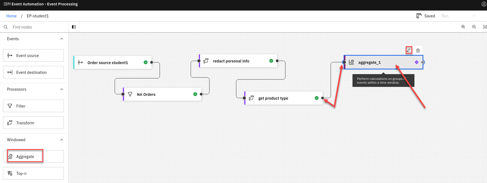
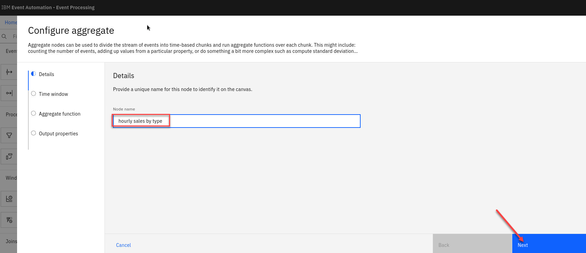
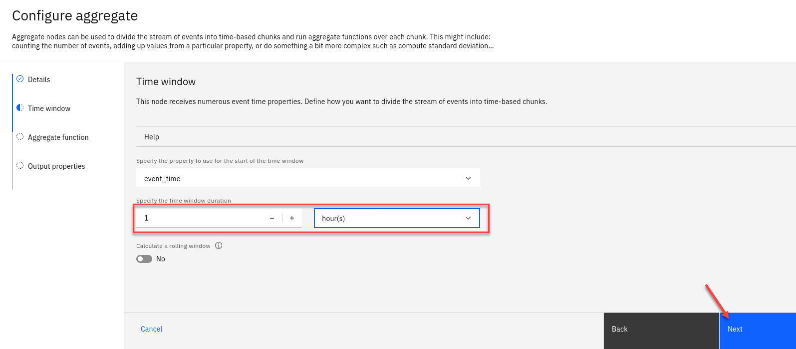
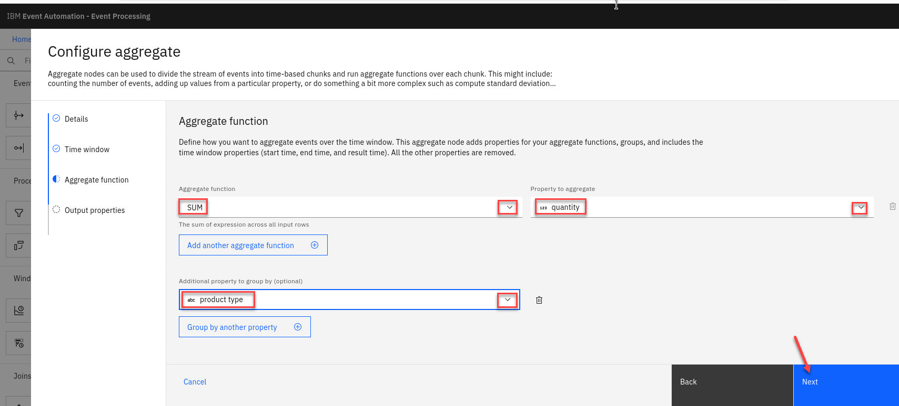
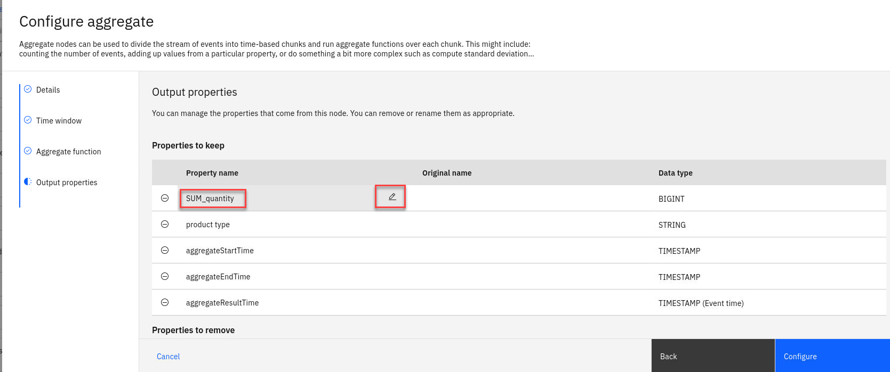
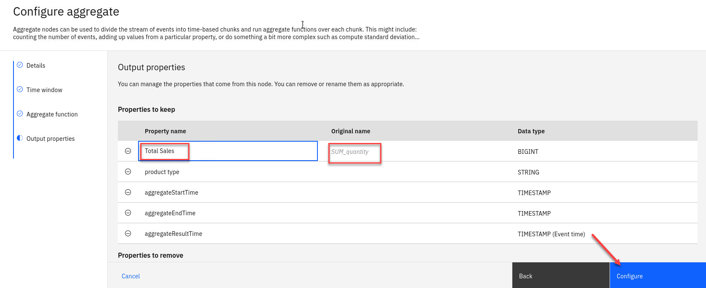
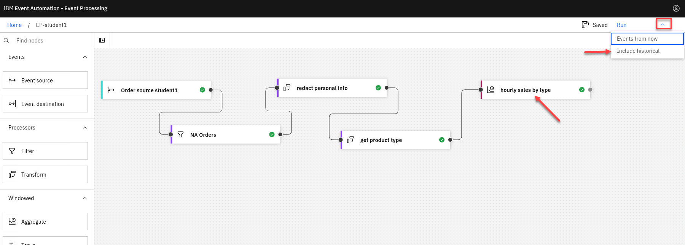
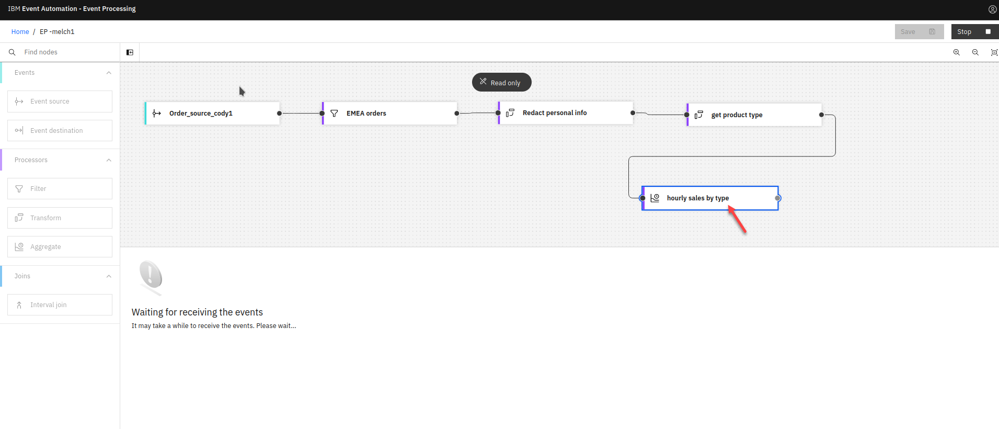
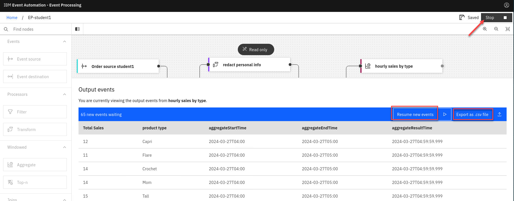

# Lab 3 - Aggregate events to detect trends over time

Aggregates enable you to process events over a time-window. This enables
a summary view of a situation that can be useful to identify overall
trends.

## Scenario : Track how many products of each type are sold per hour

 In this scenario, we identify the product that has sold the most units
 in each hourly window. This could be used to drive a constantly
 updating event streams view of "Trending Products".

1. For this scenario, we will use the flow from the last tutorial.  Go to the **Event Processing** home page, search for your User Name and click on the **Edit flow**

    For example "melch1".
 
      

1. Now that you have transformed the stream of events  to include the get product type attribute, the next  step is to total the number of items sold (using
this new property)
    Add an **Aggregate** node and link it to your get product type.

    Click on the **Pen icon** on the Aggregate node to edit it.

    

1. Name the aggregate node to show that it will count the number of units sold of each type: **hourly sales by type**

    Click **Next**
    

1. Now specify the time window to be a 1-hour window.

    Click **Next**
   

1. Now we we create the aggregate function to sum the number of items sold in each hour, grouped by product type.

    **Note:** You select the "v" next to the varies functions and properties to see what is available.
    

1. Rename the new aggregate properties by clicking the property name and then selecting the pencil icon.

   
  

    **Note:**: It can be helpful to adjust the name of properties to something that will make sense to you, such as describing the SUM property as total sales .

1. You will see the new name and the Original Name will be saved as well. 

    Click **Configure** to finalize the aggregate.
    

## Testing the flow

The final step is to run your event processing flow and view the results.

1. Use the "Run" menu, and select **Include historical** to run your transform on the history of order events available on this Kafka topic.
  
    

    **NOTE:** "Include historical" is useful while you are developing your flows, as it means that you don't need to wait for new events to be produced to the Kafka topic. You can use all of the events already on the topic to check that your flow is working the way that you want.

  
1. Click the "hourly sales by type" node to see a live view of results from your aggregation. It is updated as new events are emitted onto the orders topic.
**Note:** You may see the message "Waiting for receiving the events" while the process is running.

    

1. You will now see the results and will see the new proporty for **total sales** in the output.

    

1. You can pause the streaming of the data and then you can click the **Download CSV** to get a copy of the results to use in MS Excel for example. 

1. When you have finished reviewing the results, you can stop
this flow.

    

## Recap

You used an aggregate node to count the events based on this extracted property, grouping into one-hour time windows.

[Return to main Event processing lab page](../index.md)