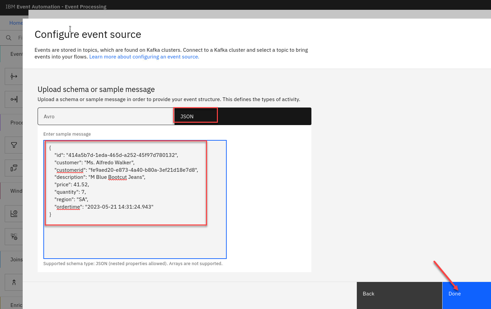
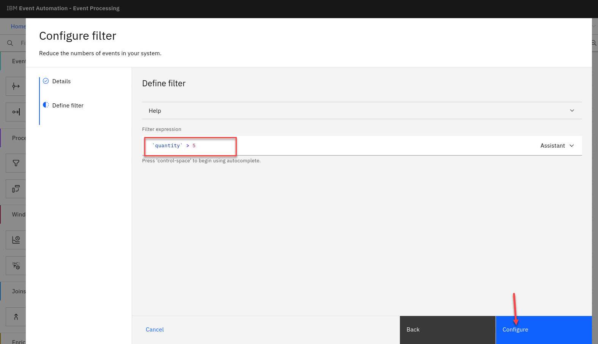
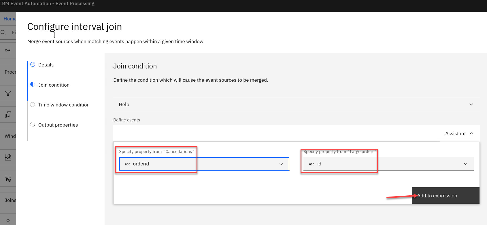

# Lab 4 - Join related events that occur within a time window

When looking for patterns in an event stream, sometimes we need to examine events from more than one topic. We talk of this as a "join" between the streams - the same term we would use when working with databases and correlating data between two tables.
## Scenario : Identify suspicious orders

Many interesting situations need us to combine multiple streams of events that correlate events across these inputs to derive a new, interesting situation.

In this scenario, we will look for suspicious orders. Specifically, we will be looking for a particular pattern of behavior where large orders have been placed, followed by a smaller order, but the large order was at some point cancelled. 

This pattern would suggest an attempt to manipulate prices, since the presence of the large order might result in a subsequent reduction in prices, which the smaller
order can take advantage of.

To find this pattern, we will use the "join" capability to compare a stream of "orders" with a stream of "cancellations".


# 1.1 Discover the topic to use

1. Login to the EEM home page as **eem-user** we will need to get info on another topic for this lab.

    

1. Go to the **Event Endpoint Management** catalog home page and find the **Cancellations** topic.

    You will notice that as a user you will only have access to the Catolog page and Subscription page.

    We already have the ORDERS.NEW details we needed. 

    Now click on the **CANCELLATIONS** topic to review the information about the event that are available here.
    
    

1.  We will now generate access to   this topic.  We have only the one Controls that was created for this Topic.  

    
    
    If you scroll down on the page you will see the Servers available that will be used in the Event Processing and also Code samples.  
     

1. Click on the **Cancelled orders** Control topic and select the **Generate access credentials** in the upper right.

    

1. Here you will be asked for contact info.  Enter something like a email or just your userid 

    For example student1@mail.com
    
    Click on Generate.
    

1. You will now see your Access Credentials. You will need to save these for later.  On the Desktop if you open the **EEM-info** file that is a scratch pad to save credentials and other info for the labs. 

    Save the Username and Password under Cancelled in the file. 
    

## 1.1  Create new flow to join two streams

1. We will now create a new flow and name it as **suspicious-orders**

    **Ex: EP-student1-suspicious-orders**
    

1. You will know be on the canvas. You will have a event source node on the canvas. To configure the event source node hover over the node and select the pen icon.

    

1. Configure the new event source. Make sure to use the Add event source. You may see others that were recently created.

    

1. Give the node a name that describes this stream of events and include your userid for ex:

    **Order source student1**

    We need to get the server address from Event Endpoint Management or if you saved it in the EEM-info note.

    

1. Now accept the certificates and click **Next** 

   

1. Now we will add the username and password that you saved from the Event Endpoint Management.

    Click **Next**

    

1. Now select the topic.  You should only see the ORDERS.NEW topic and click on **Next**
    

1. Now we will add a Sample message for this topic
  

1. Select the JSON tab and cut and paste the following in and click **Done**

	```
    {
     "id": "414a5b7d-1eda-465d-a252-45f97d780132",
     "customer": "Ms. Alfredo Walker",
     "customerid": "fe9aed20-e873-4a40-b80a-3ef21d18e7d8",
     "description": "M Blue Bootcut Jeans",
     "price": 41.52,
     "quantity": 7,
     "region": "SA",
     "ordertime": "2023-05-21 14:31:24.943"
    }
    ```
    

1. Before configuring scroll to the bottom and turn off the save switch
  

### Add filter node

1. Create a filter node by dragging one onto the canvas. You can find this in the Processors section of the left panel.

    Click and drag from the small gray dot on the event source to the matching dot on the filter node.

    Click on the pen to configure this node
     

1. Give the filter node a name that describes the results: **Large orders**.

     
1. Create a filter that selects orders for more than 5 items.  Use the Expression Assistant for this.  Once done click **Add to expression** 
     
 1. You will see your new filter.  Click on **Configure**   
    
1. Now let's test are flow so far. Click on Run and select Include historical.  
    
1. Review the Output for the events and you should see only quantities greater then 5.
    

### Discover and add additional source of events
Identify which of these large orders are cancelled within 30 minutes of being made.

The next step is to find a stream of order cancellation events to add to your flow.

1. Add a new event source onto the canvas and click on the pen icon to edit it. 
    

1. Configure the new event source. Make sure to use the Add event source. You may see others that were recently created.
    

1. Give the node a name that describes this stream of events for ex:

    **Cancellations**

    We need to get the server address from Event Endpoint Management or if you saved it in the EEM-info note.
    

1. Now accept the certificates and click **Next**
    

1. Now we will add the username and password that you saved from the Event Endpoint Management for this topic.

    Click **Next**
    

1. Now select the topic. You should only see the CANCELLATIONS topic.   
    Click **Next**
    

1. Now we will add a Sample message for this topic 
    

1. Select the JSON tab and cut and paste the following in and click **Done**

	```
    {
        "id": "a8651c18-5360-43a3-ae08-98130a845ed4",
        "orderid": "839096ce-c16e-41f2-8842-69350c6ca0e2",
        "canceltime": "2023-05-20 13:08:17.828",
        "reason": "BADFIT"
    }
	```
    

1. Before configuring scroll to the bottom and turn off the save switch 
    

1. You will see a *Validation error*.  Don't worry that will be taken care of once we connect that node in the next steps. 
    

### Join the two streams
1. Add an **Interval join** node and link it to the two streams by clicking and drag from the small gray dot on the cancellations event
source to the matching dot on the filter node. Do the same for the large orders filter node.  

    Hover over the **IntervalJoin_1** node and click the **pen icon** to edit the node.  

    


1. Give the join node a name that describes the events it should identify: **Cancelled large orders**

    

1. Configure the join node by clicking the Assistant drop down.

    Define the join by matching the **orderid** from the cancellation events and the **id** from the large order events

    Then click on **Add to expression**

    
 
1. You will now see your expression.  
    
    Click "Next"

    
  
   
1. Specify that you are interested in detecting cancellations that are made within 30 minutes of the (large) order.

     Click "Next"

    

1. Now we will remove the properties that we do not need to simplify the output.
 We only need to know when it happened, what product was cancelled and by what customer

    Keep the two "Event time" properties - ordertime and canceltime.

    Keep the description and customerid properties from the Large orders.

    Click on the icon next to the properties you want to remove.  

    

1. Once you are done should look like this and you can click **Configure** to finalize the
join.
    

## 1.2 Test the flow
The next step is to test your event processing flow and view the results.

1. Use the "Run" menu, and select **Include historical** to run your transform on the history of events available on this Kafka topic.
  
    

    **NOTE:** "Include historical" is useful while you are developing your flows, as it means that you don't need to wait for new events to be produced to the Kafka topic. You can use all of the events already on the topic to check that your flow is working the way that you want.

    **Note:** You may see the message "Waiting for receiving the events" while the process is running.

1. When you have finished reviewing the results, you can stop this flow.

    

## 1.4 Identify small orders

The next step is identify small orders (that we will later correlate with the cancelled large orders).

1. Add a **Filter** node to the flow and link it to the order events. Click on the **pen icon** to edit new node.

      

1. Give the filter node a name that describes the events it should identify: **Small orders**

    Click **Next**
      

1. Create a filter that selects orders for five or fewer items using the Assistant and click on **Add to expression**

    

1. You will now see your filter expression. 
    
    Click **Configure** to finalize the filter.

    

1. Now you will see your flow and notice a Validation error. Disregard that error since we have not yet completed connecting all nodes.

    

## 1.5 Correlating small orders with cancelled large orders
The next step is identify small orders that occur within a short time of cancelled large orders.

1. Add an **Interval join** node to combine the small order events with the cancelled large order events.  
  Click the pen icon to edit the new node.

     

1. Give the join node a name that describes the events it should
 identify: **Suspicious orders**

     

1. Click on the **Assistant** 

    Join the two streams based on the **description** and click on **Add to expression**
    

1. This will show your expression.

    Click **Next**
    

1. Specify 30 minutes time window that you want to use for the join.

    This will identify a small order, when it occurs within thirty minutes of a large order that is soon cancelled.
    
    Click **Next**

    
1. Choose the output properties that will be useful to return.

    **NOTE:** Use the "+" next to properties to add and "-" to remove properties.  

    - For the Small orders keep the following properties: id, customer, description and event_time but delete all the others

    - Delete all the properties on Cancelled large orders
  
    Now rename the 4 properties as shown below by hovering over the property and clicking on the edit pencil. 

    You will notice when changing the properties names the **Orginal name** will be saved.   
    
    Click **Configure** to finalize the join.

    
## 1.6 Test the flow
 The final step is to run your event processing flow and view the results.

1. Use the "Run" menu, and select **Include historical** to run your flow on the history of order, cancelled events available on the Kafka topics.
    

    **NOTE:** "Include historical" is useful while you are developing your flows, as it means that you don't need to wait for new events to be produced to the Kafka topic. You can use all of the events already on the topic to check that your flow is working the way that you want.

    **Note:** You may see the message "Waiting for receiving the events" while the process is running.

1. When you have finished reviewing the results, you can stop this flow.

    
 

    You should notice some suspicious customers in the results.
("Suspicious Bob","Naughty Nigel","Criminal Clive", "Dastardly Derek") 

    There are likely also some non-suspicious customers in the results.
    
    Some of these might be customers who innocently made a large order, decided they didn't need that many, cancelled it and made a smaller order instead. 

    Some of them might be customers who coincidentally made a small order for the same product that a suspicious person was currently manipulating the price of.

## Recap

You used filter nodes to divide the stream of orders into separate subsets - of large and small orders.

You used join nodes to combine the orders events with the corresponding cancellation events, and to look for small orders in the context of large orders that happened within a short time window.

[Return to main Event processing lab page](../index.md#lab-abstracts)
