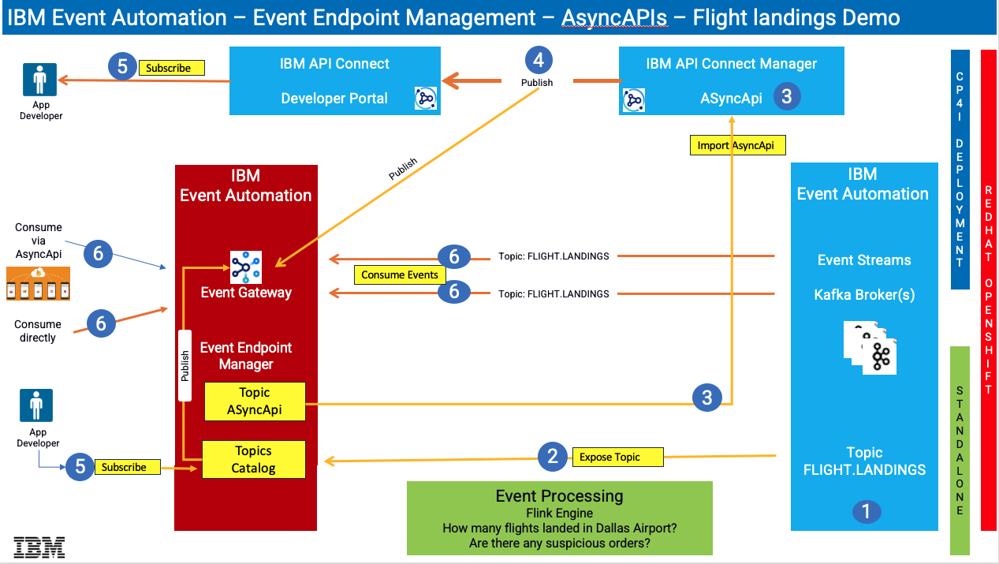

## Multi-Style Integration with IBM Cloud Pak for Integration Event Endpoint Experience
Get hands on building API and Event driven flows in this day in the life experience integrating with Async APIs

[Return to Kafka lab page](../index.md#lab-sections)

# IBM Cloud Pak for Integration - IBM API Connect AsyncAPI Labs

AsyncApi's helps you to socialize the Kafka sources (Topics) as API's through IBM Event Gateway. The labs will enable Cloud Pak for Integration developers on how to create an Async API in IBM API Connect Manager, Produce events to IBM Event Streams using IBM App Connect Toolkit Flow, and finally Consume the events using open-source kafka client kafka-console-consumer.sh as well as consuming from a Java Client Application  

Architecture Diagram below  

 

## Lab Abstracts

|  Subject                            | Description                                            |                                                               
|-------------------------|------------------------------------------------------------------------------------------------------------|
| [Lab 1](lab1/ReadMe.md)       |**Work with IBM Event End Point Management (EEM)** In this lab you will:   a) Review Event Endpoint Management as and Admin  b) Download the FLIGHT.LANDINGS yaml that was exported.  This will be used in Lab 2 to import into API Connect.  c) Extract Event Gateway Certificates to be used for Testing (lab3).
|-------------------------|------------------------------------------------------------------------------------------------------------|
| [Lab 2](lab2/ReadMe.md)       |**Work with IBM Api Connect** - In this lab you will:  a) Create AsyncAPI, and a Product in IBM API Connect Manager.  b) Publish the Product & AsyncApi to API Connect Developer Portal.  c) Subscribe to the AsyncApi from API Connect Developer Portal.
|-------------------------|------------------------------------------------------------------------------------------------------------|
| [Lab 3](lab3/ReadMe.md)       |**Consuming flight landing events** - In this lab you will run kafka clients to consume the Flight landing events being produced in kafka.

[Return to Kafka lab page](../index.md#lab-sections)
