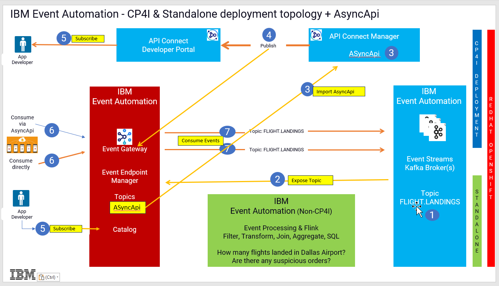

## Multi-Style Integration with IBM Cloud Pak for Integration Event Endpoint Experience
Get hands on building API and Event driven flows in this day in the life experience integrating with Async APIs

[Return to Kafka lab page](../index.md#lab-sections)

# IBM Cloud Pak for Integration - IBM API Connect AsyncAPI Labs

AsyncApi's helps you to socialize the Kafka sources (Topics) as API's through IBM Event Gateway. The labs will enable Cloud Pak for Integration developers on how to create an Async API in IBM API Connect Manager, Produce events to IBM Event Streams using IBM App Connect Toolkit Flow, and finally Consume the events using open-source kafka client kafka-console-consumer.sh as well as consuming from a Java Client Application  

Architecture Diagram below  

 

 
## Lab Abstracts

|  Subject                            | Description                                            |                                                               
|-------------------------|------------------------------------------------------------------------------------------------------------|
| [Lab 1](lab1/ReadMe.md)       |In this lab you will,  a) Review Kafka Topics that are managed in the Event Endpoint Manager b) Select the FLIGHT.LANDINGS topic and export as AsyncAPI for IBM API Connect. Management c) Import the AsyncAPI that you exported from the EEM portal. c) Create a new Product for the AsyncAPI and Publish the Product & AsyncApi to API Connect Developer Portal and IBM Event Gateway. 
|-------------------------|------------------------------------------------------------------------------------------------------------|
| [Lab 2](lab2/ReadMe.md)       |In this lab you will, Subscribe to the AsyncApi from API Connect Developer Portal.  Then you will get code samples from API Connect Developer Portal to use to run kafka clients to consume the Flight landing events being produced to the FLIGHT.LANDINGS topic. 

[Return to Kafka lab page](../index.md#lab-sections)