# IBM Cloud Pak for Integration - Creating AsyncAPI

In this lab you will, <br> 
1) Review the FLIGHT.LANDINGS topic in Event EndPoint Management (EEM).<br>
2) Download the Flight Landings AsyncAPI yaml to import into APIC.
<br>


# 1. Event Endpoint Manager

Sharing a topic with APIC is considered a Kafka topic owner action/process, given it contains sensitive information and they own the topic they get to decide how it is shared and managed. Users of the catalog are intended to be consumers (only) and are expected not to use their generated access for additional socialization in downstream tools such as APIC.

## 1.1 Review ONLY FLIGHT.LANDINGS in EEM

Here we will review the tasks in Event Endpoint Management by the Admin and take a look at the FLIGHT.LANDINGS topic.

**Note:** This section is just **showing the screens** that a Event Endpoint Management Admin would use to expose a topic as AsyncAPI for IBM API Connect.

1. We will review the screens that show what the Event Endpoint Management admin will see and do. 

     If you notice the admin has several other menu items on the left.  As a EEM user you will only see the first 2.
    
    The Catalog page will show all **Published** topics.  Let's look at the FLIGHT.LANDINGS topic now.  

    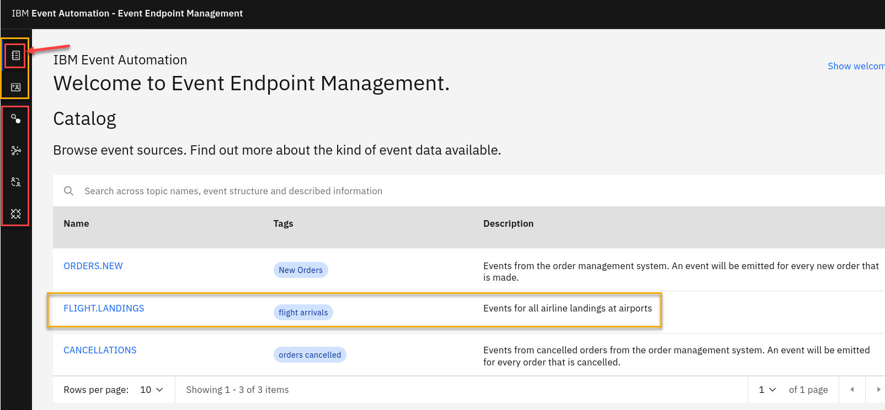

1. Here we see the **Controls** setup for this topic and you can also from here Generate access credentials if you would like to consume this topic. 

    **Note:** You will not need to Generate access credentials for this.

    On this screen you also see the Export AsyncAPI.   This will not be the correct format for IBM API Connect. 

    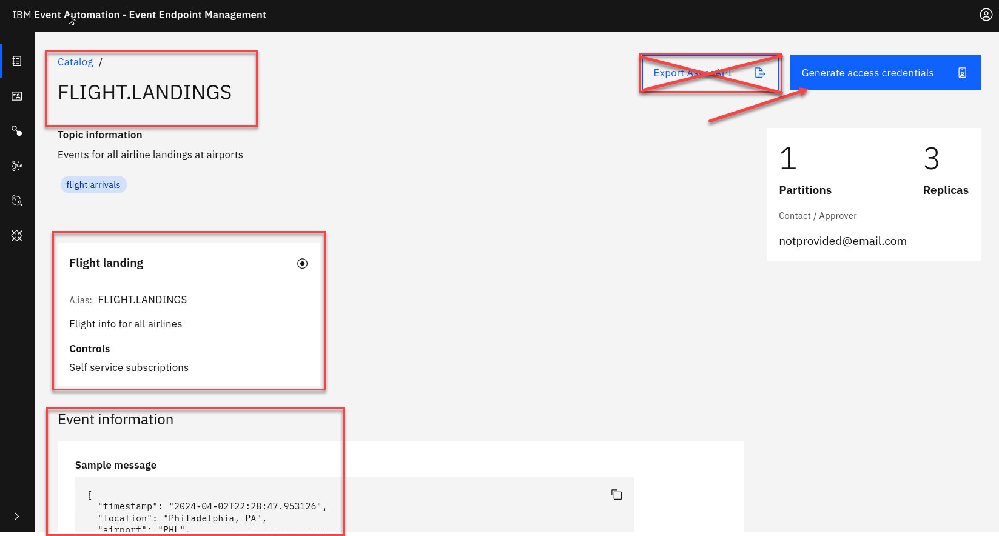


1. Now as Admin we will go to the topics page.   Here I see all topics available in EEM.  You noticed that **CUSTOMERS.NEW** shows up here but not in the catalog page.  That is because this has not yet been Published yet. 

    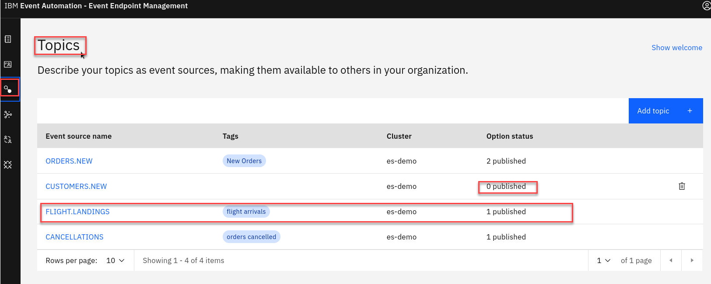

1. Now we will look at the options for the FLIGHT.LANDINGS topic.   Here you will see that it has been published to the Event Gateway.  

    This is also where the AsyncAPI can be downloaded.  

    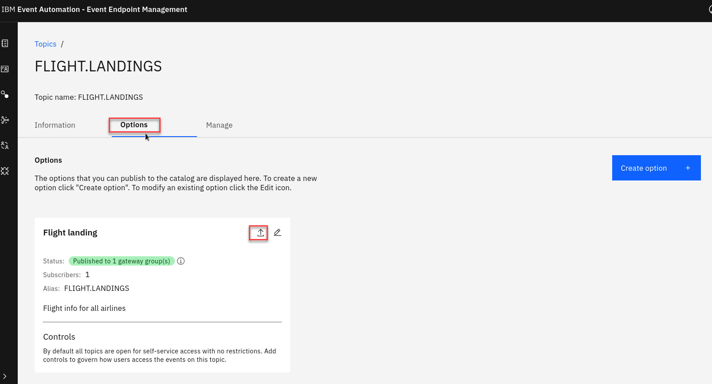

1.  Here the admin choose the format to export. 
    
    **Note** This has already been downloaded and is available below. 

    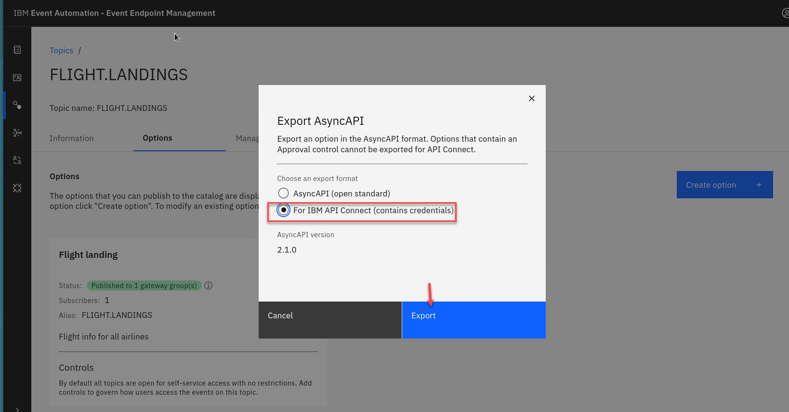

**That is the end of the review of Event Endpoint Manager.** 


# 2. Flight Landings AsyncAPI yaml and Event Gateway Bootstrap certificate

First we will download the AsyncAPI for FLIGHT.LANDINGS to be imported into IBM API Connect. 
<br>
Next we will obtain Event Gateway bootstrap certificate, to be used by the Kafka Consumer clients.
### Download AsyncAPI Yaml
1. We will need to login to EEM as admin in order to download the FLIGHT.LANDINGS yaml.

    Open my-event-manager in a new tab.

    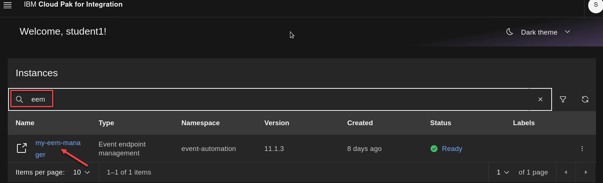
1. Select Topics from the menu on the left. You will see the FLIGHT.LANDINGS topic
    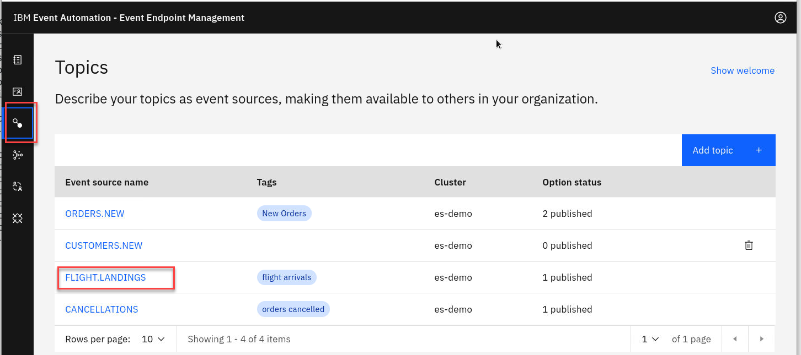

1. Now select **Options**
    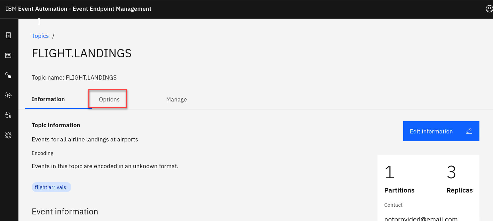

1. Now click on the Download icon for Flight landing control.
    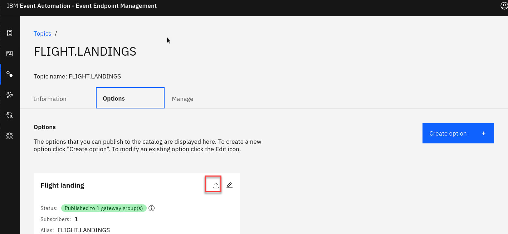

1. You will have two options.  Select the the one for IBM API Connect and export.
    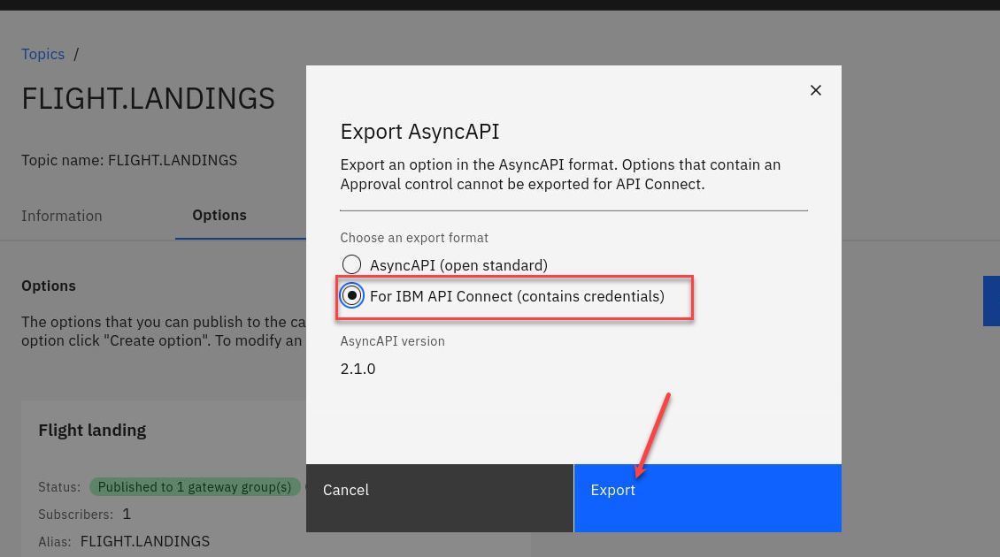

You will be importing the downloaded AsyncAPI definition file into Api Connect Manager in the next lab.

This will save it into your Download directory. 
### Get bootstrap certs
1. Now we will get the bootstrap certs. 

    In OCP console, click the drop-down next to your username and select "Copy Login Command".

	**Note:** Make sure that you are in the correct namespace.  Here in this example I am student1 

	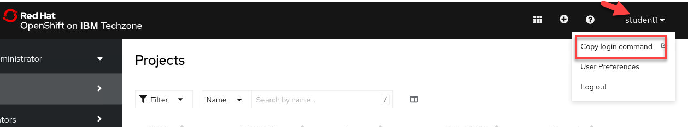

1. A new browser tab opens. Click the *Display Token* hyperlink.

	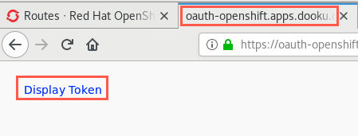
	
1. Copy the command under "Log in with this token".

	
	
1. Open a terminal window and paste the command into the terminal and hit enter which logs you into the cluster. Enter the following command to change to your namespace.
Here we are using namespace student1

	```
	oc project student1
	```

	
	
1. Now go to the EEM directory

    ```
    cd ~/EEM
    ```
	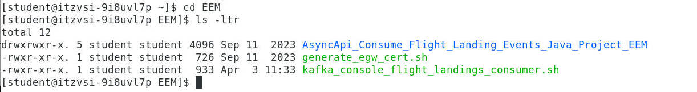

1. Run the **generate_egw_cert.sh** script

    ```
    ./generate_egw_cert.sh
    ```

	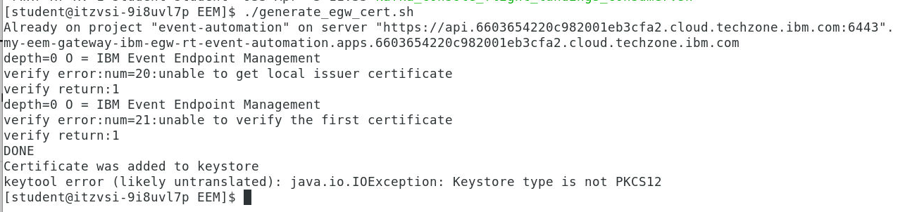

1. Run **ls -ltr** of the directory and will should see the egw cert files

    ```
    ls -ltr
    ```
    
	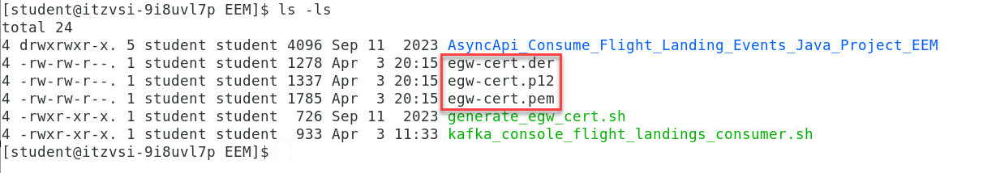


[Return to main Event Endpoint Management lab page](../index.md#lab-abstracts)    