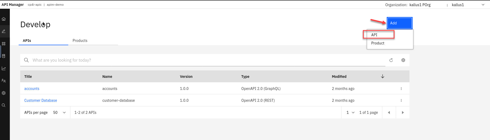

# IBM Integration - Creating AsyncAPI

In this lab you will, review Kafka Topics that are managed in the Event Endpoint Management portal.  You will select the FLIGHT.LANDINGS topic and export as AsyncAPI for IBM API Connect Management Portal

[Return to main EEM lab page](../index.md#lab-abstracts)

## 1.0 Discover EEM Topics 

1. Now go to the tab for **my-eem-manager** and open in a new tab. 

    **NOTE:** If you already have a tab opened for EEM then go there.

    

1. Now we will login to the eem manager using **eem-admin**. 

    

1. Once login click on the **Topic icon** on the left side of the page.  This will open the Topics page. 

    You should see the **FLIGHT.LANDINGS** topic.
    
    Click on the topic name.

    

1. We will now be on the page with all the information for this Topic.   You can view the Schema or Sample Message. 

    We will click on the **Export AsyncAPI for IBM API Connect**.
    
    This will open a window to save the FLIGHT.LANDINGS yaml. Make sure that **Save File** is selected and Click **OK**. 

    

## 2.0 Import AsyncAPI into APIC

Now that we have exported the FLIGHT.LANDINGS yaml we will login to the APIC Manager to import it.

1. Now from the Integration Instances select the **apim-demo** and open in a new window.

    

1. Now on the APIC login page make sure you are login already in the upper right corner.   In this example it is "kallus1"

    Click on the login using the **Common Services User Registry**

    

1. Now from the APIC homepage Select the **Develop APIs and products** from the tile or the icon on the left side of the screen. 

    

1. Now Click on **Add** and select **API**

      

1. You will see options for OpenAPI and AsyncAPI.   We will select **AsyncAPI**

    But you can also see how you can import OpenAPI's for SOAP, REST, GraphQL. 

    

1. Click **Next**

    

1. Now we will select **Drag and drop files here or click to upload**

    

1. This will open the **File Upload window**  You should be in the */student/Downloads* directory.  Select the FLIGHT.LANDINGS.yaml you downloaded from EEM and click Open.  

    

1. Should show that the yaml has been successfully validated. 

    Click **Next**

    

1. Click **Next**

    

1. Do not select Activate API. Leave unselected and Click **Next**

    

1. Should now show that the AsyncAPI definition was generated. 

    Click **Edit**

    

1. There is not much to review in here so go ahead and select the **Develop APIs and products** from the icon on the left side of the screen.

    

1. You will now see your AsyncAPI for FLIGHT.LANDINGS

    

### 2.1 Create new Product for AsyncAPI

Now we will need to create a new Product for are AsyncAPI to publish them.  We will be publishing the AsyncAPI to the Event Gateway that is part of Event Automation and is configured in the Event Endpoint Manager.  

1. First we will create a new Product that will be used to include varies AsyncAPIs.
    Select the **Add** and select **Product**. 

    

1. This will be a New Product and click **Next** 

    

1. Now we will name the Product.  Just call it AsyncAPIs since this product will only be able to include AsyncAPIs.

    Click **Next**

    

1. Here you will see that this product will only be able to enforce AsyncAPIs.

    Select the new FLIGHT.LANDINGS AsyncAPI and click **Next**

    

1. Keep the Default Plan as is and click **Next**

    

1. Click **Next** 

    

1. The Summary should show all green.   Click **Done**

    

### 2.2 Publish Product for the Developers to use in the Portal

1. Now go back to the Develop page and select **Products**

    You will see your new AsyncAPIs product.  Click on the three dots on the right and select **Publish**

    

1. On the Publish product screen you will select which catalog you will publish this to. Since we only have the Sandbox catalog select that and click **Next** 

    

1. Leave the defaults on this page and Click **Publish**

    

1. You should get a notifiation that this AsyncAPI was published.   You can close it by clicking the "x".

    Click on the **Products** tab then. 

    

1. You will see your new product is available.  

    

## RECAP

 
 
[Return to main EEM lab page](../index.md#lab-abstracts)
