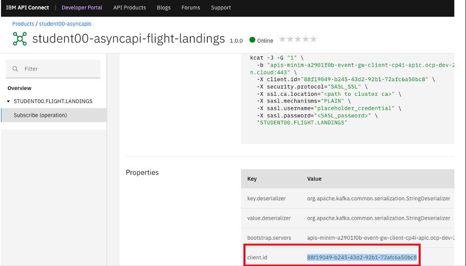

# IBM Cloud Pak for Integration - AsyncApi - Consuming Flight Landing Events

In this lab, you will follow steps to consume the flight landing events using Kafka Clients  kafka-console-consumer.sh, and Java Client.
<br>

[Return to main EEM lab page](../index.md#lab-abstracts)

# 1. Consuming Flight Landing Events

## 1.1 kafka-console-consumer.sh

Receive flight landing events using open-source kafka-console-consumer.sh <br>

From API Connect Developer Portal, navigate to your Async API & the Subscribe Operation.<br> 


Copy the code snippet by clicking "Copy to Clipboard" icon on right (sample command below).<br>

```
kafka-console-consumer.sh --bootstrap-server "apis-minim-xxxxx-event-gw-client-cp4i-apic.ocp-dev-xxxx-0000.us-east.containers.appdomain.cloud:443" \
  --group "1" \
  --consumer-property "client.id=88f19049-b245-43d2-92b1-72afc6a50bc8" \
  --key-deserializer "org.apache.kafka.common.serialization.StringDeserializer" \
  --value-deserializer "org.apache.kafka.common.serialization.StringDeserializer" \
  --consumer-property "security.protocol=SASL_SSL" \
  --consumer-property "sasl.mechanism=PLAIN" \
  --consumer-property "sasl.jaas.config=org.apache.kafka.common.security.plain.PlainLoginModule required username=\"placeholder_credential\" password=\"<SASL_PASSWORD>\";" \
  --consumer-property "ssl.truststore.location=<path to truststore>" \
  --consumer-property "ssl.truststore.password=<truststore password>" \
  --consumer-property "ssl.truststore.type=<truststore type>" \
  --topic "STUDENT00.FLIGHT.LANDINGS" \
  --consumer-property "ssl.endpoint.identification.algorithm="
```
Modify the command, and update username, password, ssl.truststore.location, ssl.truststore.password, ssl.truststore.type fields.<br>

<br>
username: client id/key of APIC developer portal/application <br>
password: secret of the APIC developer portal application <br>
ssl.truststore.location: ./bootstrap.p12 <br>
ssl.truststore.password: passw0rd <br>
ssl.truststore.type: PKCS12 <br>
<br>

## Run kafka-console-consumer.sh

If the configurations are correct, then you should receive the flight landing events (at 10 seconds interval) being generated by the Flight landing Event Simulator App Connect Message Flow.<br>
```
{"flight":"UA853","terminal":"C","passengers":96}
{"flight":"KA681","terminal":"D","passengers":47}
{"flight":"SA283","terminal":"H","passengers":191}
{"flight":"CA882","terminal":"J","passengers":14}
```
<br>


## 1.2 kafkacat (kcat)
kcat (formerly kafkacat) is a command-line utility that you can use to test and debug Apache Kafka® deployments. You can use kcat to produce, consume, and list topic and partition information for Kafka.<br>





<br>
NOTE: kcat v1.7.0 having some issues with the consumption. Lets use kafkacat v1.6.0 instead as below! <br>

```
docker run -v ~/Downloads:/tmp/certs -it --network=host edenhill/kafkacat:1.6.0 kafkacat -C -G "5" \
  -b "apis-minim-a2901f0b-event-gw-client-cp4i-apic.ocp-dev-290268003089a11bfac4ffe6a9d666b7-0000.us-east.containers.appdomain.cloud:443" \
  -o stored \
  -X client.id="ClientId from APIC devportal Subscribe operation" \
  -X security.protocol="SASL_SSL" \
  -X ssl.ca.location="/tmp/certs/bootstrap.crt" \
  -X enable.ssl.certificate.verification=false \
  -X sasl.mechanisms="PLAIN" \
  -X sasl.username="Client key of apic developer portal/application" \
  -X sasl.password="Secret of the APIC developer portal application" \
  "STUDENT00.FLIGHT.LANDINGS"
  ```

If the command ran successfully, you should receive Flight Landing Events from your Event Streams Topic through the AsyncApi that you have created! <br>
```
{"flight":"SA676","terminal":"H","passengers":136}
{"flight":"AI959","terminal":"A","passengers":200}
{"flight":"SA346","terminal":"E","passengers":95}
{"flight":"CA887","terminal":"J","passengers":24}
{"flight":"SA830","terminal":"E","passengers":171}
```

<br>


## 1.3 Java Application

Use the Java Client application and receive the flight landing events thru the IBM Event Gateway --> Api Connect Async Api --> Event Streams, using a java client<br>

From API Connect Developer Portal, navigate to your Async API & the Subscribe Operation.<br> 


Open App Connect Enterprise Toolkit.
<br>
Copy the code snippet by clicking "Copy to Clipboard" icon on right (sample code below).<br>
OR <br>
<b>Just use supplied Java Project in the Project Interchange. <br></b>

```
import org.apache.kafka.clients.consumer.ConsumerRecord;
import org.apache.kafka.clients.consumer.ConsumerRecords;
import org.apache.kafka.clients.consumer.KafkaConsumer;
import org.apache.kafka.clients.CommonClientConfigs;
import java.time.Duration;
import java.util.Collections;
import java.util.Properties;
import org.apache.kafka.common.config.SaslConfigs;
import org.apache.kafka.common.config.SslConfigs;

public class AsyncApi_Consume_Flight_Landing_Events {
  public static final void main(String args[]) {  
    Properties props = new Properties();

    props.put("bootstrap.servers", "apis-minim-a2901f0b-event-gw-client-cp4i-apic.ocp-dev-290268003089a11bfac4ffe6a9d666b7-0000.us-east.containers.appdomain.cloud:443");
    props.put("key.deserializer", "org.apache.kafka.common.serialization.StringDeserializer");
    props.put("value.deserializer", "org.apache.kafka.common.serialization.StringDeserializer");

    // Add below property to avoid "no name found" error
    props.put(SslConfigs.SSL_ENDPOINT_IDENTIFICATION_ALGORITHM_CONFIG, "");

    // set the group id to 2 if you are running both kafka-console-consumer.sh also. Each client need to be be unique.
    props.put("group.id", "2");
    props.put("client.id", "xxxx-b245-43d2-92b1-xxx");

    props.put(CommonClientConfigs.SECURITY_PROTOCOL_CONFIG, "SASL_SSL");

    props.put(SaslConfigs.SASL_MECHANISM, "PLAIN");
    props.put(SaslConfigs.SASL_JAAS_CONFIG, 
      "org.apache.kafka.common.security.plain.PlainLoginModule required " +
      "username=\"student00-scram-credentials\" " + 
      "password=\"your-scram-password\";");
    // The Kafka cluster may have encryption enabled. Contact the API owner for the appropriate TrustStore configuration.
    props.put(SslConfigs.SSL_TRUSTSTORE_LOCATION_CONFIG, "/tmp/bootstrap.p12");
    props.put(SslConfigs.SSL_TRUSTSTORE_PASSWORD_CONFIG, "passw0rd");
    props.put(SslConfigs.SSL_TRUSTSTORE_TYPE_CONFIG, "PKCS12");

    KafkaConsumer consumer = new KafkaConsumer<String, String>(props);
    consumer.subscribe(Collections.singletonList("STUDENT00.FLIGHT.LANDINGS"));
    try {
      while(true) {
        ConsumerRecords<String, String> records = consumer.poll(Duration.ofSeconds(1));
        for (ConsumerRecord<String, String> record : records) {
          byte[] value = record.value();
					String key = record.key();
					ObjectMapper om = new ObjectMapper();
					JsonNode jsonNode;
					try {
						jsonNode = om.readTree(value);
					
            // Do something with your JSON data
            String flightNumber = jsonNode.get("flight").asText();
            String terminal = jsonNode.get("flight").asText();
            String numPassengers = jsonNode.get("flight").asText();

            System.out.println("DEBUG: A FLIGHT HAS LANDED!");
            System.out.println("         flight number: " + flightNumber);
            System.out.println("              terminal: " + terminal);
            System.out.println("  number of passengers: " + numPassengers);
          }
        }
    } catch (Exception e) {
      e.printStackTrace();
      consumer.close();
      System.exit(1);
    }   
  }
}
```


Class Name: AsyncApi-Flight-Landings-Java <br>

You need the below jar files to resolve the compilation errors. They are included in the AsyncApi-Flight-Landings-Java Project under jars folder. Please make sure the Project Build Path is setup right.<br>
jackson-annotations-2.10.5.jar <br>
jackson-core-2.11.4.jar <br>
jackson-databind-2.10.5.1.jar <br>
kafka-clients-2.8.0.jar <br>
slf4j-api-1.7.30.jar <br>

<br>
Make sure that you have set the parameters accurately: <br>

```
props.put(SaslConfigs.SASL_JAAS_CONFIG,  <br>
      "org.apache.kafka.common.security.plain.PlainLoginModule required " + <br>
      "username=\"student00-scram-credentials\" " + <br>
      "password=\"your-scram-password\";");<br><br>
props.put(SslConfigs.SSL_TRUSTSTORE_LOCATION_CONFIG, "~/Downloads/bootstrap.p12");
props.put(SslConfigs.SSL_TRUSTSTORE_PASSWORD_CONFIG, "passw0rd");
props.put(SslConfigs.SSL_TRUSTSTORE_TYPE_CONFIG, "PKCS12"); 
consumer.subscribe(Collections.singletonList("STUDENT00.FLIGHT.LANDINGS"));
```
<br>

If no compilation errors, run the AsyncApi_Consume_Flight_Landing_Events Java Program and watch the Flight Landing Events being received every 10 seconds.<br>
<br>
<br>
[Return to main EEM lab page](../index.md#lab-abstracts)
