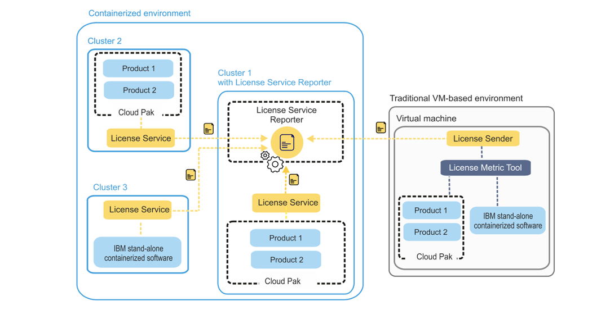
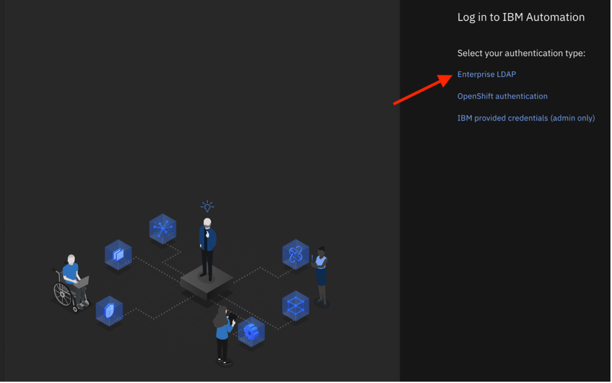
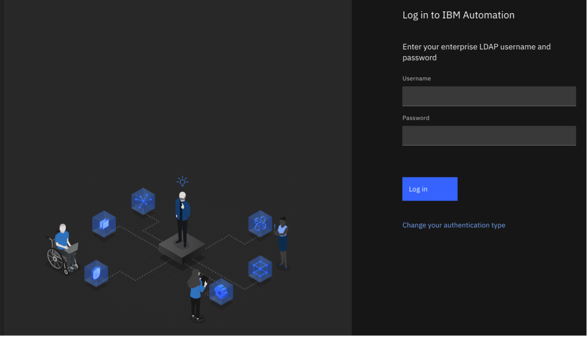
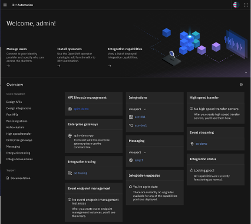
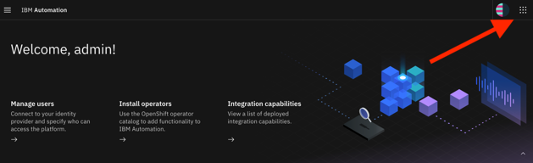
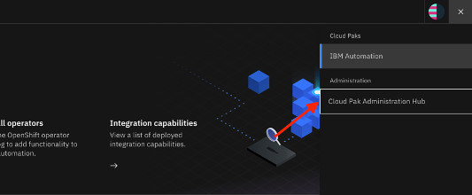
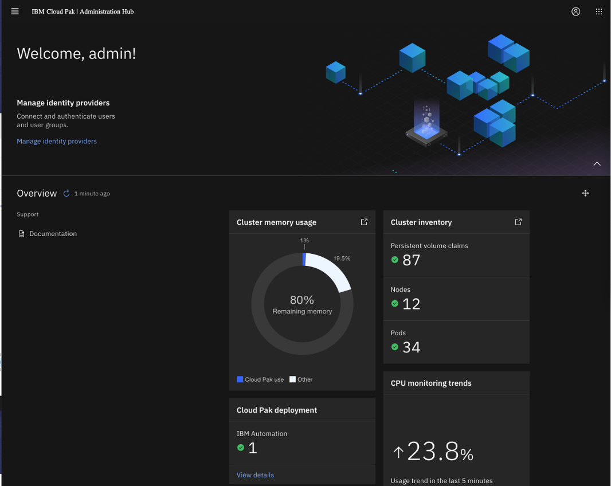
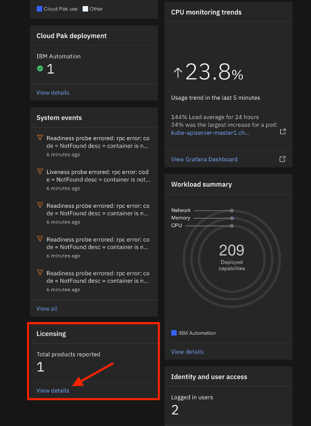
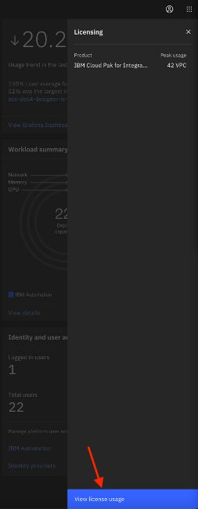

# CP4I License Service Lab

## Introduction

The License Service is one of the IBM Cloud Pak Foundational Services.  The License Service collects and measures the license usage of 
IBM Cloud Pak for Integration (CP4I) at the cluster level. It provides license consumption reporting and audit readiness for a single OpenShift cluster.  T
he diagram below provides and overview of the License Server’s architecture:

The purpose of this lab is to introduce you to the features of the License Service which includes monitoring and measuring license usage of the IBM Cloud Pak solutions and IBM stand-alone containerized software.

## Access Your Cloud Pak for Integration Environment

1. In a browser, enter the URL for the Cloud Pak for Integration Platform Navigator that is provided by your instructor.

2. Select Enterprise LDAP.
   
   
   
3. Login with the username and password that are provided by your instructor.
   
   
   
4.	You should now see the Cloud Pak for Integration Navigation Platform as seen below. 

    

## Navigate to the Cloud Pak for Integration Administration Hub

5. Once in the Navigation Platform, there are several ways to access the Graphical License Reports.  In this lab, we will use the Cloud Pak for Integration Administration Hub to achieve access.  To access the Administration Hub, click on the square matrix of dots in the upper right corner.  A submenu will appear from the right side.
   
   
   
6. Select “Cloud Pak Administration Hub” from the submenu.
   
   
   
7.	You should now see the Cloud Pak for Integration Administration Hub as seen below.  The Administration Hub provides Cluster Administrators an at a glance overview of a cluster. 
   
    
   
8.	As you scroll down, you can also see the licensing tile and then select “View details”.
   
    

9.	When you select “View Details”, the following side panel will appear from the right.  Click “View license usage”.
   
    

## Access the High-Level Graphical License Panel
