# Lab 6 - Streaming Queues for MQ on CP4I

## Introduction

This lab demonstrates the Streaming Queue feature added to MQ in the 9.2.3.0 CD release.
Streaming Queues allow you to configure any local or model queue with the name of second named queue. This second queue is referred to as a Stream Queue. 

When messages are put to the original queue, a duplicate copy of each message is also placed on the stream queue. The Streaming Queue feature allows you to create a duplicate stream of messages which can be used for later analysis, logging, or storage without affecting the business applications using the original queue.

### Lab Objectives

In this lab, you will:

* Create two queues. An application queue that messages are put to by a sending application, and a stream queue for duplicate messages to be streamed to
* Configure the application queue to stream messages to the stream queue
* Send messages to the application queue and observe them being duplicated to the stream queue
* Modify the stream queue and the streaming quality of service to demonstrate the behaviour when duplicate messages cannot be streamed
* Inspect some of the messages to see that they are identical

We will not demonstrate messages being consumed from either of the queues. Stream queues are regular MQ local queues and getting messages from them
is done in the same way as any other MQ queue.

We will not demonstrate using a queue alias to topic as the stream queue, although this is supported. More information on using a queue alias as the streamqueue is available in the IBM Documentation.

### Acknowledgements
This lab was written by Matthew Whitehead (mwhitehead@uk.ibm.com).

[Streaming Queues in IBM Knowledge Center](hhttps://www.ibm.com/docs/en/ibm-mq/9.2?topic=scenarios-streaming-queues)

## Background 

Topology overview for stream queues

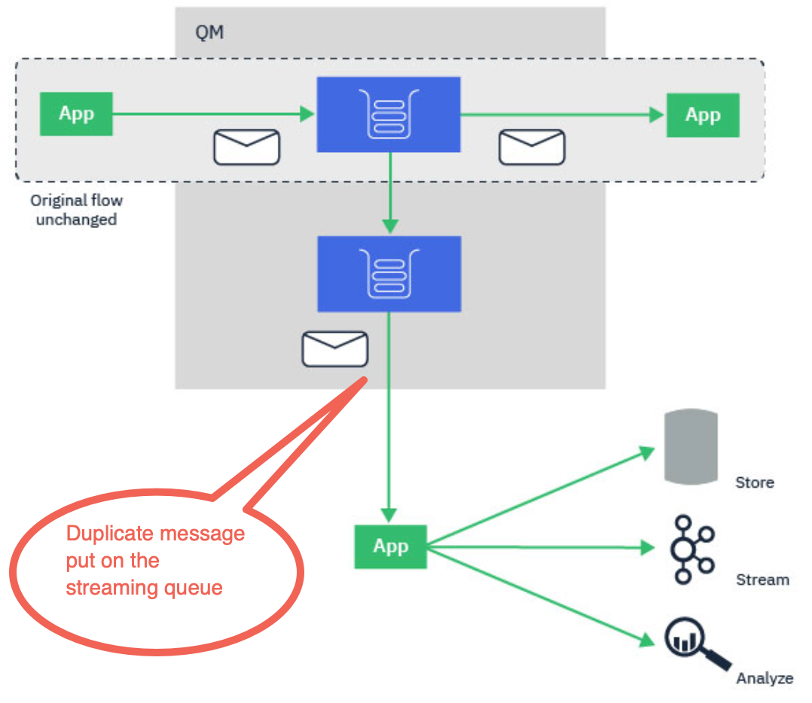

The topology diagram shows the basic capability of stream queues. A regular local queue that is currently being used by MQ applications can be configured to stream a duplicate of every message put to that queue, to a second destination called a stream queue.

The streaming queues feature of IBM® MQ is configured by the administrator on individual queues, and the messages are streamed by the queue manager, not by the application itself.

This means that in almost all cases the application putting messages to the original queue is completely unaware that streaming is taking place. Similarly, the application consuming messages from the original queue is unaware that message streaming has taken place. 

**The version of the IBM MQ client library does not need upgrading to make use of streaming queues, and the original messages are completely unchanged by the streaming process.**

You can configure streaming queues in one of two modes:

* Best effort
    
    In this mode, the queue manager considers it more important that delivery of the original message is not affected by delivery of the streamed message. 
    If the original message can be delivered, but the streamed message cannot, the original message is still delivered to its queue. This mode is best suited to those applications, where it is important for the original business application to remain unaffected by the streaming process.
    
* Must duplicate
    
    In this mode, the queue manager ensures that both the original message and the streamed message are successfully delivered to their queues. 
    If, for some reason, the streamed message cannot be delivered to its queue, for example, because the second queue is full, then the original message is not delivered to its queue either. The putting application receives an error reason code and must try to put the message again. 

### Streamed messages

In most cases, the copy of the message delivered to the second queue is a duplicate of the original message. This includes all of the message descriptor fields, including the message ID and correlation ID. The streamed messages are intended to be very close copies of the original messages, so that they are easier to find and, if necessary, replay them back into another IBM MQ system.

There are some message descriptor fields that are not retained on the streamed message. The following changes are made to the streamed message before it is placed on the second queue:

* The expiry of the streamed message is set to MQEI_UNLIMITED, regardless of the expiry of the original message. If CAPEXPRY has been configured on the secondary queue this value is applied to the streamed message.
   
* If any of the following report options are set on the original message, they are not enabled on the streamed message. This is to ensure that no unexpected report messages are delivered to applications that are not designed to receive them:  

	* Activity reports
   * Expiration reports
   * Exception reports

Due to the near-identical nature of the streamed messages, most of the attributes of the secondary queue have no affect on the message descriptor fields of the streamed message. For example, the DEFPSIST and DEFPRTY attributes of the secondary queue have no affect on the streamed message.

The following exceptions apply to the streamed message:

* CAPEXPRY set on the CUSTOM attribute

    If the secondary queue has been configured with a CAPEXPRY value in the CUSTOM attribute, this expiry cap is applied to the expiry of the streamed message.
   
* DEFBIND for cluster queues

    If the secondary queue is a cluster queue, the streamed message is put using the bind option set in the DEFBIND attribute of the secondary queue.

### Streaming queue restrictions

Certain configurations are not supported when using streaming queues in IBM® MQ, and these are documented here.

The following list specifies the configurations that are not supported:

* Defining a chain of queues streaming to each other, for example, Q1->Q2, Q2->Q3, Q3->Q4
* Defining a loop of streaming queues, for example, Q1->Q2, Q2->Q1
* Defining a subscription with a provided destination, where that destination has a STREAMQ defined
* Defining STREAMQ on a queue configured with USAGE(XMITQ)
* Modifying the STREAMQ attribute of a dynamic queue
* Setting STREAMQ to any value that begins SYSTEM.*, except for SYSTEM.DEFAULT.LOCAL.QUEUE
* Defining STREAMQ on any queue named SYSTEM.*, with the following exceptions:
        
  * SYSTEM.DEFAULT.LOCAL.QUEUE
  * SYSTEM.ADMIN.ACCOUNTING.QUEUE
  * SYSTEM.ADMIN.ACTIVITY.QUEUE
  * SYSTEM.ADMIN.CHANNEL.EVENT
  * SYSTEM.ADMIN.COMMAND.EVENT
  * SYSTEM.ADMIN.CONFIG.EVENT
  * SYSTEM.ADMIN.LOGGER.EVENT
  * SYSTEM.ADMIN.PERFM.EVENT
  * *SYSTEM.ADMIN.PUBSUB.EVENT
  * SYSTEM.ADMIN.QMGR.EVENT
  * SYSTEM.ADMIN.STATISTICS.QUEUE
  * SYSTEM.DEFAULT.MODEL.QUEUE
  * SYSTEM.JMS.TEMP.QUEUE

* Setting STREAMQ to the name of a model queue

### Stream queues and transactions

The streaming queues feature allows a message put to one queue, to be duplicated to a second queue. In most cases the two messages are put to their respective queues under a unit of work.

If the original message was put using MQPMO_SYNCPOINT, the duplicate message is put to the stream queue under the same unit of work that was started for the original put.

If the original was put with MQPMO_NO_SYNCPOINT, a unit of work will be started even though the original put did not request one. This is done for two reasons:

1. It ensures the duplicate message is not delivered if the original message could not be. The streaming queues feature only delivers messages to stream queues if the original message was also delivered.
    
1. There can be a performance improvement by doing both puts inside a unit of work

The only time the messages are not delivered inside a unit of work is when the original MQPUT is non-persistent with MQPMO_NO_SYNCPOINT, and the STRMQOS attribute of the queue is set to BESTEF (best effort).

**The additional put to the stream queue does not count towards the MAXUMSGS limit.  In the case of a queue configured with STRMQOS(BESTEF), failure to deliver the duplicate message does not cause the unit of work to be rolled back.**

### Streaming to and from cluster queues

It is possible to stream messages from a local queue to a cluster queue and to stream messages from cluster queue instances to a local queue.

#### Streaming to a cluster queue

This can be useful if you have a local queue where original messages are delivered, and would like to stream a copy of every message to one or more instances of a cluster queue. This could be to workload balance the processing of the duplicate messages, or simply to have duplicate messages streamed to another queue elsewhere in the cluster.

When streaming messages to a cluster queue, messages are distributed using the cluster workload balancing algorithm. A cluster queue instance is chosen based on the DEFBIND attribute of the cluster queue.

For example, if the cluster queue is configured with DEFBIND(OPEN), an instance of the cluster queue is chosen when the original queue is opened. All duplicate messages go to the same cluster queue instance, until the original queue is reopened by the application.

If the cluster queue is configured with DEFBIND(NOTFIXED), an instance of the cluster queue will be chosen for every MQPUT operation.

**You should configure all cluster queue instances with the same value for the DEFBIND attribute.**

#### Streaming from a cluster queue

This can be useful if you already send messages to several instances of a cluster queue, and would like a copy of each message to be delivered to a streaming queue, on the same queue manager, as the cluster queue instance.

When the original message is delivered to one of the cluster queue instances, a duplicate message is delivered to the stream queue by the cluster-receiver channel.

## Run the lab

### Lab configuration

This lab was designed to be run on IBM Cloud Pak for Integration (CP4I) 2021.2.1 on RedHat OpenShift 4.6 or later.

* In this lab you will create and start a single queue manager using *yaml*
* The MQSC snippets will be included in the yaml file 
* The lab assumes that CP4I has MQ 9.2.3.0 installed to /opt/mqm and that the sample programs are available in /opt/mqm/samp/bin

**Entering commands for this lab - In this lab, you will come across some quite long commands to enter. You will be using Linux Shell like bash. To avoid a lot of typing, you may copy the commands from this document and execute on the Shell.**

### Define the queue manager instance of CP4I in a yaml file

To create an MQ queue manager, you could use the UI as you did in Lab 1. Most administrators use scripting to define things which novice users would do with the UI.

This lab shows you how to write yaml to create the queue manager, application queues and associated streaming queue, and channels.  

1. You should still be logged into the OpenShift environment. If not, click on your username on the top right menu of the OpenShift Console, then click on Copy Login Command.

	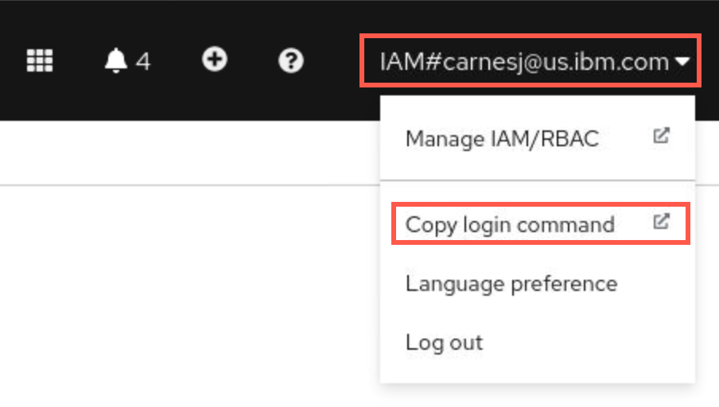

1. Click *Display Token* then copy the token. 

	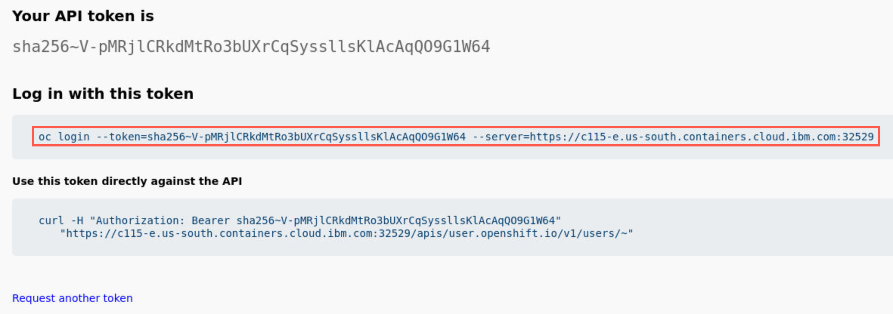
	
1. Paste the copied token into a terminal window and run the command by hitting enter.

	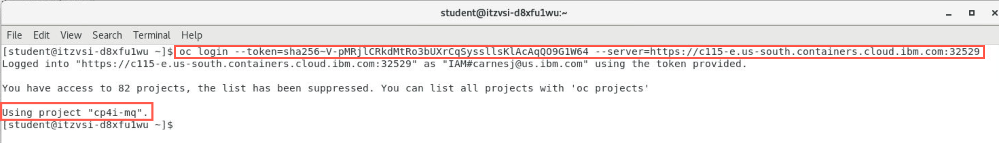
	
1. You should be logged into project *cp4i-mq* from the previous labs. If not, change to that project with the following command:
	
	```sh
	oc project cp4i-mq
	```
	
	**You should still be in the cp4i-mq project so you shouldn’t need to run this command unless your login has timed out.**
	
1. Open a new terminal window by double-clicking the icon on the desktop.

	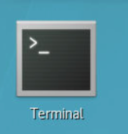	
1. Navigate to the MQonCP4I/streamq/deploy directory using the following commnand:

	```sh
	cd ~/MQonCP4I/streamq/deploy
	```

1. Enter the following command to display the permissions for the files:

	```sh
	ls -al
	```	
	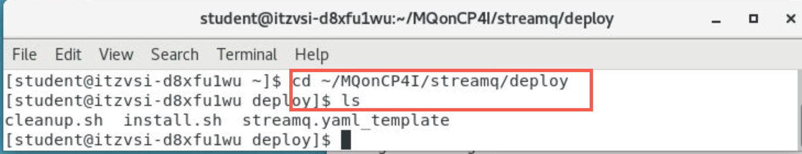
	
1. Make *installl.sh* and *cleanup.sh* executable with the following commands.

	```sh
	chmod +x install.sh
	```
	```sh
	chmod +x cleanup.sh
	```
	
	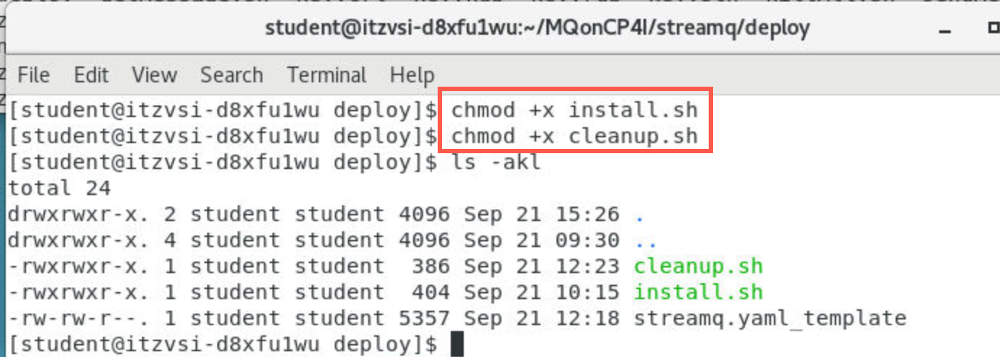
	
1. Enter the following command to edit the file *install.sh*. Make sure to add the "&" which will run the editor in the background so you don't tie up your terminal.

	```sh
	gedit install.sh &
	```
	
	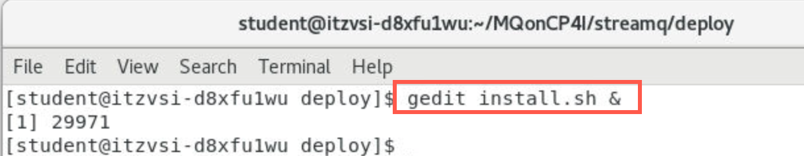
	
1. If necessary, change the value for TARGET_NAMESPACE to your project name. Click the hamburger menu in top right corner and select *Find and Replace*.

	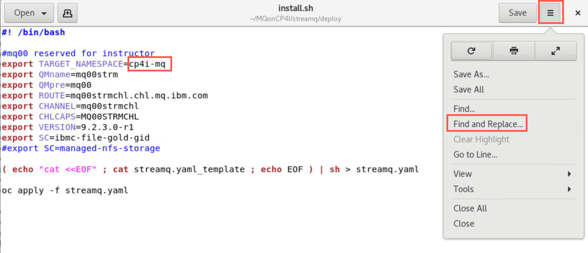

1. Enter mq00 in the “Find” field and mqxx in the “Replace with” field. Use your student number in place of 00. Click *Replace All*, then click *Save*.

	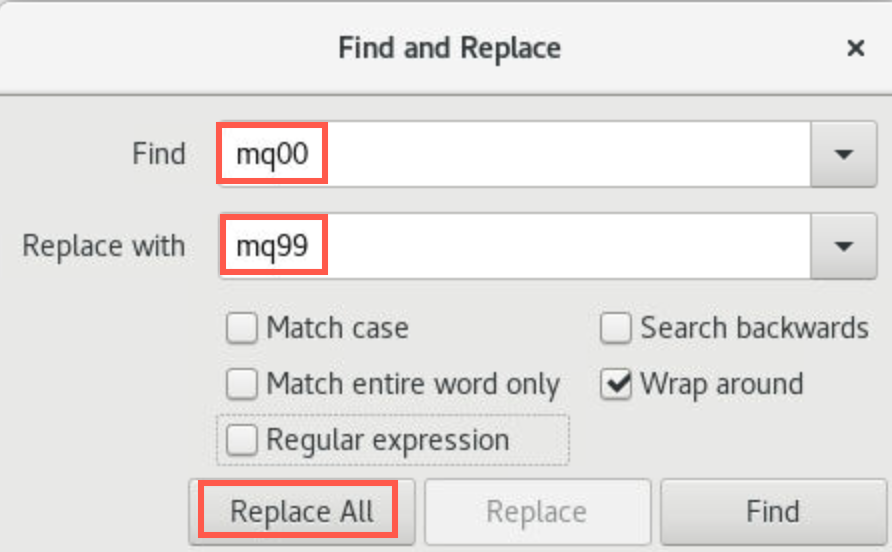

	**The storage class on the COC clusters is managed-nfs-storage. If you are an IBMer running on on ROKS then you also need to change SC to ibmc-file-gold-gid.**	
	
	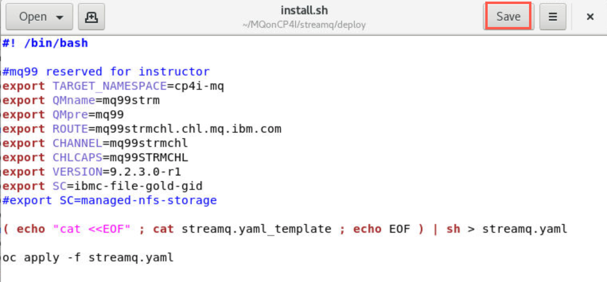
	 	
1. In the editor click the drop-down in the Open box, click *Other Documents*, then select *cleanup.sh*.

	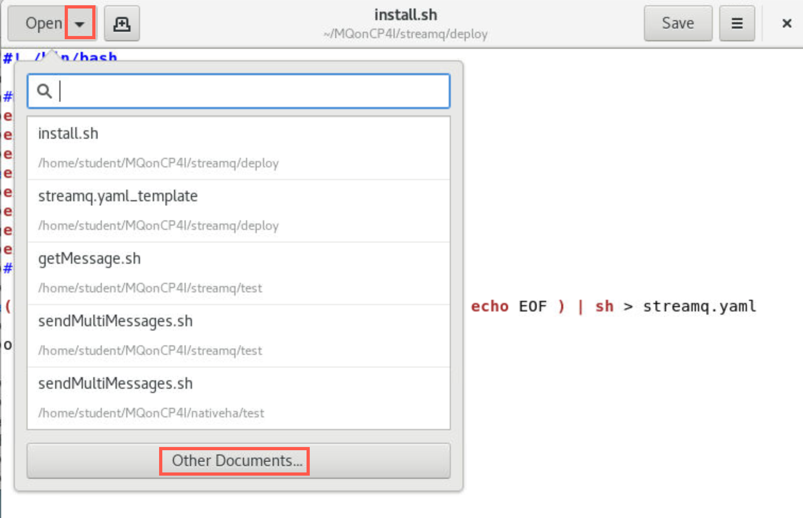
	
	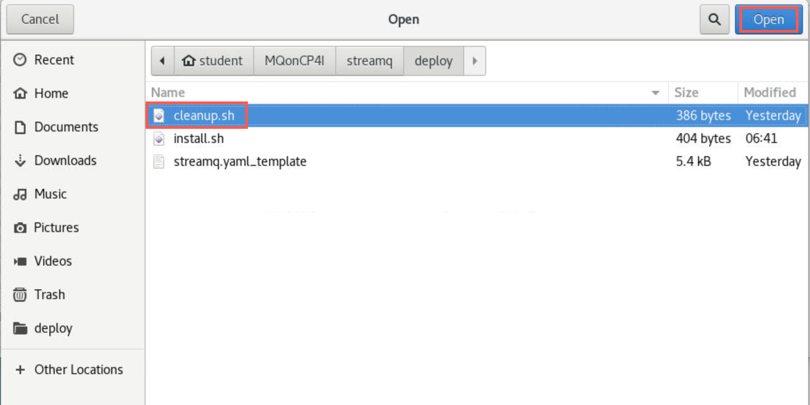

1. As above you did above, change *TARGET_NAMESPACE* to your project name, then change “00” in the export commands to your *student ID*. Click *Save*.

	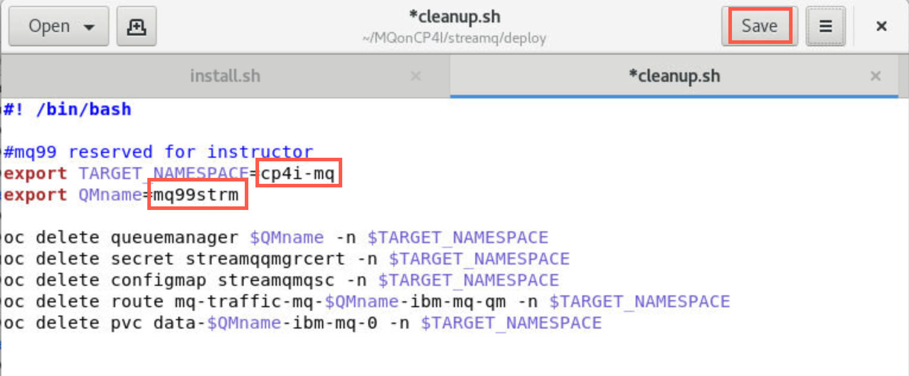

1. As done previously click drop-down next to Open, click Other Documents, then select *streamq.yaml_template*.

	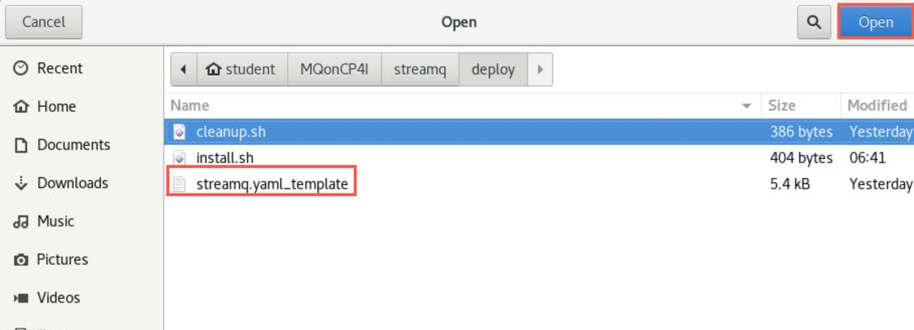
	
1. Do not change anything in this file! The install.sh script will copy this file to *streamq.yaml*, substitute your student ID in the environment varibles, and apply the yaml file to the OpenShift cluster. Review the file to understand how your queue manager will be created. 

	Pay particular attention to each *kind* stanza:

	* **ConfigMap** for mqsc commands
	* **Secret** to define the tls certificate and key
	* **QueueManager** to define attributes for your specific QM
	* **Route** to accesss the queue manager from outside the cluster

	In the QueueManager stanza, notice the name, the type (ephemeral) and references to the ConfigMap and Secret. In the *ConfigMap* stanza you will see the mqsc commands to define the queues *APPQ* and *MY.LOG.QUEUE*. Notice that *MY.LOG.QUEUE* is the streaming queue for *APPQ*.

	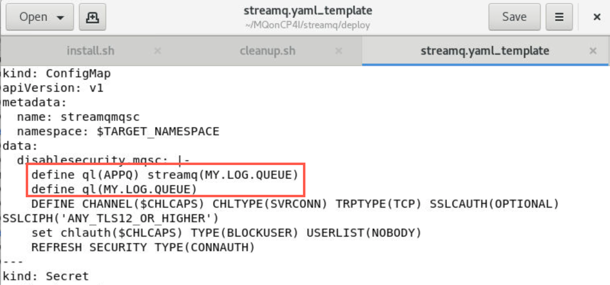

### Deploy the MQ Queue Manager with associated resources

1. Open a new terminal window and navigate to the deploy directory again with the command:

	```sh
	cd ~/MQonCP4I/streamq/deploy
	```
	
1. Run the *install.sh* script:

	```sh
	./install.sh
	```

	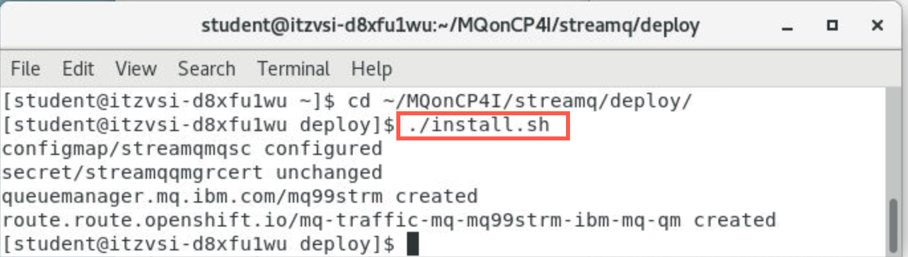

	The results are displayed showing the objects (mentioned above) which were created.
	
#### Display queue manager instance in Platform Navigator

1. Open your web browser tab for the Platform Navigator. Refresh the page. The status for *mqxxstrm* will have a status of *Pending* until completely deployed.

	After a couple of minutes the instance is deployed and the status changes to *Ready*.

	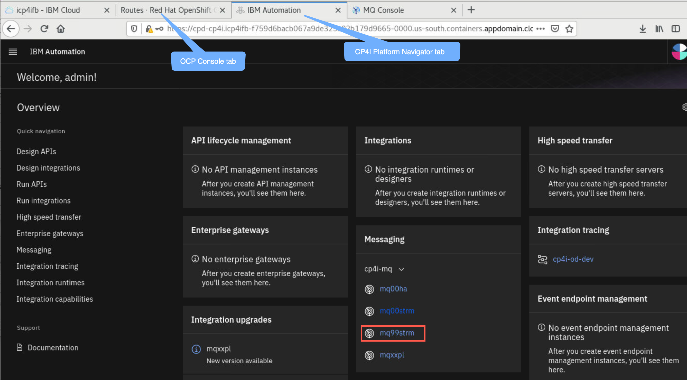
	
	 **If you have closed the Platform Navigator, you can change to the OCP Console > Project cp4i > Networking > Routes > integration-navigator-pn. See screen shot below.**
	
	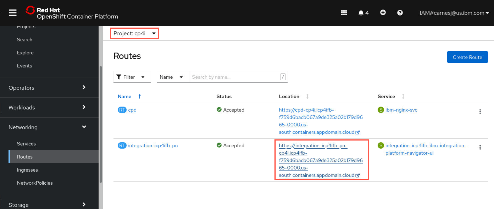

#### Open MQ Console

1. In the *Platform Navigator* click the hyperlink for your instance which will take you to the MQ Console for your queue manager, but first you must respond to the security warnings if prompted. Click *Advanced* then *Accept the Risk and Continue*.

	You are then taken to the MQ Console for your queue manager. Recall that you named the queue manager with your student ID prefix and *strm* - **mqxxstrm**. The instance name, **mqxxstrm**, is the same as the queue manager name. Click *Manage*.
	
	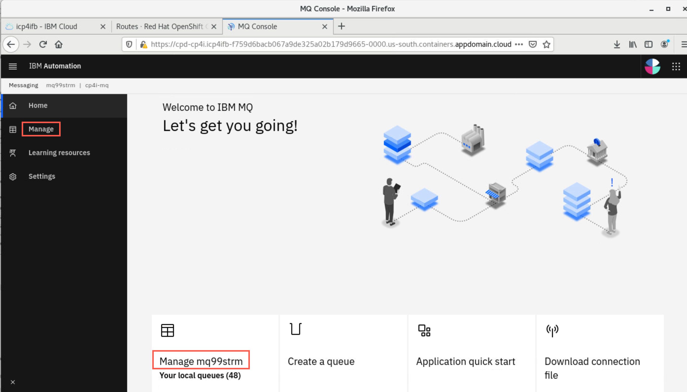
	
	Then click *Local queue managers*.
	
	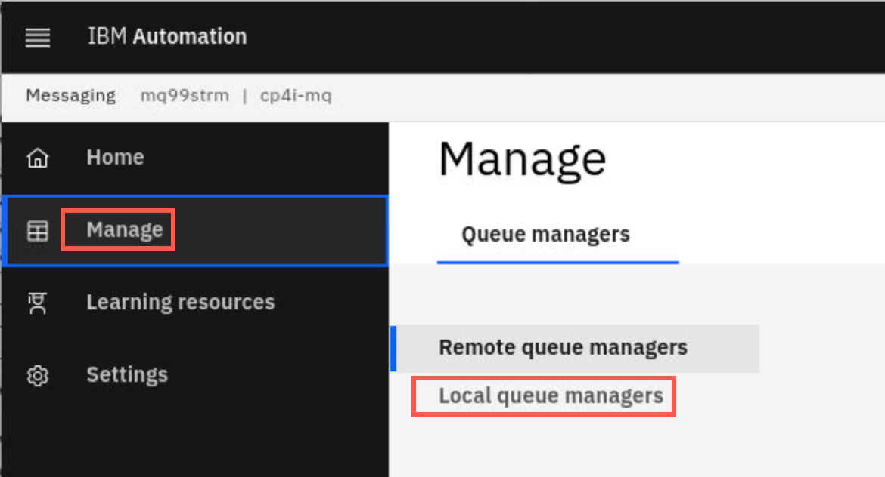

#### Verify queues are empty
	
1. On the *Manage* page you will see *Queues*, *Topics*, *Subscriptions*, and *Communications*. Under *Queues* you will see **APPQ** and **MY.LOG.QUEUE** which were defined by the mqsc commands in the yaml defined *ConfigMap*.	
	
	
1. Verify that there are no messages on these queues. Queue depth should be zero.

	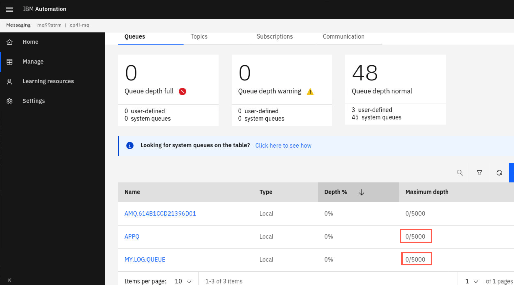

#### Explore channel settings

1. Click *Communication* > *App Channels* where you will find the channel **MQXXSTRMCHL**. The channel was also defined in the mqsc commands in the yaml defined *ConfigMap*. Click the elipsis on the right side then select *View Configuration* to display or edit the channel properties.

	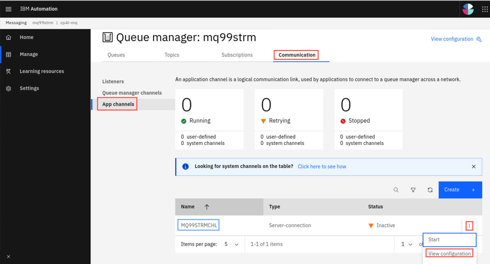
	
1. Click the breadcrumb to return to the *Manage* page.

	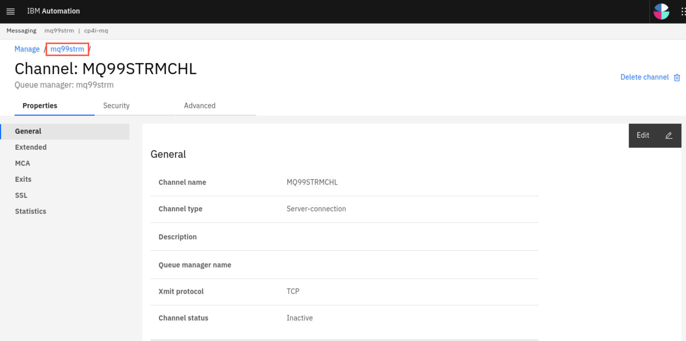

1. Notice the *View Configuration* hyperlink in the top right corner. This takes you to the queue manager properties. Click the link now.

	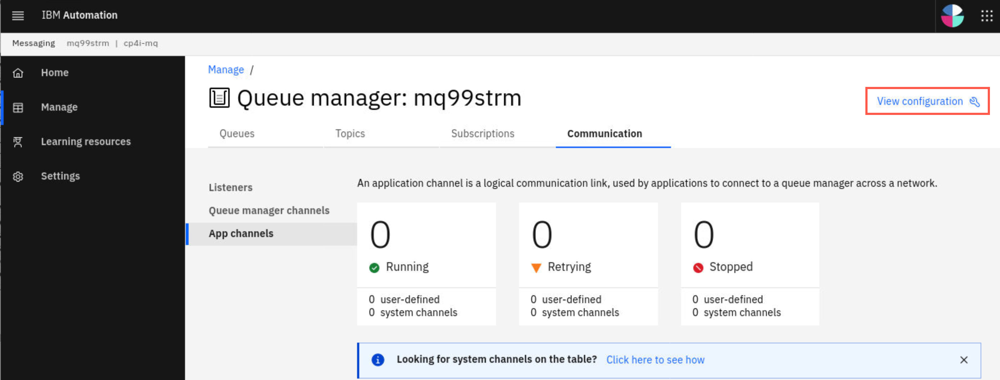
	
1. You arrive at the overall queue manager properties to be displayed or edited. Click *Security* > *Channel authentication*. 

	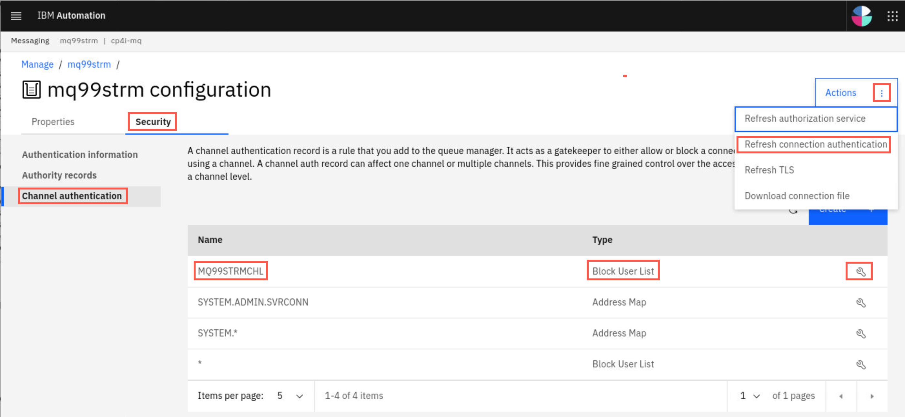
	
1. Here you see the channel auth created by the mqsc commands in the yaml defined *ConfigMap* as well as the system channel auth records. Your yaml file defined the MQXXSTRMCHL record with a type of *Block*. You can click the wrench icon to display or edit the record. If you do change the properties you will then need to refresh security. To do that you simply click the Actions elipsis and select the necessary refresh option.	
1. Continue to explore the MQ Console as long as you like.

#### Review your MQ instance in OpenShift

There is an extensive amount of detail in the OpenShift Console. The following instructions will lead you to accomplish the purpose of this lab. But feel free to explore more detail to help you understand OpenShift and CP4I.

If running as part of a PoT there will be multiple queue managers running so you need to be looking for your *mqxxstrm* instance queue manager.

1. Return to the browser tab in Firefox for the OCP Console. You will be in the *Administrator* view. Click *Projects* then scroll down to find **cp4i-mq* (substiting your namespace if necessary) and click the hyperlink.

	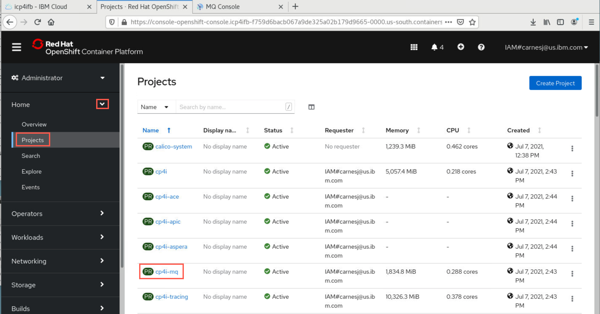
	
1. The project *Overview* opens where you can see the status and utilization of the **cp4i-mq** namespace (project).

	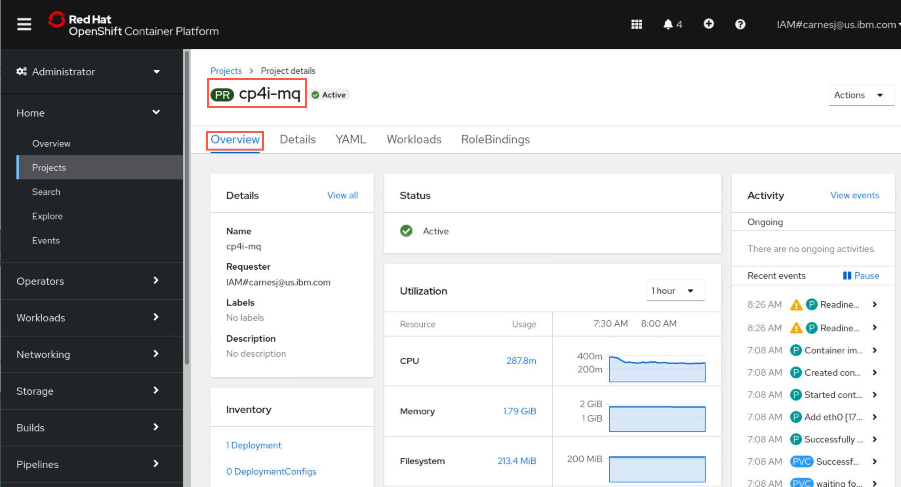

1. On the left sidebar expand *Operators*, then select *Installed Operators*.

	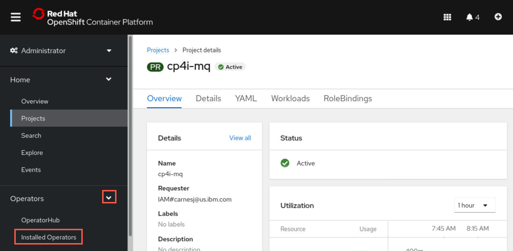
	
1. Scroll to find **IBM MQ** then click the hyperlink.

	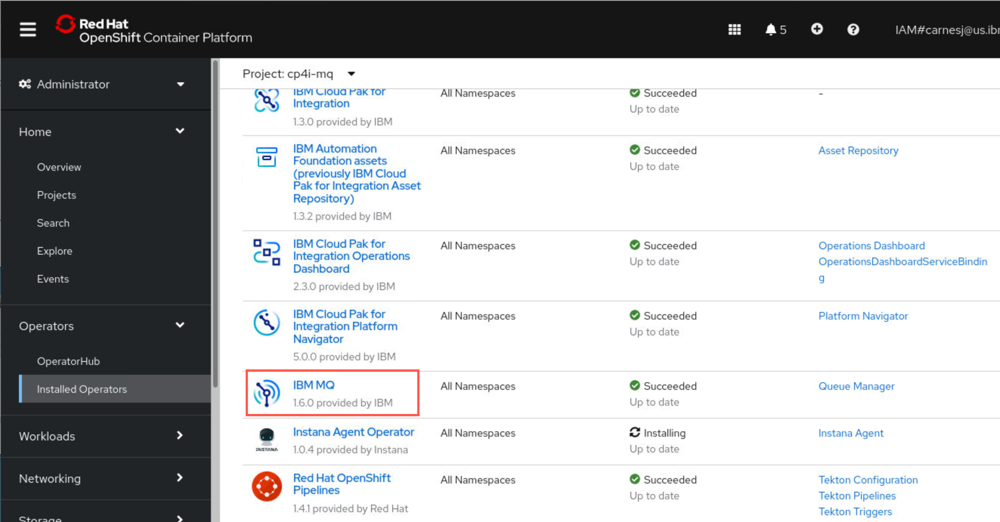

1. You can read about the *IBM MQ* operator and select the tabs to discover what information is available. Click the *Queue Manager* tab. 
	
	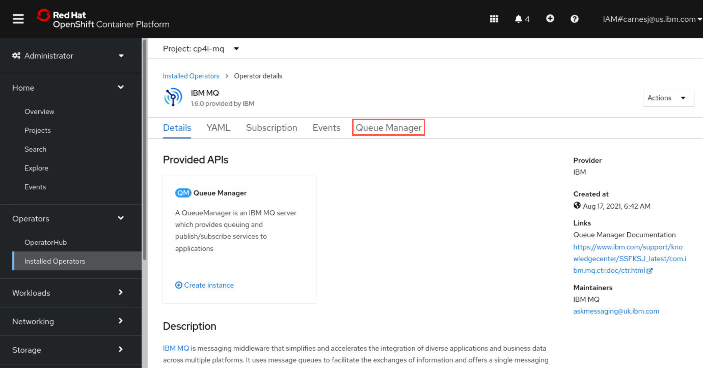

1. You will see numerous instances. To easily locate your instance enter **mq** plus your student number in the filter field. You will see that your instance **mqxxstrm** is running.

	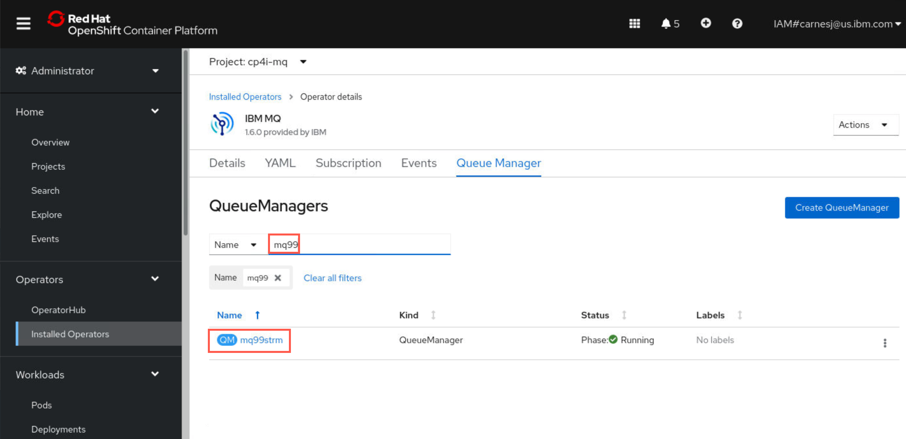
	
1. On the left sidebar expand *Workloads*, then select *Pods*. Use your filter to limit the display to your instance. You will see one pod for your MQ instance. The pod has a replica count of one, meaning there is one container in the pod and it is running your queue manager. 

	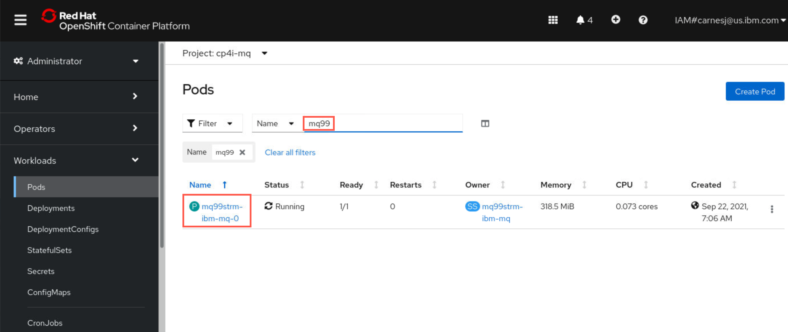
	
1. You can also see this on the command line. In your terminal window enter the following command using your student ID in place of *xx*.
	
	```sh
	oc get pods | grep mqxx
	```
	
	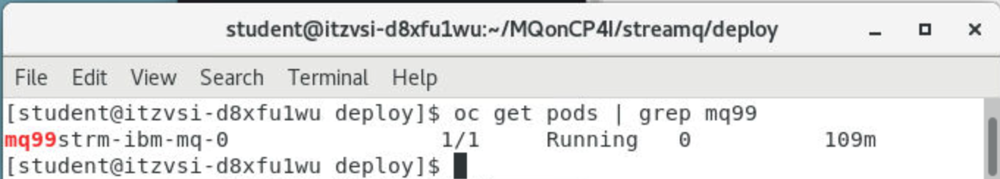

### Test the deployment

1. In a terminal window navigate to */home/ibmuser/MQonCP4I/streamq/test* directory. You will find three files (and additional files for TLS):

	* CCDT.JSON
	* getMessage.sh
	* sendMessage.sh

	Open them in gedit.
	
	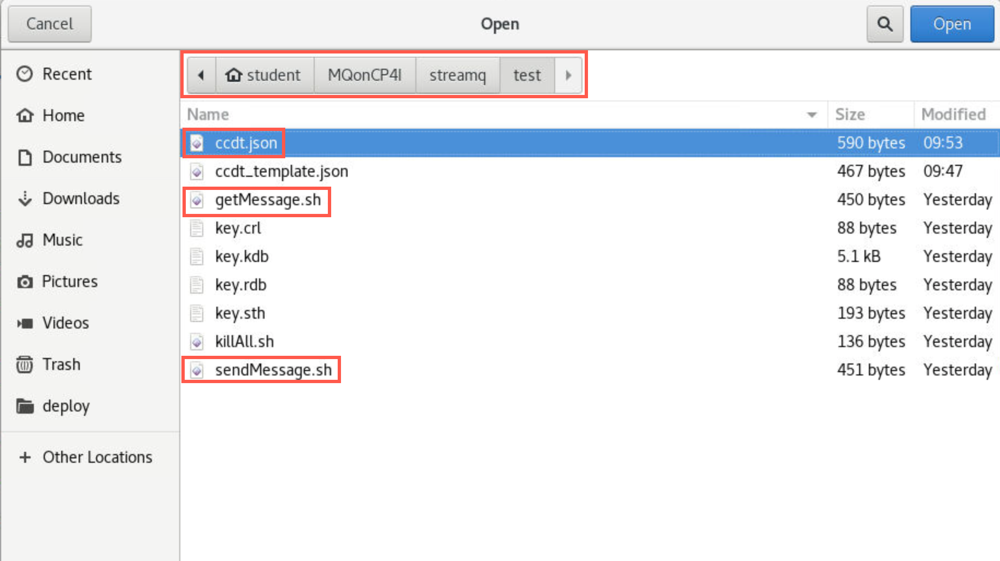
	
1. In the ccdt.json file, you need to update the host next to host: with your host name. To get your host name, run the following command in a terminal window:

	```sh
	oc get route | grep mq99
	```
	
	Your host name should start with mqxxstrm-ibm-mq-qm where xx is your student ID.	
	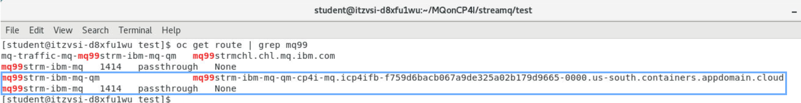	
1. It is much easier to read in the OpenShift console. Return to the web browser tab where the console is open. On the left sidebar, scroll down to *Networking*, use the drop-down to see the options, and select *Routes*.

	Use the filter to search for your queue manager routes to limit your search much like you did using grep with the oc command. Click the route name hyperlink for *mqxxstrm-ibm-mq-qm*.
	
	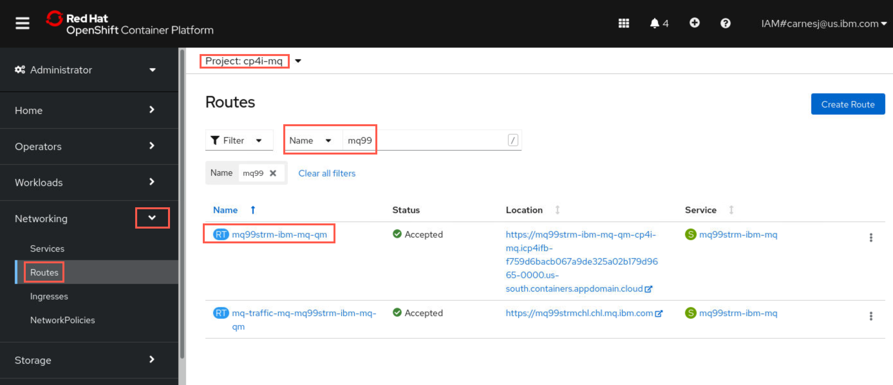
	
1. Click the hyperlink for the route. Under *Route Details* scroll down to *Router:default*. There you will find the Host URL. Copy the URL under *Host* to use in the ccdt.json file.

	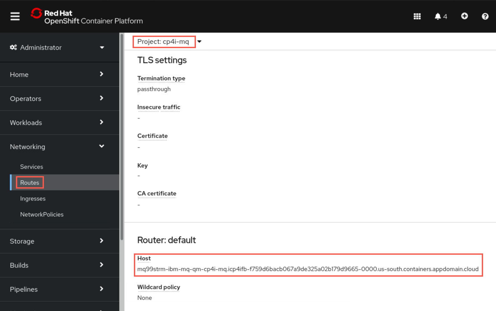

1. Return to the editor and paste the value into the *host:* field of ccdt.json. Under *channel* > *name:* insert the name of your SVRCONN channel (MQxxSTRMCHL). Then input the value of your queue manager in the *queueManager:* field.

	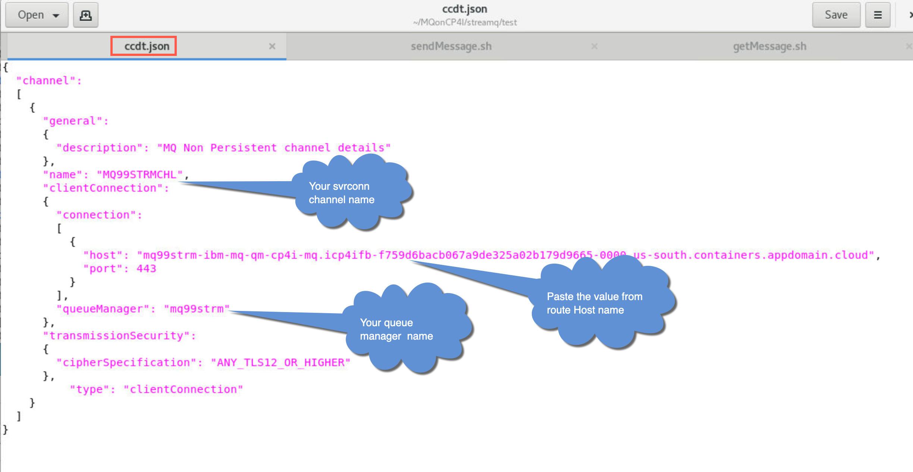
	
	Click *Save* to save ccdt.json.
	
1. Now edit *getMessage.sh* and *sendMessge.sh*. You need to change the same values in each file. In the export statements, change 00 to your student ID. Verify that the paths for *MQCCDTURL* and *MQSSLKEYR* are set to /home/student/…. Click the *Save* button for each file.

	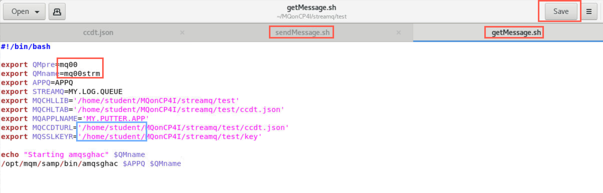
	
1. In the terminal window in the ./test directory make *sendMessage.sh* and *getMessage.sh* files executable with the following commands:

	```sh
	chmod +x sendMessage.sh
	```
	```sh
	chmod +x getMessage.sh
	```
	
	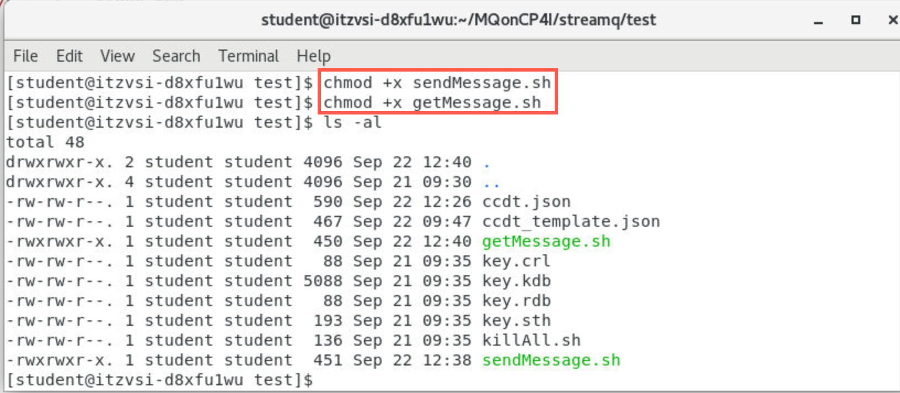

#### Put messages on the application queue
	
1. In the terminal window in the *./test* directory initiate the testing by running the following command:

	```sh
	./sendMessage.sh
	```
	
	The script will then connect to MQ and start sending messages incessantly. Leave this window open to keep sending messages.
	
	*sendMessage.sh* uses the amqsphac sample application shipped with MQ to put some messages to the application queue *APPQ*. 
	
   **The script will not put any messages directly to
MY.LOG.QUEUE – the queue manager will do that for us.**
	
	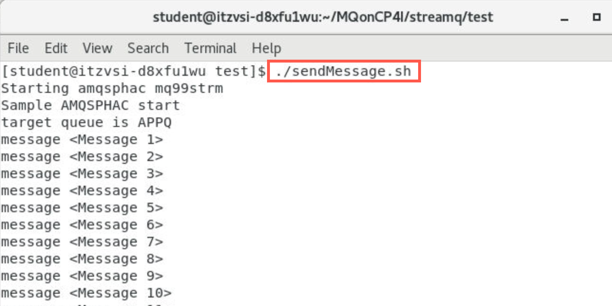

1. After a number of messages have been put, end the script with *CTRL-C*. Leave the terminal window open.

#### Check to see if messages are on app queue and streaming queue
		
1. Return to the browser where the MQ Console is running. Click *Manage* > *Queues*. Scroll down if necessary to see all queues. Compare the number of messages for **APPQ** to the number of messages for its streaming queue **MY.LOG.QUEUE**. They should be the same.

	Note that even though we didn’t put any messages to *MY.LOG.QUEUE* it has the same number of messages on it as *APPQ*. The stream queue feature has taken a copy of each message we put to *APPQ* and streamed it to *MY.LOG.QUEUE*.

	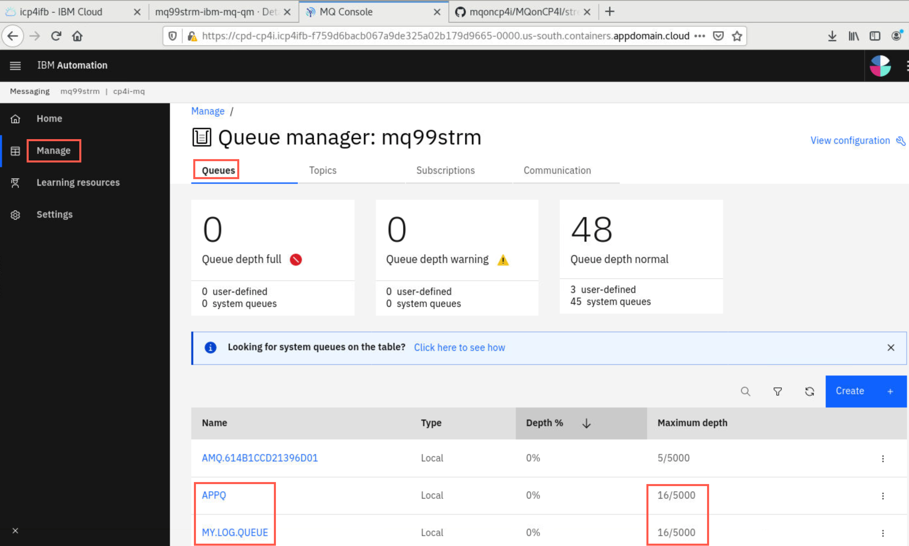

1. Open another command window, navigate to */home/student/mqoncp4i-master/MQonCP4I/streamq/test* directory and run the following command:

	```sh
	./getMessage.sh
	```
	
	
	
	When all messages have been read, end the script with *CTRL-C* . Leave the terminal window open.

1. In the MQ Console, click the refresh button and compare the number of messages on both queues again.

	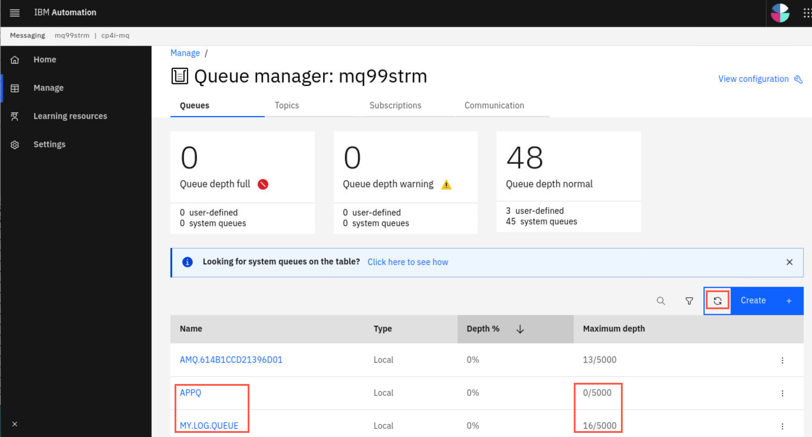

	*getMessage.sh* retrieved the messages from the *APPQ* queue. The messages on the streaming queue *MY.LOG.QUEUE* remain. This is the expected behavior as the streaming queue is intended to be a log for another eventing application to read.

#### Reduce maxdepth on streaming queue

1. First clear the messages from the stream queue. Still in MQ Explorer, click the elipsis to right of *MY.LOG.QUEUE* and select *Clear queue*.

	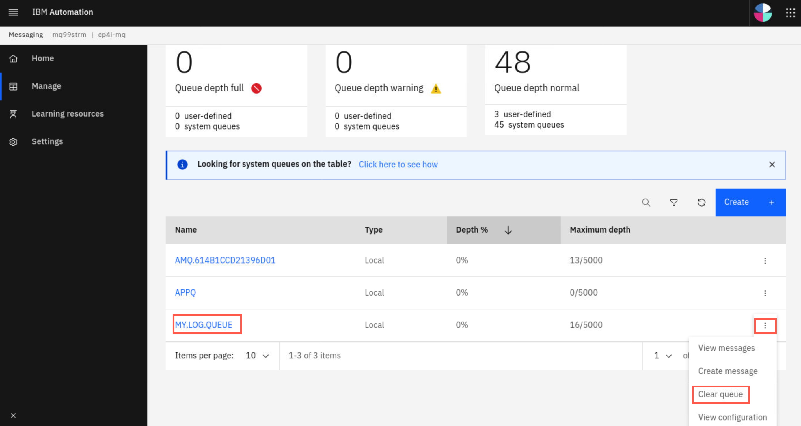

1. In the pop-up, click *Clear Queue* to confirm you want to delete the messages.

	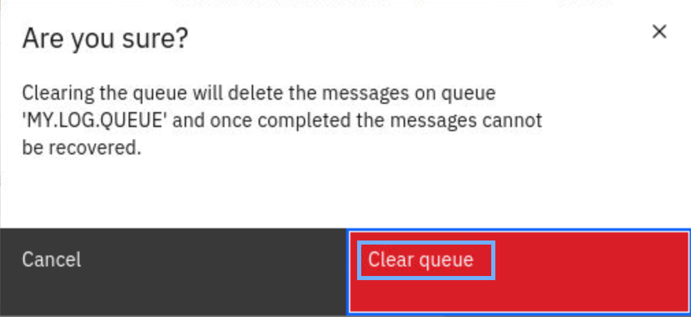
	
	Both queues are now empty.
	
	
	
1. Click the elipsis for *MY.LOG.QUEUE* and select *View configuration*.

	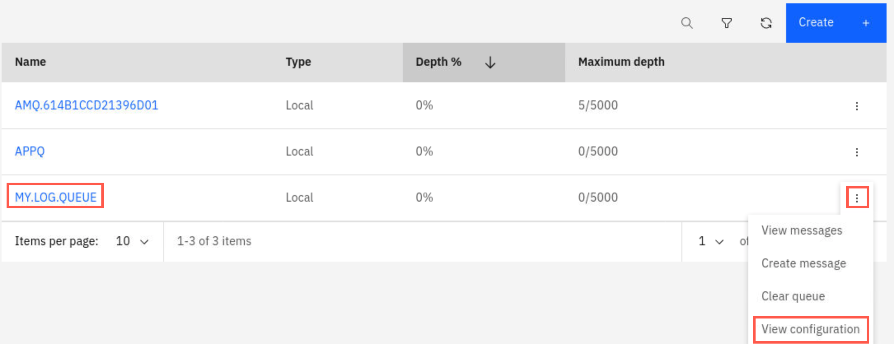
	
1. You are going to change the *Max Queue Depth* for the queue. Click *Extended* then click the *Edit* button.

	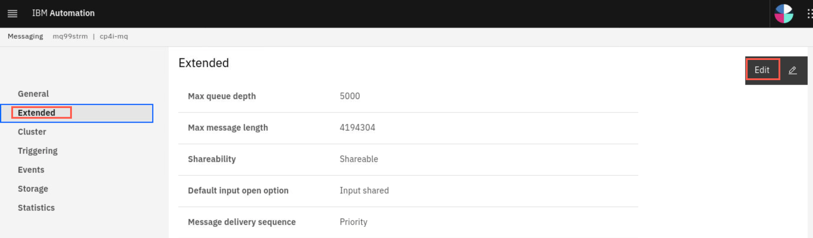
	
1. Locate the *Max Queue Depth* field and change it to 10. Click *Save*.

	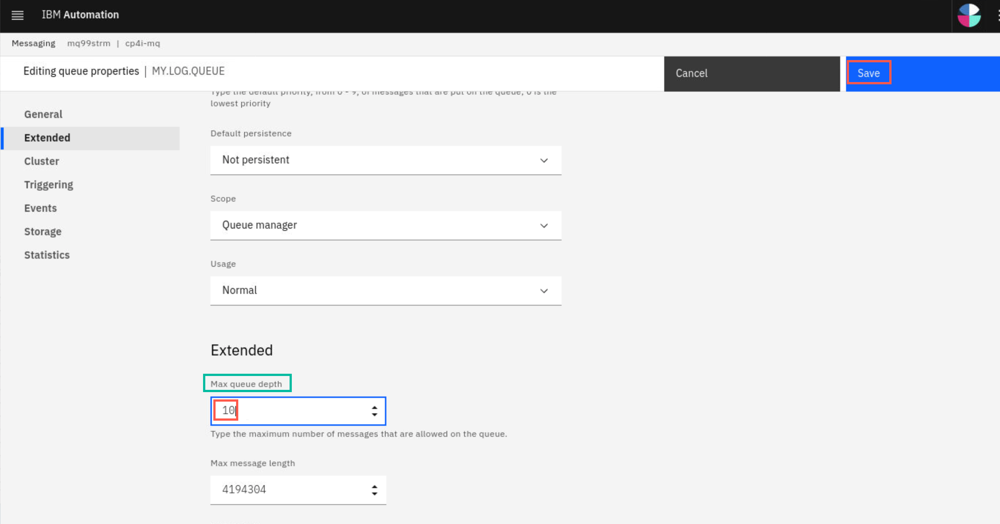
	
1. Return to the terminal window where you ran the *sendMessage.sh* command. Repeat and run the command. Let the script run until at least twenty messages have been put to *APPQ*. End the program with <CTRL-C> after twenty messages have been put.

	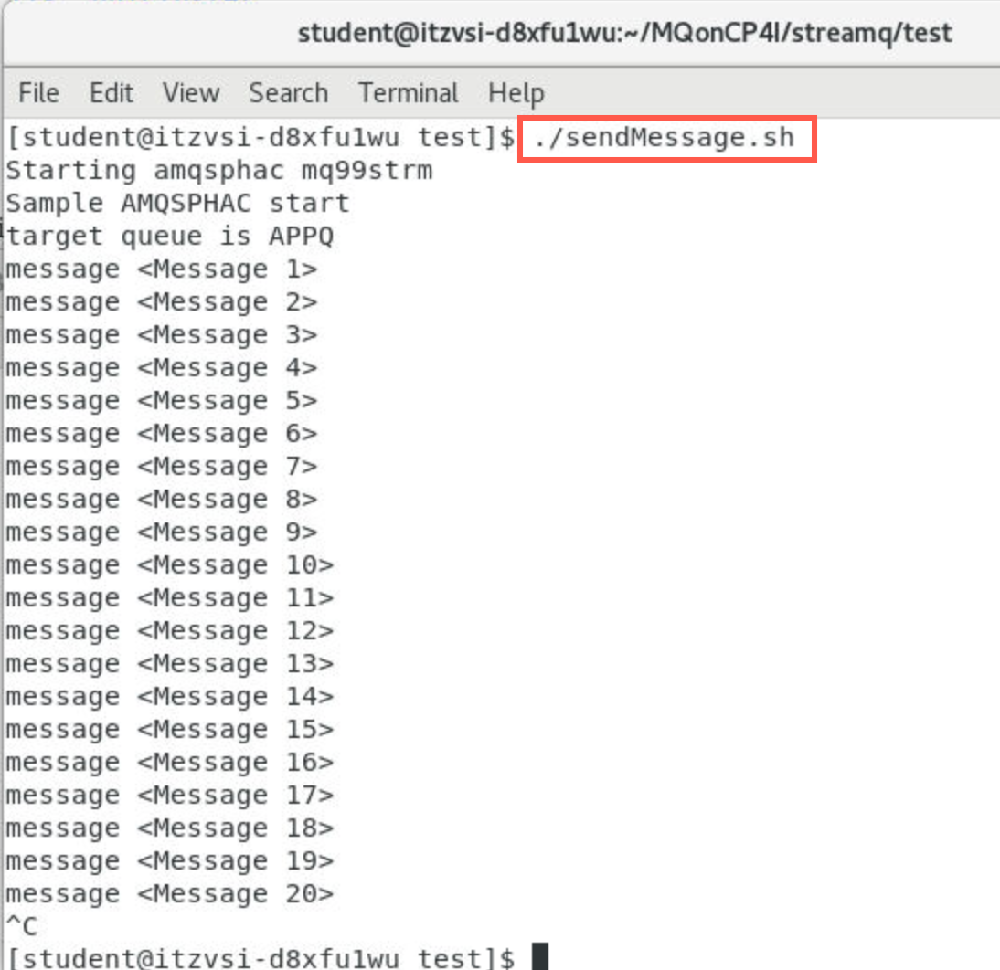

1. In the MQ Console, navigate to the *Manage* > *Queues* display. You will find that *APPQ* has all twenty messages. But what happened to the stream queue *MY.LOG.QUEUE*?

	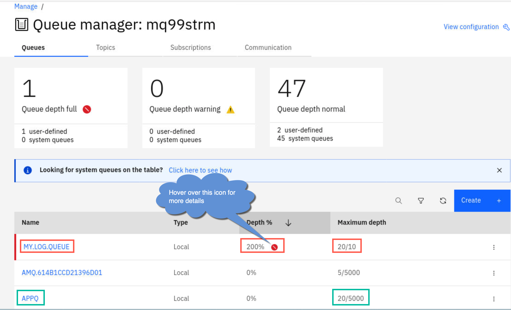

	The display indicates an error on the stream queue. Max queue depth is now **10**. But 20 messages were put to the application queue which 200% over max. Hover over the error icon and it indicates that number of messages exceeds 100% of max.

#### Check quality of service on streaming queue
	
1. 	Click the elipsis for **APPQ** and select *View configuration* again. 

	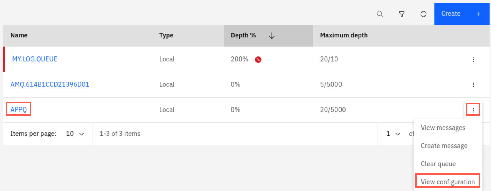
	
1. Click *Storage* then *Edit*. 

	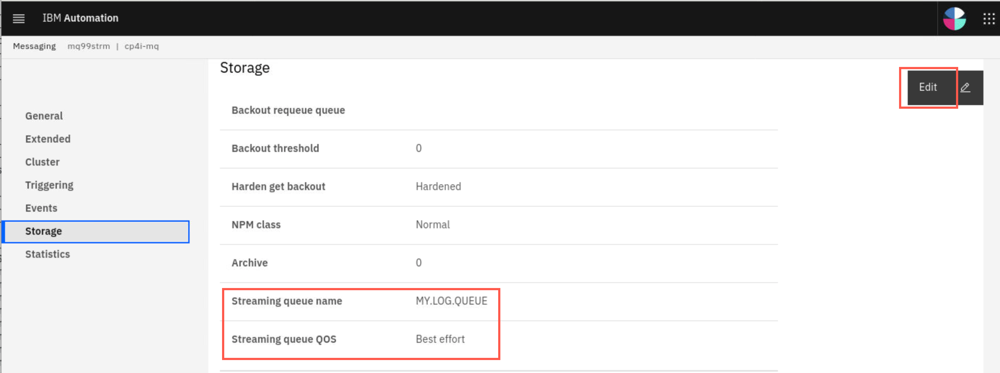
	
	 Note that the *Streaming queue Quality of Service (QOS)* is set to  **Best effort**. The **BESTEF** quality of service is the default value and indicates that MQ should attempt
to stream the duplicate messages to the stream queue but that it should deliver the original message to *APPQ* even if there is a problem delivering the duplicate. 

	This quality-of-service is best suited to applications where you want to make sure that the original behavior of the application is not affected by the stream queue feature. In this mode a putting application will never receive an error from the MQPUT API call due to an error with the streaming feature.

#### Change quality of service on streaming queue to must dup

1. Steam queues offer a second quality-of-service, **MUSTDUP** (must duplicate). When MUSTDUP is used, MQ will either deliver both messages, or neither
of them. If there is a problem delivering the duplicate to the stream queue then the original message will not be delivered to the application queue and the
putting application will receive an error reason code.
Let’s change our *APPQ* to use the MUSTDUP quality of service and see what affect that has.

	Click the dropdown for *Streaming queue QOS* and select **Must duplicate**. Click *Save*. 
	
	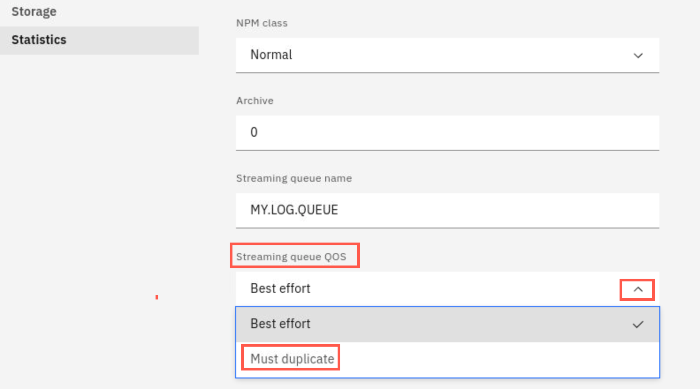

#### Rerun send message until queue full

1. Now we will re-run the *sendMessage.sh* script again and see what happens when we try to put more messages to *APPQ*. Remember that *MY.LOG.QUEUE* is still full.
	
	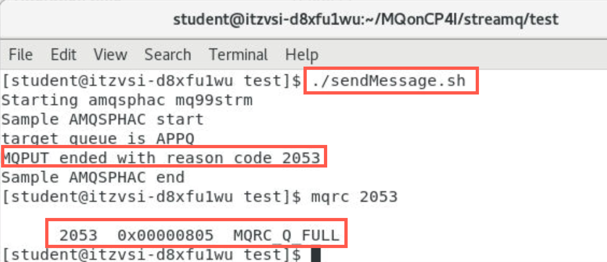

	amqsphac has received an error, MQRC 2053 (MQRC_Q_FULL). This is not because *APPQ* is full, but it is because *MY.LOG.QUEUE* is full. When **MUSTDUP** is used any error with the stream queue will be passed back to the application.
	
	**If there was a problem with APPQ then the application would receive that error instead and MQ would not attempt to deliver the message to the stream queue.**
	
#### Remove max queue depth restriction

1. Reset the *Max queue depth* for *MY.LOG.QUEUE* to the default value 5000. If you forgot how to set the property review the previous instructions.

	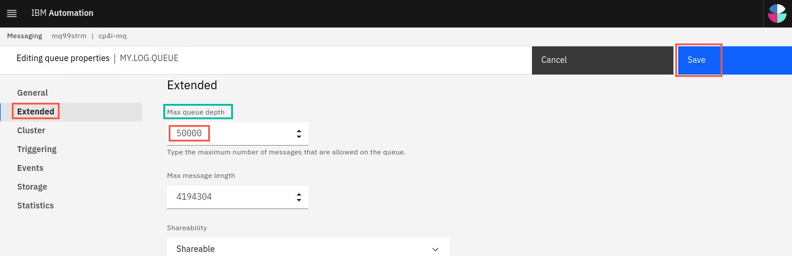
	 	
#### Rerun sendmessage

1. Now re-run the *sendMessage.sh* program and try putting some more messages to *APPQ*. This time we shouldn’t see any errors because MQ is able to stream duplicates to *MY.LOG.QUEUE* again.

#### Compare messages

1. If we check the queue depths we should now see 40 messages on *APPQ*, and 30 on *MY.LOG.QUEUE* (because 10 of them couldn’t be delivered when Max queue depth was set to 10. 


## Congratulations

You have completed this lab Streaming Queue for MQ on CP4I.


## Cleanup
	
1. Close all the applications and terminal windows.

1. In a terminal navigate to /home/student/MQonCP4I/streamq/deploy:

	```sh
	cd ~/MQonCP4I/streamq/deploy
	```
	
	You should have updated the cleanup.sh script earlier in the lab. Run it now to delete the nativeHA queue manager.
	
	```sh
	./cleanup.sh
	```

	
		

[Return MQ CP4I Menu](mq_cp4i_pot_overview.html)
