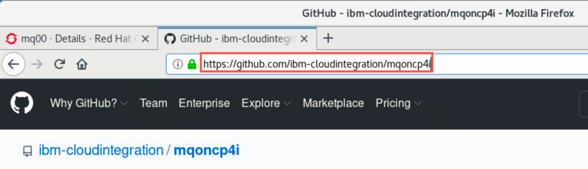
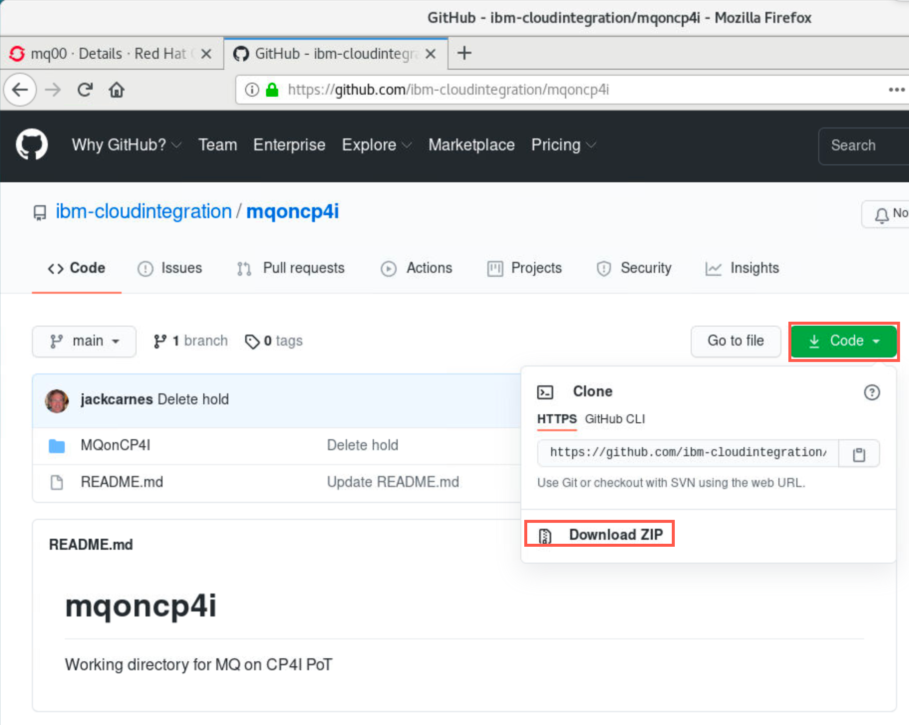
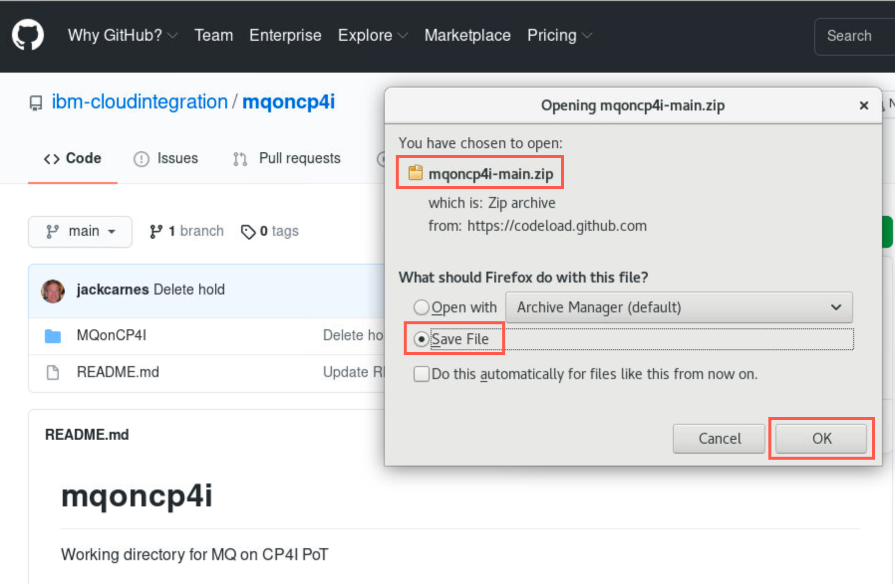
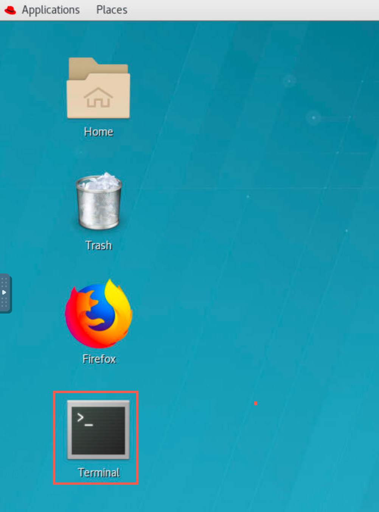
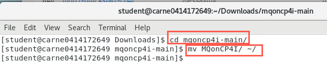
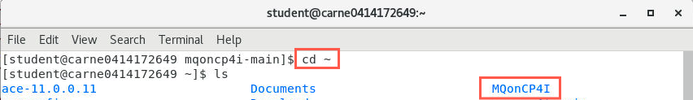
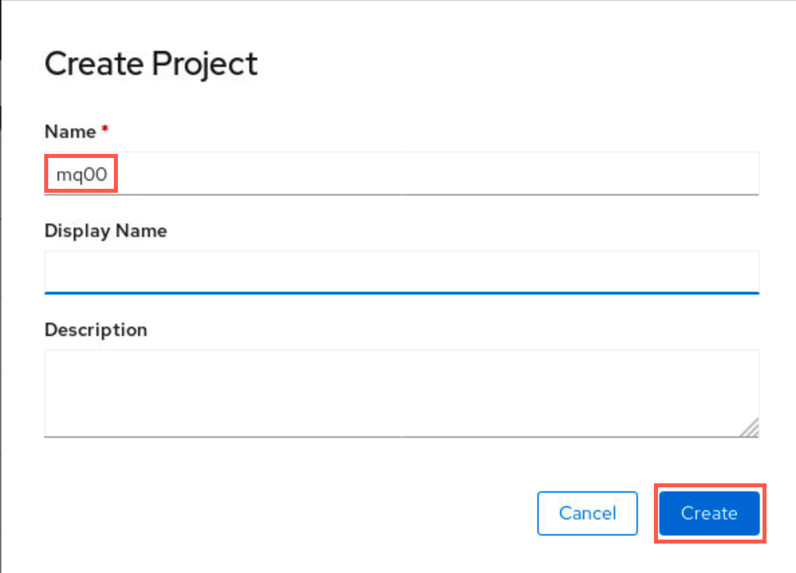
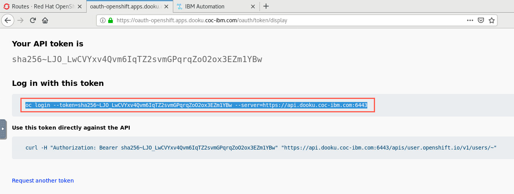
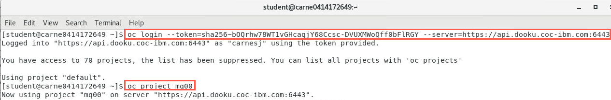
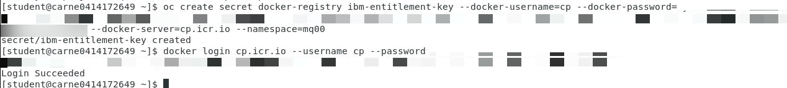

# Setup environment for MQ CP4I PoT

<a name="download"></a>	
## Download artifacts for MQ on CP4I PoT

You should be logged on your VDI as *student*. 

1. Open a Firefox browser tab and navigate to [Github MQonCP4i](https://github.com/ibm-cloudintegration/mqoncp4i).

	
	
1. Click *Code* and select *Download zip*.

	

1. Click *Save file* radio button then click *OK*.

	
	
1. Open a terminal window by double-clicking the icon on the desktop.

	
	
1. Enter the following command to see the zip file you just downloaded.

	```
	cd Downloads
	```
	
1. Enter the following command to unzip the downloaded file:

	```
	unzip mqoncp4i-main.zip
	```
	
	
	
1. Move the unzipped directory to your home directory with the following command:
	
	```
	cd mqoncp4i-main
	```
	
	```
	mv MQonCP4I/ ~/
	```
	
	 
	
	This will create the directory **/home/student/MQonCP4I**. Change to your home directory and list the contents of the directory to verify that it contains *MQonCP4I*. 
	
	```sh
	cd ~
	ls
	```
	
	
	
Great! You are now ready to start working with MQ in the labs. If running a PoT, attendees are now ready to start Lab 1 where they will create queue managers using their assigned IDs.

[Continue to Lab 1](mq_cp4i_pot_lab1.html)

[Return MQ CP4I Menu](mq_cp4i_pot_overview.html)

<a name="namespace"></a>
## IBM Only - Create Project (namespace) for your lab assets

1. Click *Projects* then click *Create project*.

	
	
1. Select a student number between 01 - 99. Append this number to "mq" to create your unique project name within the cluster (**mq00** is reserved for the instructor and has been used to document the lab). Project is the term for namespace in OpenShift. This is used to keep your assets separate from the other students.

	Enter the name of your project **mqxx** in the name field and click *Create*. 
	
	
	
### Create entitlement secret for your namespace

1. In OCP console, click the drop-down next to your username and select "Copy Login Command".

	

1. A new browser tab opens. Click the *Display Token* hyperlink.

	
	
1. Copy the command under "Log in with this token".

	
	
1. Open a terminal window and paste the command into the terminal and hit enter which logs you into the cluster. Enter the following command to change to your namespace. Make sure to substitute 00 with your student number.

	```
	oc project mq00
	```

	
	
	Note - "An entitlement key will be provided to you as part of the PoT. If you already have an entitlement key you may use it."
		
1. Enter the following command to create the secret replacing "**your-entitlement-key-goes-here**" with your real entitlement key:
	
	```
	oc create secret docker-registry ibm-entitlement-key --docker-username=cp --docker-password=**your-entitlement-key-goes-here** --docker-server=cp.icr.io --namespace=mq00
	```
	
1. You can now login to Docker with the following command replacing "**your-entitlement-key-goes-here**" with your entitlement key.

	```
	docker login cp.icr.io --username cp --password **your-entitlement-key-goes-here**
	```
	
	

[Return to main lab page](../index.md)
