# Lab 2b - Event Streams - MQSOURCE Kafka Connector

## 1. Overview

This lab will continue with the MQ StreamQ lab to show how to build MQSOURCE Kafka Connector in IBM Event Streams to synchronize/copy data from IBM MQ Queue to IBM Event Streams Topic.
<br>

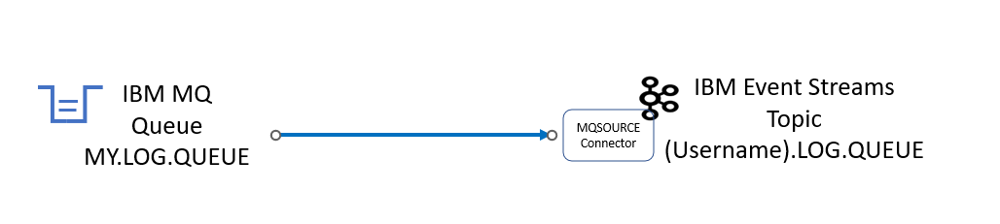

<br>

## 2. Create IBM Kafka Topic that will be used by the MQ Connector

From the Cloud Pak for Integration Console;<br>
The screen shots are showing this as username **melch1**<br>

1. Open the es-demo kafka cluster and select **Create a topic**

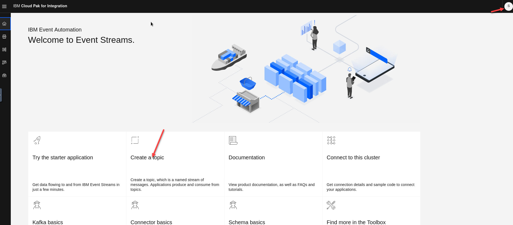

2. Enter the new topic name.   Make sure tha you prefix the topic with your username in this case **melch1**  since this is a shared clusters so you will see other topics listed. The name will be for for the StreamQ we created in the StreamQ lab.   (ex: melch1.LOG.QUEUE) <br>
Click **Next** for the next 3 screens

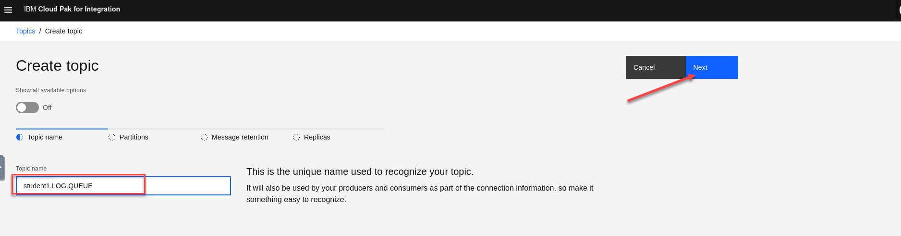

3. Once here click **Create Topic**.<br>

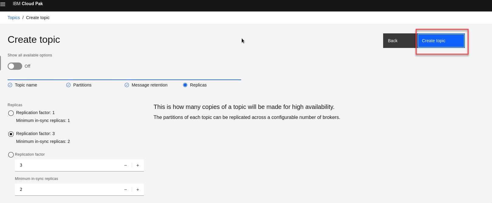


## 3. Create MQSOURCE Connector
In this section you will create the MQSOURCE Connector that will connect your MQ StreamQ from the previous lab to the Kafka topic you just created. <br>

1. Logon to the OpenShift Console, and click on the Plus sign (Import Yaml). <br>

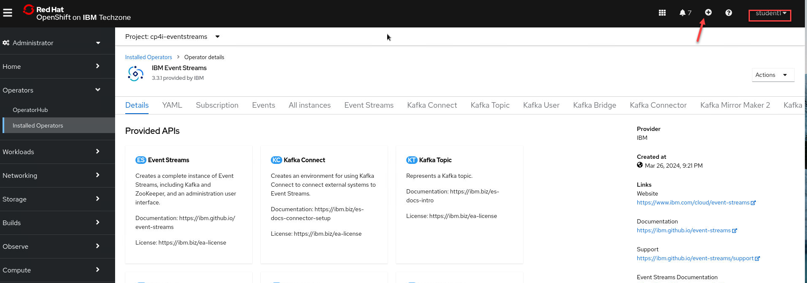

2. Copy/Paste the below KafkaConnector yaml, and update the configuration to match your student number.<br>
Example:
<br>(username) = melch1
<br>(XX) = 01

```
apiVersion: eventstreams.ibm.com/v1beta2
kind: KafkaConnector
metadata:
  name: <username>-mq-source-connector
  namespace: cp4i-eventstreams
  labels:
    # The eventstreams.ibm.com/cluster label identifies the KafkaConnect instance
    # in which to create this connector. That KafkaConnect instance
    # must have the eventstreams.ibm.com/use-connector-resources annotation
    # set to true.
    eventstreams.ibm.com/cluster: my-connect-cluster
spec:
  class: com.ibm.eventstreams.connect.mqsource.MQSourceConnector
  tasksMax: 1
  config:
    topic: <username>.LOG.QUEUE
    mq.queue.manager: <mqXXstrm>
    mq.connection.name.list: <mqXXstrm>-ibm-mq.<username>.svc(1414)
    mq.channel.name: SYSTEM.DEF.SVRCONN
    mq.queue: MY.LOG.QUEUE
    mq.user.name: dummy
    mq.password: dummy
    key.converter: org.apache.kafka.connect.storage.StringConverter
    value.converter: org.apache.kafka.connect.storage.StringConverter
    mq.record.builder: com.ibm.eventstreams.connect.mqsource.builders.DefaultRecordBuilder
    mq.message.body.jms: true
```
3. Paste the yaml into the import YAML screen and make your updates.  Go to the bottom of screen and click **Create**
<br>
**NOTE:** The following is example using the melch1 userid.

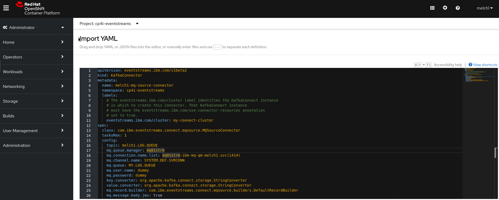

## 4. MQSOURCE Connector Readiness Check

From the OpenShift Console;<br>
a) Navigate to Operators > Installed Operators <br>
b) Change project to cp4i-eventstreams<br>
c) Click on "IBM Event Streams" Operator<br>

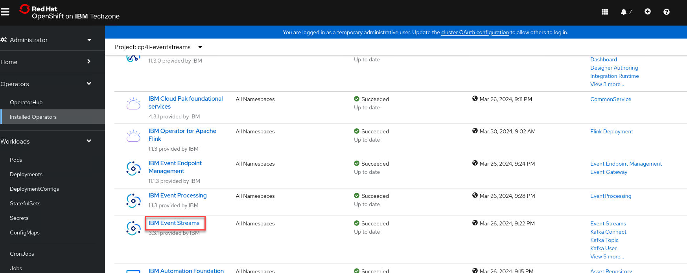

d) Click on "Kafka Connector" tab <br>

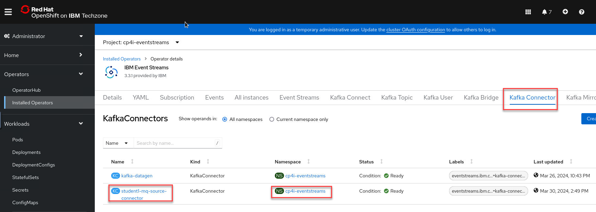

Make sure the melch(nn)-mq-source-connector is in Ready state<br>
**Note** This can take up to 6 minutes to complete. 
<br><br>

## 5. Put Sample messages into MQ Queue
#### Put messages on the application queue
<br>
1. In the terminal window from the previous lab run the test again to put messages on the queue in the *./test* directory initiate the testing by running the following command:

	The script will then connect to MQ and start sending messages incessantly. Leave this window open to keep sending messages.
	
	*sendMessage.sh* uses the amqsphac sample application shipped with MQ to put some messages to the application queue **APPQ**. 
	
  The script will not put any messages directly to
MY.LOG.QUEUE – the queue manager will do that for us.
	
  After a number of messages have been put, end the script with **CTRL-C**. Leave the terminal window open.

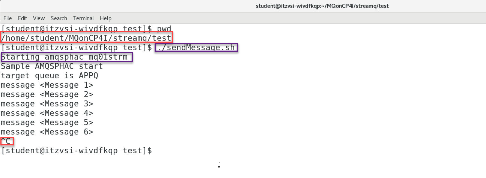

2. Now go to the MQ Console and select the MQ Stream Qmgr.  You will see the messages that were put to the **APPQ**.   You will see no messages on the **MY.LOG.QUEUE** since those have now been published on Kafka.After a number of messages have been put, end the script with <CTRL-C>. Leave the terminal window open.
  
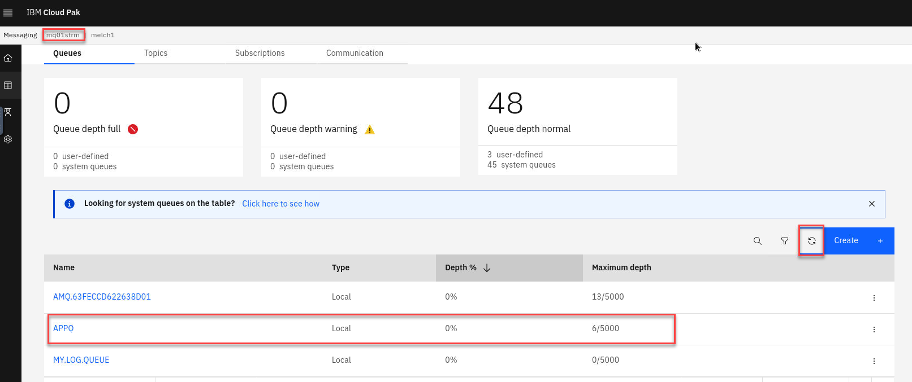
<br> 
3. Now you can go back to the terminal and run the **getMessage.sh** which will consume the messages from the **APPQ**

  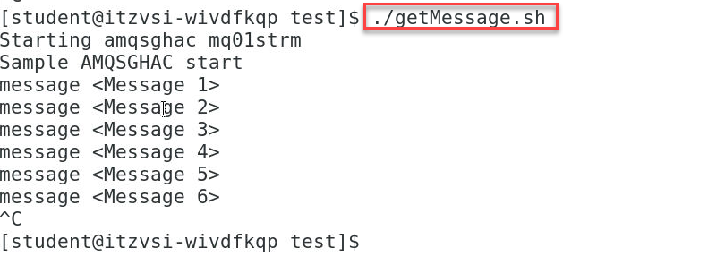
<br><br>

## 6. Verify Topic data in IBM Event Streams

1. Now go to the Event Streams Console and select your topic **(username).LOG.QUEUE**.  You will see the messages that were put to the **MY.LOG.QUEUE** now streamed to your kafka topic. 

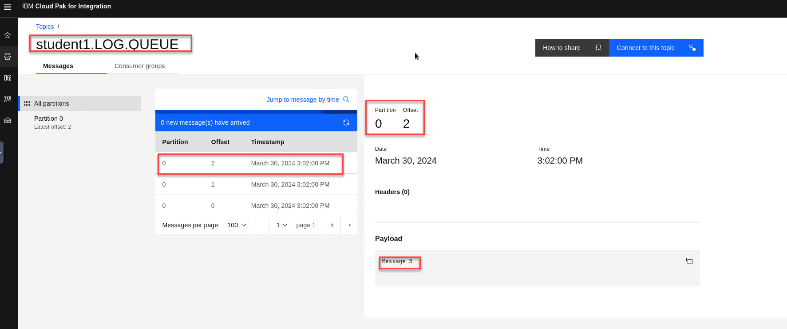


<br>
### Congratulations !!!

## Cleanup
	
1. Close all the applications and terminal windows.

1. In a terminal navigate to /home/student/MQonCP4I/streamq/deploy:

	```sh
	cd ~/MQonCP4I/streamq/deploy
	```
	
	Run the cleanup.sh script now to delete the streamq queue manager. You will need to pass the 2 args to this script, your student number and your namespace.
	
	```sh
	./cleanup.sh
	```

	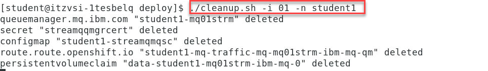
		

[Return MQ Menu](../index.md#lab-abstracts)
