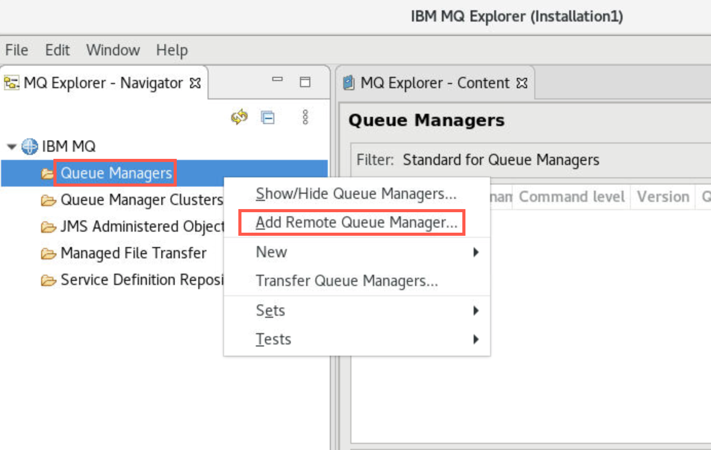
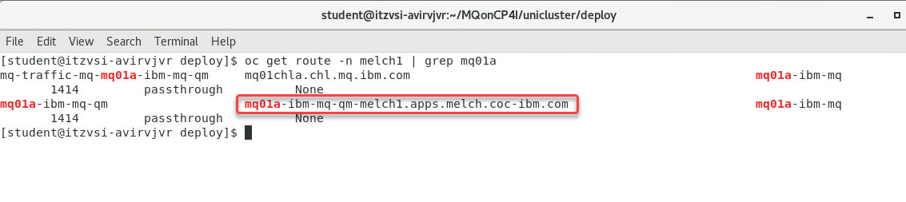

# Lab 3 - MQ Uniform Cluster on CP4I 

Featuring:

 * Creating a Uniform Cluster
 * Application Rebalancing
 * Application Rebalancing & Queue Manager Outage
 * Metrics
 * Using CCDT Queue Manager Groups

## Introduction

This lab introduces MQ Uniform Cluster and Application Rebalancing as of MQ 9.2 code level. The lab can be run on any IBM Cloud environment running RedHat OpenShift 4.6 or above with IBM Cloud Pak for Integration (CP4I) 2020.4.1 or above.

In this lab, you will:

* Create a Uniform Cluster quickly using yaml configuration files consisting of three identical queue managers
* Run re-connectable sample applications to a queue manager within the Uniform Cluster to show automatic rebalancing of the apps to other queue managers in the Uniform Cluster

	

* Stop then restart a queue manager with connected apps to show automatic application rebalancing to remaining running queue managers in the Uniform Cluster
* Report resource usage metrics for the applications, introduced in MQ 9.1.5.
* Connect an application to a Queue Manager Group instead of a queue manager

### Pre-reqs

You should have already downloaded the artifacts for this lab in the lab Environment Setup.

If you are doing this lab out of order return to [Environment Setup](../envsetup/mq_cp4i_pot_envsetup.md) to perform the download. Then continue from here.

#### Important points to note

The lab guide assumes you are using the RHEL desktop VM from the IBM Asset Repo. If you are using another platform, you can download the necessary artifacts from the github repo. The instructor will provide directions.

**Note**: The screen shots were taken on a test cluster and many will not match what you see when running the lab. Particularly URL values will be different depending on the cluster where CP4I is running. Projects (Namespaces) may also vary. It is important to follow the directions, not the pictures.

#### Further information

* [IBM MQ Knowledge Center](https://www.ibm.com/docs/en/ibm-mq/9.2?topic=mq) 
* “Building scalable fault tolerant systems with IBM MQ 9.1.2 CD” article by David Ware, STSM, Chief Architect, IBM MQ: 
[David Ware article](https://developer.ibm.com/messaging/2019/03/21/building-scalable-fault-tolerant-ibm-mq-systems/)
* “Active/active IBM MQ with Uniform Clusters” video by David Ware:
[YouTube Demo Video](https://www.youtube.com/watch?v=LWELgaEDGs0&feature=youtu.be)

## Configure the cluster using yaml

1. Open a Firefox web browser by double-clicking the icon on the desktop.

	
	
1. Navigate to the URL for the OCP console provided in your PoT email. If required to log in use the userid / password provided in the email.

	

1. Then add another browser tab by clicking the "+" sign and opening the *CP4I Navigator* URL for the platform navigator provided in your PoT email.

	

1. You may still be logged in from the previous labs. If your platform navigator session timed out, you may be required to log-in again.

	
1. Once the navigator opens, right click on the **Integration instances** and open in a new tab.

	
	
1. If you ran the *Cleanup* step in prior labs there should be none of your queue managers running. However there may be other's instances running. 

	
	
	If you have any remaining *mqxx* (xx = your student ID), delete them now.

1. Open a new terminal window by double-clicking the icon on the desktop.

	

1. Navigate to the */MQonCP4I/unicluster/* directory using the following commnand:

1. There are two subdirectories, *deploy* and *test*. Change to the *deploy* directory.

	```
	cd deploy
	ls
	```	
	
	
	
	*unicluster.yaml_template* contains the yaml code to define a cluster. *uni-install.sh* is a shell script which contains environment variables using your student ID and copies *unicluster.yaml_template* to *unicluster.yaml* and runs the openshift command to apply the definitions. *uni-cleanup.sh* is another shell script containing environment variables with your student ID and commands to delete your queue managers and related artifacts when you are finished. 

1. Review the yaml file.  Scan through the template which has definitions for all three queue managers. Your environment variables will be substituted throughout the file. If you execute a find for "$" you can easily locate the substitutions. 

	Each queue manager has two *ConfigMap* stanzas, one *QueueManager* stanza, and one *Route* stanza. One *ConfigMap* is the mqsc commands for the queue manager - **uniform-cluster-mqsc-x** and one for the cluster ini file - **uniform-cluster-ini-x**.
	
	The queue managers share the same secret - lines 1 - 9.
	Queue manager **mqxxa** is defined on lines 11 - 116.
	Queue manager **mqxxb** is defined on lines 118 - 223.
	Queue manager **mqxxc** is defined on lines 225 - 325.	
	
	
	Pay particular attention to the mqsc commands which define the cluster repository queue managers and the cluster channels. 
		
1. You should still be logged into the OpenShift environment. Click on your username on the top right menu of the OpenShift Console, then click on *Copy Login Command*. 

	

1. A new tab will be opened.  Login with your username/password Click *Display Token*, copy the token and run it on your terminal.
	
	
	**Note**: You should still be in your project so you shouldn't need to run this command.
	
	Run the following command to navigate to your project substituting your personal project name:
	
	```
	oc project palpatine5
	``` 

1. Now we will run the install script for the unicluster Qmgrs in your namespace.  If you run the uni-install.sh 
	
1. Review the output from the script.  You should see 3 Qmgrs created with all required assets. 
	
	
	
1. Return to the *Platform Navigator* web browser page. In *Integration Instances* click the *Refresh* button. 
The queue managers will be in a *Pending* state for a couple of minutes while they are provisioned.
 
 	
		
1. On the *OpenShift Console* you can watch the pods as they create containers. Click *Workloads* then select *Pods*. You will see a pod for each queue manager and you will see states of *Pending*, *Container creating*, and then *Running*.

	
	
	

1. After a few minutes the queue managers will then show *Ready* on the *Platform Navigator* and the pods will show *Running* on the *OpenShift Console*.
	
	
	
	

1. Your cluster is also now completely configured. Check this from the *MQ Console* of one of thee queue managers. Click the hyperlink for your mq..a

	
	
1. You will be presented with a warning pop-up. Click *Advanced*, then scroll down and click *Accept the Risk and Continue*.

	

1. In the *MQ Console* click *Manage mq00a*. Of course your queue managers are different, 00 being replaced by your student ID.

	
	
1. You will see the two local queues **APPQ** and **APPQ2** which were defined by the mqsc *ConfigMap* defined in the yaml template. The other queue managers also have the queues by that name. 

	
	
	Click *Communication*.
	
1. The listener *SYSTEM.LISTENER.TCP.1* is running. 

	
	
	Click *App channels*.
		
1. *App channels* are actually *SVRCONN* channels. You will have two defined within the yaml file. **MQ00CHLA** and **TO_UNICLUS00**. These will used during testing in the next section. 

**NOTE:** Make note of the MQ00CHLA name you will have one for each Qmgr and will use that in connecting with MQ Explorer.


	
	Click *Queue manager channels*.
	
1. Here you find your cluster channels. If you looked closely at the yaml template, you'll remember that your *mqxxa* and *mqxxb* are the primary repositories for your cluster *UNICLUSxx*. While looking at *mqxxa* you see a cluster receiver channel **TO_UNICLUS_MQ00A** and two cluster sender channels **TO_UNICLUS_MQ00B** and **TO_UNICLUS_MQ00C**. They should be *Running*. 
	
	
	
	Click *View Configuration* in the top right corner.

1. The queue manager properties are displayed. Click *Cluster* to see the cluster properties where you see your cluster name - UNICLUSxx.

	

1. You can check the other queue manager's console to verify that they are all configured the same. You should have verified that when reviewing the yaml template.

	You are all set, time for testing.

## Test uniform cluster

### Perform health-check on Uniform Cluster

Before proceeding, we need to check the cluster is up and running.
1. Open a new terminal window.
 
 Enter the following command to start MQ Explorer making sure to use the correct case:

	```
	MQExplorer
	```
	
 

1. When the utility is ready, right-click *Queue Managers* and select *Add Remote Queue Manager*.

	

1. Enter your queue manager name using your student ID. Click *Next*.

	

1. We will now need to get the hostname for this Qmgr to connect to it outside the OCP cluster to MQExplorer.   
Run the following command 

```
oc get route -n melch1 | grep mq01a
```
Copy the hostname 
	

*	Enter the value from the *hostname* above. 
*	Enter **443** for the *Port number*.
*	Enter your SVRCONN channel name in the *Server-connection channel* field.
	
	**Note** for the uniform cluster lab do not click the checkbox for Multi-instance queue manager.
	
	Click *Next* three times.
	
	
	
	[For more information refer to KnowledgeCenter](https://www.ibm.com/support/knowledgecenter/SSFKSJ_9.1.0/com.ibm.mq.ctr.doc/cc_conn_qm_openshift.htm)
		
1. Click the checkbox for *Enable SSL key repositories*. Click *Browse* and navigate to */home/ibmuser/MQonCP4I/tls* and select **MQExplorer.jks**. Then click *Open*.

	
	
1. Click the *Enter password* button and enter the jks password **'password'**. Click *OK* then *Next*.

	
	
1. On the next screen click the checkbox for *Enable SSL options*. Click the drop-down next to *SSL CipherSpec* and select **ANY_TLS12_OR_HIGHER**.

	
	
1. Click *Finish*. You will get a pop-up saying "Trying to connect to the queue manager".

	
	
1. After a few seconds you see that MQ Explorer has connected. The Queue Manager will be added and shown in the navigator.

	
	
1. Operate MQ Explorer as you normally would. Expand the queue manager and "explore" MQ looking at queues, channels, etc.

	


**You now have the hosts to connect to the QMgrs Connect all 3 Qmgrs in MQExplorer**

1. Expand *Queue Manager Clusters* to confirm that queue managers **mqxxa** and **mqxxb** have full repositories, while **mqxxc** has a partial repository.

	
	
1. You observed the cluster channels in the MQ Console, but you can verify them in MQ Explorer also. Since *mqxxc* is a partial repository, it has two cluster sender channels, one to each full repository.

	

1. Check that Cluster Sender and Receiver Channels for each queue manager are running and if not, start them.

	

	**Note**: the Server Connection Channels will be inactive – do not attempt to start these.
	
1. Right-click you cluster name and select *Tests* > *Run Default Tests*.
	
	
	
1. Check that there are no errors or warnings resulting in the *MQ Explorer - Test Results*.

	

## Launch getting applications

In this section we shall launch 6 instances of an application connected to the same queue manager.

The Client Channel Definition Table (CCDT) determines the channel definitions and authentication information used by client applications to connect to a queue manager.
We shall be using a CCDT in JSON format. 

1. Open a terminal window and navigate to */home/student/MQonCP4I/unicluster/test*. Copy the command snippet so you don't have to type the whole thing (you will need it in other terminals).

	```
	cd /home/student/MQonCP4I/unicluster/test
	```

1. Make shell scripts executable with the following commmand:

	```
	chmod +x getMessage.sh
	```
	
	Repeat the command for the other scripts:
	
	* sendMessage.sh
	* killall.sh
	* rClient.sh
	* sClient.sh
	* setEnv.sh
	* *showConns.sh
	
	
	
1. Edit **ccdt.json** with the following command:

	```
	gedit ccdt.json
	```
	
		
1. Before you make any changes review the file observing:
	
	* the channel name matches the server connection channel on the queue manager
	* the host is in the format that you used in MQ Explorer	* the port is the listener port for the queue manager
	* queue manager name
	* cipherspec

	
	
1. You only need to change the channel name, host, and queue manager name.  First you need to find the host name. To get the host name, return to the OpenShift console. Make sure you are in the *cp4i-mq* project substituting your personal project for cp4i-mq. Open *Networking* and select *Routes*. Filter by your queue manager name (mqxxa) then click the hyperlink for *mqxxa-ibm-mq-qm*.

	
	
	Scroll down to the *Router:default* section. Copy the string under *Host* and paste it into the host field of the *ccdt.json* file.
	
	

	Change the "00" to your student ID in the channel *name* and *queueManager* values. 
	
	
	
	Click *Save*.
	
1. In the editor, click the Open drop-down and select *getMessage.sh*. You may need to click *Other documents* if it doesn't appear in the list. 

	
	
1. Also review this file before making any changes observing:

	* MQCHLLIB sets the folder containing the JSON CCDT file
	* MQCHLTAB sets the name of the JSON CCDT file
	* MQCCDTURL sets the address of the JSON CCDT file
	* MQSSLKEYR sets the location of the key
	* MQAPPLNAME gives a name to the application for displays 
	* The shell will run the sample program *amqsghac* getting messages from queue *APPQ* on your queue manager
	
	Change the "00" in QMpre and QMname to your student ID, then click *Save*.
	
	

1. Open a new terminal window and enter the command:

	```
	MQonCP4I/unicluster/test/getMessage.sh
	```
	
	 
	
	Do this 5 more times so that you have six terminals running the program.

1. Notice that each time you open a new terminal and run the shell again the programs start to rebalance and reconnect. 
	
	

1. Return to the OpenShift Console browser tab. Make sure you are in the your project. Open *Workload > Pods*, use the filter to search for you queue managers, then click the hyperlink *mqxxa-ibm-mq-0* pod. 

	
	
1. Click *Terminal*. This opens a terminal window in the container running inside that pod.

			
1. There is a new MQSC command, *DISPLAY APSTATUS*, which we shall now use to display the status of an application across all queue managers in a cluster.

	Start *runmqsc* with following command:
		
	```
	runmqsc mq00a
	```
	
	Run the display *APSTATUS* command:	
		
	```
	DISPLAY APSTATUS(MY.GETTER.APP) TYPE(APPL)
	```
	
	*COUNT* is the number of instances of the specified application name currently running on this queue manager, while *MOVCOUNT* is the number of instances of the specified application name running on the queue manager which could be moved to another queue manager if required. You started the getMessage.sh six times.
	
	
	
	Click *Expand* to make the window larger. Repeat the command changing the *TYPE* to **QMGR**.	
	
	```
	DISPLAY APSTATUS(MY.GETTER.APP) TYPE(QMGR)
	```
	
	At first, all instances of the application will be running on mqxxa and none on the other two queue managers. However, by the time you run this command, the instances will probably be shared across all queue managers as shown below.
	
	This display shows how the applications have been rebalanced. Notice that each queue manager in the cluster is now running two of the client applications making a total of six rebalanced.
	
	 
	
	Click *Collapse* to return the window to normal size. Enter *end* to stop runmqsc.
	
	```
	end
	```

1. Some of the application instances will show reconnection events as the workload is rebalanced to queue managers *mqxxb* and *mqxxc*.

	
	
## Launch putting application

We shall launch another sample which will put messages to each queue manager in the cluster. The running samples should then pick up these messages and display them. In this lab, we are using one putting application to send messages to all getting applications using cluster workload balancing. You could set up the same scenario with one or more putting applications per queue manager and application rebalancing would work in the same way that you’ve seen for getting applications.

1. Open a new terminal window and navigate to */home/student/MQonCP4I/unicluster/test*. Open an edit session for *sendMessage.sh*. Review the export commands observing:
	
	* MQCHLLIB (sets the folder of the JSON CCDT file
	* MQCHLTAB sets the name of the JSON CCDT file
	* MQSSLKEYR sets the location of the key
	* MQAPPLNAME gives a name to the application for displays 
	* The shell will run the sample program *amqsphac* putting messages to queue *APPQ* on your queue manager	

	Change *00* to your student ID, then click *Save*.
	
			
1. We shall be using the sample amqsphac in this scenario. In the terminal window, enter the following command: 
		
	```
	./sendMessage.sh
	```		
	
	

1. You should now see the generated messages split across the getting application sessions that are running. Each window will contain a subset, like this:

	

	Note: the messages may not be evenly distributed across the getting applications instances.
	
## Queue Manager maintenance

In this scenario, imagine a queue manager needs to be stopped for maintenance purposes. We shall demonstrate how doing this will cause the applications running on that queue manager to run instead on the remaining active queue managers in the Uniform Cluster. Once the maintenance is complete, the queue manager will be re-enabled.

When a queue manager is ended, the applications on that queue manager are usually lost. However, if the optional parameter -r is used, the applications will attempt to reconnect to a different queue manager.

1. Return to the OpenShift Console tab in the web browser. You should still be in the *cp4i-mq* Project. Click the drop-down for *Workloads* and select *Stateful Sets*. Filter on your **c** queue manager. Click the hyperlink for your the *Stateful Set*.

		
1. Click *YAML* which will open an editor for the *Stateful Set*. Scroll to the *spec* stanza at line 370. Change *replicas* to **0**. This will remove the active container in effect stopping the queue manager.

	
	
	Click *Save*.
	
1. Click *Save* again on the *Managed resource* pop-up.

		
1. Click *Pods* in the side-bar and notice that the pod for *mqxxc* has been terminated.

	
	
	**Tip**: Now that you have seen the yaml code to change replicas, there is a much faster way to scale down the replicas in order to stop a queue manager. Instead of clicking the *YAML* tab in the *StatefulSet* click *Details* instead. Then just decrease the count by 1. To start the queue manager again, just increase the number back to 1. Use this pod counter when asked to stop or start the queue manager.
	
	
1. In the application windows, you'll notice that the application connected to *mq00c* are now trying to reconnect.

	
			
1. After a while, an application imbalance will be detected, and affected applications will be reconnected to the other available queue managers.

	To see this happening, re-run the MQSC command DISPLAY APSTATUS on any active queue manager in the cluster. After a minute or two you should see all application instances now running on mq00a and mq00b:

	

1. Once you are happy that the applications have balanced out equally across the other queue managers, re-start the stopped queue manager by changing the *spec > replicas* back to one in *Stateful Set* **mq00c-ibm-mq**.
	
	

1. In the application windows, you'll notice that the application connected to *mq00c* has now reconnected.	
	
	 
	
	As this queue manager has started and has no applications connected, it will request some from the other queue managers in the cluster.
	
1.  Display *apstatus* again and you'll see that the applications are again rebalanced.

	
	
## Metrics (new in 9.1.5)

The amqsrua sample application provides a way to consume MQ monitoring publications and display performance data published by queue managers. This data can include information about the CPU, memory, and disk usage. MQ v9.1.5 adds the ability to allow you to monitor usage statistics for each application you specify by adding the STATAPP class to the amqsrua command. You can use this information to help you understand how your applications are being moved between queue managers and to identify any anomalies.

The data is published every 10 seconds and is reported while the command runs.

Statistics available are:

* Instance count: number of instances of the specified application name currently running on this queue manager. See also COUNT from MQSC APSTATUS that we saw earlier.
* Movable instance count: number of instances of the specified application name running on this queue manager which could be moved to another queue manager if required. See also MOVCOUNT from MQSC APSTATUS that we saw earlier.
* Instance shortfall count: how far short of the mean instance count for the uniform cluster that this queue manager’s instance count is. This will be 0 if queue manager is not part of a uniform cluster.
* Instances started: number of new instances of the specified application name that have started on this queue manager in the last monitoring period (these may have previously moved from other queue managers or be completely new instances).
* Initiated outbound Instance moves: number of movable instances of the specified application that have been requested to move to another queue manager in the last monitoring period. This will be 0 if the queue manager is not part of a uniform cluster.
* Completed outbound instance moves: number of instances of the specified application that have ended following a request to move to another queue manager. This number includes those that are actioning the requested move, or that are ending for any other reason after being requested to move (note that it does not mean that the instances have successfully started on another queue manager). This will be 0 if the queue manager is not part of a uniform cluster.
* Instances ended during reconnect: number of instances of the specified application that have ended while in the middle of reconnecting to this queue manager (whether as a result of a move request from another queue manager, or as part of an HA fail over).
* Instances ended: number of instances of the specified application that have ended in the last monitoring period. This includes instances that have moved, and those that have failed during reconnection processing.

1. In the browser tab for OpenShift Console stop *runmqsc* for *mqxxa* by entering *ctrl-C*. Then run the *amqsrua* command as follows, i.e. with a class of STATAPP, a type of INSTANCE, and object of your getting application name. Change *xx* to your student ID.
	
	```
	/opt/mqm/samp/bin/amqsrua -m mqxxa -c STATAPP -t INSTANCE -o MY.GETTER.APP
	```

	(Note: you can omit the class, type and object parameters and enter them when prompted instead).

	Initial stats are displayed and then updated every 10 seconds to show activity in the previous interval. You should see an Instance Count and Movable Instance Count of 2 as shown below. You may see different numbers for the other stats in the first interval, but these should be 0 in subsequent intervals.
	
	
	
	Refer to the description of these stats at the start of this section. 
	Keep this command running.
	
1. Open a new browser tab and click the openshift bookmark of the cluster you are working on. Change to the *cp4i-mq* project if not already there.

	
	
1. In this browser tab, expand *Workloads*, select *Stateful Sets*, then click the hyperlink for *mqxxc-ibm-mq*.	

	
	
1. As you did previously, stop *mqxxc* by editing the *YAML* changing *spec > replcas* to zero. Click *Save*.
  
	
	
	Click *Save* on the *Managed resource* pop-up.	
1. Refer back to the browser tab where you are running the *amqsrua* session. When the next update is shown, the following should have changed:

	**Instance Count & Movable Instance Count**
	
	there are now 3 instances of the application running on this queue manager;

	**Initiated & Completed Outbound Instance Moves, Instances ended**
	
	temporarily equal to 1 during the first interval as an instance is moved from *mqxxc* to this queue manager.
	
	
	
1. In the other console, restart mqxxc by editing the *YAML* changing *spec > replicas* back to one and clicking *Save*.
	
	
	
1. Again, refer back to the **amqsrua** session. When the next update is shown, the stats will have changed again. There are now 2 instances running on this queue manager, one having been moved (back) to *mqxxc*. As this happens, the numbers of moved and ended instances are again temporarily equal to 1.

	
	
1. Stop the **amqsrua** session when you are ready, using *ctrl-C*.

1. Stop the putting application with *ctrl-C*. Leave the terminal window open as you will need it in the next secion.

## Using CCDT Queue Manager Groups

So far we have connected our getting applications to *mqxxa* directly, and relied on the Uniform Cluster to rebalance them across the other queue managers over a period of time. There are 2 disadvantages to connecting in this way:

* When the applications initially connect, they all start out connected to *mqxxa* and there is a delay in the Uniform Cluster balancing them across the other queue managers
* If *mqxxa* is stopped unexpectedly or for maintenance, any applications connected to it will try to reconnect to *mqxxa* and fail. They will not attempt to connect to the other queue managers in the cluster. This will also be true if applications connected to other queue managers try to reconnect after an outage.

In this section, we shall see that by using Queue Manager Groups within our CCDT file we can decouple application instances from a particular queue manager and take advantage of the built-in load balancing capabilities available with CCDTs.

For a fuller description of the issues highlighted here, see step 5 of the following article:

[Walkthrough Uniform Cluster](https://developer.ibm.com/messaging/2019/03/21/walkthrough-auto-application-rebalancing-using-the-uniform-cluster-pattern)

### Stop queue manager - application refers to queue manager directly

Now that you know how to stop and start queue managers in CP4i, you will not receive the detailed instructions as previously. 

1. Stop *mqxxa* by scaling the replicas in its *Stateful Set* to zero. 

	
	
	Click *Save* on the *Managed resource* pop-up.
	
1. This time the getting application instances connected to *mqxxa* will continually try to reconnect to the stopped queue manager:

	
	
1. Now run the following MQSC command on any active queue manager in the cluster:

	```
	DISPLAY APSTATUS(MY.GETTER.APP) TYPE(APPL)
	```
	
	After a while, there should be fewer than the 6 application instances that were originally present. You may need to run the command more than once until the rebalancing  occurs.
	
	
	
	If it still shows *COUNT(6)* then run the command again with *type(QMGR)*.
	
	```
	DISPLAY APSTATUS(MY.GETTER.APP) TYPE(QMGR)
	```
		
	
	
	You can see that there are six, three each on mq00b and mq00c, but none on mq00a.		
1. Now restart *mqxxa* by scaling the replicas back up to one.
	
	

### Stop queue manager – application refers to CCDT Queue Manager Group

1. In the classroom environment, an updated CCDT file has been created for you to use: */home/student/MQonCP4I/unicluster/test/ccdt5.json*.

	Open this file in the editor. Change the *host* values for each queue manager as you did in the *ccdt.json* file. There are 8 hosts parameters to change. As well as containing the original set of direct references to the queue managers, it gives a queue manager group definition with a route to all queue managers using the name **ANY_QM**.
	
1. Scroll down the file and note two new attributes:

	
	
	These are defined under *connectionManagement*: 
	
	* **clientWeight**: a priority list for each client. The default value is zero. A client with a higher clientWeight will be picked over a client with a smaller value.
	* **affinity**: setting the affinity to “none” will build up an ordered list of group connections to attempt to try in a random order, for any clients on a particular named host.

1. Now let’s put the updated CCDT to the test. First, stop the 6 running getting application instances that you started earlier by entering *ctrl-C* in each terminal. You may leave the termninal running.
	
	
		
1. Please note: the supplied updated CCDT5 file was originally created for a scenario with an additional queue manager called *mqxxd*. For completeness, we shall create that missing queue manager now.

1. In your editor session (gedit), click *Open* > *Other documents* and navigate to 
*/home/student/MQonCP4I/unicluster/deploy*, then select *uniaddqmgr.yaml_template* and click *Open*. 

	 
	
	Do not change anything in this file. Review it observing that it will create *qmxxd*, configmaps for *mqxxd*, and a route for *mqxxd*. It will use the same secret as the other three queue managers.
	
	

1. 	Open another file in the editor: 

	*/home/student/MQonCP4I/unicluster/deploy/uni-addqmgr.sh*.
	
	Review the export commands observing:
	
	* MQCHLLIB sets the folder of the JSON CCDT file
	* MQCHLTAB sets the name of the JSON CCDT file
	* MQSSLKEYR sets the location of the key
	```
 1. Now we will run the install script for the fourth unicluster Qmgrs in your  namespace.  
		
	Enter the following command to create the new queue manager:
	
	```
	./uni-addqmgr.sh
	```
	
	 
	
	Like *mqxxc*, it will have a partial repository.
	
	Note: You need to add *mqxxd* to MQExplorer to see it in the cluster display.
	
1. In the editor, open */home/student/MQonCP4I/unicluster/test/sClient.sh*. Change *00* to your student ID. Change the path for *MQCHLTAB* and *MQCCDTURL* to **/home/student/MQonCP4I/unicluster/test/ccdt5.json**. Click *Save*.

	
	
	*ccdt5.json* includes *mqxxd* and entries for the queue manager group *ANY_QM*. The script will connect to an available queue manager and run the getting application *amqsghac*.
	
1. Open and make the same edits in *rClient.sh*. 

				
1. In the editor, open file 			
*/home/student/MQonCP4I/unicluster/test/showConns.sh*. Make the necessary changes: 00 to your student ID and the paths for MQCHLTAB and MQCCDTURL to **/home/student/MQonCP4I/unicluster/test/ccdt5.json**.
	
	  
	
	Script *sClient.sh* will start the getting application *amqsghac* using *ccdt5.json* and will continue to run in that terminal. Script *rClient.sh* however, will start six more client applications running getting application *amqsghac* in the background. The main difference being that displays for those six clients will all be displayed in that single terminal.
	
1. Before you start the getting applications, you will want to start a script which displays the queue managers and the number of applications connected to it. Open four new terminal windows. In each one enter the following command where "xx" is equal to your student ID and "z" is equal to "a", "b", "c", or "d".

	```
	MQonCP4I/unicluster/test/showConns.sh mqxxz
	```
	
		
1. Position those four windows so you can see the diplays:

	
	
1. Now you are ready to start the getting applications. In each one of your open terminal windows, run the following command:

	```
	MQonCP4I/unicluster/test/sClient.sh
	```
				
	 
	
	This time you are running the application with the queue manager group ANY_QM, prefixed with * which tells the client to connect to any queue manager in the ANY_QM group. 
	
	Again, you will need to run this command 6 times.	
1. Observe the behavior as the queue managers rebalance the connections. Watch the windows runnning the *showConns.sh* scripts as well as the windows where the getting applications are running. The application instances will now attempt to connect to any of the queue managers defined in the queue manager group, and with the client weight and affinity options defined above, we should see each application instance connect to one of the queue managers in the Queue Manager Group and Uniform Cluster.

	Eventually, the applications are evenly distributed across the queue managers.
	
	 
	
	You can confirm this by watching the windows runnning the *showConns.sh* script or running the MQSC command DISPLAY APSTATUS on any active queue manager in the cluster.
	
1. In a command window, start the putting application by entering the following command:

	```
	./sendMessage.sh
	```
	
	
	
1. While *showConns.sh* displays show even distribution, you can also observe the application windows to see that the applications are getting an even distribution of messages.

	
			
1. Now end *mqxxa* to force the applications to be rebalanced:

	
	
	Rather than the applications getting stuck in a reconnect loop trying to connect to *mqxxa* as we saw using the previous version of the CCDT file, the applications now tied to the queue manager group ANY_QM will go through each of the definitions of ANY_QM and when able to successfully connect to one of the underlying queue managers, will do so. You should see this reported in a subset of the application instances:
	
	
	
1. Run the MQSC command DISPLAY APSTATUS on any active queue manager in the cluster (try it on mqxxd stateful set this time since it was added later). After a while, there should once more be 6 connections in total, as there were before *mqxxa* was shut down. Notice there are 6 total, but none on *mqxxa*

	
	
1. Restart *mqxxa*.

	
	
	
1. Open one more terminal window and run the following command:

	```
	MQonCP4I/unicluster/test/rClient.sh
	```
	Six more clients are started and you can see the messages that window is receiving.	
	
		
1. Check the *showConns.sh* windows and you will see the applications evenly distributed again now totaling twelve.	
	
		
	
## Congratulations

You have completed this lab Uniform Clusters and Application Rebalancing.


## Cleanup

1. In one of the terminal windows, run the following command to end the getting applications:

	```
	./killall.sh
	```
	
	

1. Close all the applications and terminal windows.


1. In a terminal window run the following command:

	```
	/home/student/MQonCP4I/unicluster/deploy/uni-cleanup.sh
	```

	
	
Run the command with the arugments that you used in the EnvSetup using your Student number and namespace:

	```
	/home/student/MQonCP4I/unicluster/deploy/uni-cleanup.sh -i 05 -n palpatine5
	```

   
[Continue to Lab 2](../Lab_5/mq_cp4i_pot_lab5.md)

[Return to MQ lab page](../index.md#introduction)

